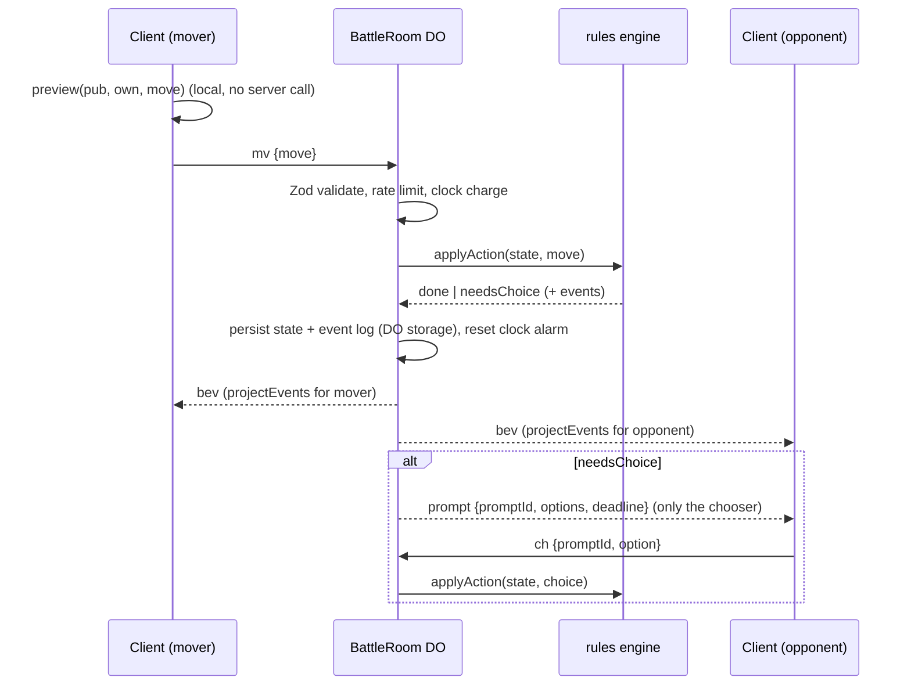
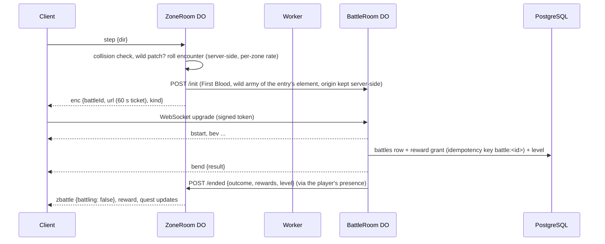
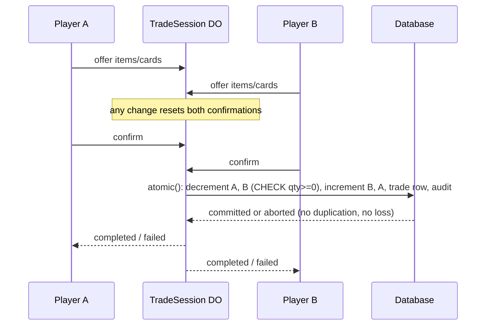

# Chain Theorem — Architecture

This document defines the package map, the dependency rules and every package's public interface. It is
the contract that all code is built against. The binding game rules are in `docs/DESIGN.md` (the spec);
this file shows how they are implemented. Delegated decisions made while writing it are logged as DD rows
in spec section 18 and as records in `docs/decisions/`.

## 1. Package map and dependency rules (spec 13.1, R-DATA-001)

```text
chain-theorem/
  AGENTS.md  CLAUDE.md  PROGRESS.md  README.md  TESTING.md  DEPLOY.md
  apps/
    client/     Vite + Phaser 4.2 + Preact overlay. Local battles (M3), online (M4+), overworld (M5+)
    server/     Worker entry (auth, REST, static assets) and the Durable Object classes
    tools/      content CLI, balance simulator, fuzzer, load test, seed, map importer
  packages/
    rules/      pure deterministic engine + module SDK (`@chain-theorem/rules`, `/sdk`), zero deps
    ai/         NPC search, depends only on rules
    content/    ability, item and trait modules; config.ts (CAPS); generated registry
    db/         Kysely schema, migrations, repositories (PostgreSQL and SQLite/D1)
    protocol/   Zod schemas for WebSocket messages and REST payloads
  docs/         DESIGN.md, ARCHITECTURE.md, CONTENT_GUIDE.md, PLAYTEST_GATE_1.md, decisions/
  assets/       LICENSES.md and any human-supplied art
  scripts/      repo scripts (dependency check, secret scan, dev launcher, deploy check)
```

| Package    | May import                                                                |
| ---------- | ------------------------------------------------------------------------- |
| `rules`    | nothing (no runtime dependencies at all)                                  |
| `content`  | `rules`                                                                   |
| `ai`       | `rules`                                                                   |
| `db`       | nothing in the repo (Kysely, Zod)                                         |
| `protocol` | nothing in the repo (Zod)                                                 |
| `client`   | `rules`, `content`, `protocol`, `ai` (NPC in a Web Worker for local play) |
| `server`   | every package                                                             |
| `tools`    | every package                                                             |

Nothing imports `apps/*`. `rules` never imports `content`; the engine is built with
`createEngine(registry, CAPS)`. Enforced by `scripts/check-deps.ts` (package manifests) and ESLint
`no-restricted-imports` (source), both part of `pnpm check`. ESLint also bans `Date`, `Math.random`,
timers, `fetch`, `console` and `node:*` inside `packages/rules/src` (purity, spec 0).

Workspace packages export TypeScript sources directly (`exports` points at `.ts`); Vite, Vitest, tsx and
Wrangler (esbuild) all consume them, so there is no library build step.

## 2. Rules engine (`@chain-theorem/rules`, spec 13.2, R-DATA-002)

### 2.1 Coordinates and identities

- `Square` is `0..63`, `a1 = 0`, `b1 = 1`, …, `h8 = 63`; `file = sq & 7`, `rank = sq >> 3`.
- Every piece has a stable numeric `PieceId` (`0..31`), assigned at battle start in square order a1..h8.
  A piece keeps its id through promotion, capture and revival (spec 5.4).
- "Square order a1 to h8 from the owner's side" (5.4) is `relOrder(side, sq)`: white uses `sq`,
  black uses `(7 - rank) * 8 + file`.

### 2.2 Core types (`packages/rules/src/types.ts`)

```ts
export type Side = 'white' | 'black';
export type PieceType = 'pawn' | 'knight' | 'bishop' | 'rook' | 'queen' | 'king';
export type ElementId = 'ember' | 'tide' | 'grove' | 'storm' | 'stone' | 'frost' | 'neutral';
export type Category = 'CAPTURING' | 'CAPTURES' | 'CAPTURED' | 'PASSIVE';
export type FormatId = 'first_blood' | 'vanguard' | 'full';
export type Square = number;
export type PieceId = number;

export interface Move {
  from: Square;
  to: Square;
  promotion?: Exclude<PieceType, 'pawn' | 'king'>;
}
// Wire form is UCI: 'e2e4', 'e7e8q'. Castling is the king's two-square move.

export interface Loadout {
  elements: ElementId[]; // [A] or [A, B] with Blended Family (A = pawn/knight/bishop)
  items: string[]; // item ids
  itemParams?: Record<string, { element?: ElementId }>; // Attunement Charm, Masquerade Mask
  sets: string[][]; // 1 army-wide set, or 6 in PIECE_TYPES order (Schedule)
}

export interface PieceState {
  id: PieceId;
  side: Side;
  type: PieceType;
  element: ElementId;
  square: Square | -1; // -1 = captured (off the board)
  start: Square; // starting square (revive target)
  capturedSeq: number; // capture counter value when last captured, -1 if never
}

export interface ArmyState {
  level: number;
  loadout: Loadout; // validated snapshot, locked at battle start (7.4)
  sets: Record<PieceType, string[]>; // expanded ability sets per piece type
  consumedSlots: number;
}

export interface GameState {
  schema: 1;
  contentVersion: string;
  format: FormatId;
  board: number[]; // 64 entries: PieceId or -1
  pieces: PieceState[];
  turn: Side;
  castling: number; // bitmask K=1 Q=2 k=4 q=8
  ep: Square | -1;
  halfmove: number; // 50-move counter (plies without capture or pawn move)
  fullmove: number;
  ply: number;
  armies: Record<Side, ArmyState>;
  usage: Record<string, number>; // `${pieceId}:${abilityId}` -> charges spent (5.4)
  slices: Record<string, unknown>; // module state declared with `stateSlice` (13.5)
  reveals: Record<Side, RevealLog>; // what has been revealed ABOUT each side
  objective: Record<Side, number>; // qualifying captures for the format objective (9.1)
  captureSeq: number; // monotonically increasing capture counter
  repetition: string[]; // position hashes since the last irreversible move
  pending: PendingAction | null; // suspended action awaiting a choice (see 2.6)
  result: BattleResult | null;
  inCheck: Side | null; // king currently in check (for the alert, both king kinds)
  eventSeq: number; // number of events emitted so far in this battle
}

export interface RevealLog {
  abilities: Partial<Record<PieceType, string[]>>; // known abilities per piece type
  complete: PieceType[]; // piece types whose full set is known
  items: string[]; // known item ids
  allItems: boolean; // the full item list is known
  veiled: PieceType[]; // piece types known to carry Veil
}

export interface BattleResult {
  winner: Side | null; // null = draw
  reason: ResultReason;
}
export type ResultReason =
  | 'checkmate'
  | 'stalwart_captured'
  | 'objective'
  | 'resign'
  | 'timeout'
  | 'abandon'
  | 'stalemate'
  | 'repetition'
  | 'fifty_move'
  | 'agreement'
  | 'double_royal_defeat';
```

### 2.3 Engine API

```ts
export function createEngine(registry: ContentRegistry, caps: Caps): Engine;

export interface Engine {
  readonly registry: ContentRegistry;
  readonly caps: Caps;
  newBattle(setup: BattleSetup): { state: GameState; events: BattleEvent[] };
  legalMoves(state: GameState, side: Side): Move[];
  applyAction(state: GameState, input: ActionInput): ApplyResult;
  project(state: GameState, viewer: Side): PublicState;
  projectEvents(state: GameState, events: BattleEvent[], viewer: Side): PublicEvent[];
  // M7 7.2 spectators: public information only (2.5); same shape as PublicState with viewer
  // 'spectator', no loadout or sets on either army, legal [] and a pending choice without request.
  projectSpectator(state: GameState): SpectatorState;
  projectSpectatorEvents(state: GameState, events: BattleEvent[]): PublicEvent[];
  preview(pub: PublicState, own: Loadout, move: Move): Preview;
  stateHash(state: GameState): string; // 16 hex chars; Zobrist board + FNV-1a extras
  validateLoadout(loadout: Loadout, player: PlayerFacts): LoadoutValidation;
  deduce(pub: PublicState): Deductions; // Dossier (8.3)
  toFen(state: GameState): string;
}

export interface BattleSetup {
  format: FormatId;
  white: { level: number; loadout: Loadout };
  black: { level: number; loadout: Loadout };
  fen?: string; // custom start (tests, Scenario Lab)
  contentVersion?: string;
}

export type ActionInput =
  | { kind: 'move'; side: Side; move: Move; choices?: ChoiceOption[] }
  | { kind: 'choice'; side: Side; promptId: string; option: number } // index into options
  | { kind: 'resign'; side: Side }
  | { kind: 'timeout'; side: Side } // BattleRoom clock
  | { kind: 'abandon'; side: Side } // disconnect past grace
  | { kind: 'agreeDraw' };

export type ApplyResult =
  | { kind: 'done'; state: GameState; events: BattleEvent[] }
  | { kind: 'needsChoice'; state: GameState; events: BattleEvent[]; request: ChoiceRequest };
// Illegal input throws `RulesError` with a code ('illegal_move', 'not_your_turn', 'bad_choice', ...).
// Callers on the server catch it and reject the message (R-SEC-002).
```

All functions are pure: the input `state` is never mutated; `applyAction` works on a private clone.

### 2.4 Events (typed records, 13.2)

Every event has `i` (its battle-wide sequence index) and `depth` (0 = the committed action, 1 = a nested
bonus-action pipeline). Spec-named events: `MoveMade`, `Captured`, `AbilityTriggered`, `AbilitySilenced`,
`AbilityNegated`, `EffectFizzled`, `ChargeSpent`, `SquareIgnited`, `SquareExtinguished`, `Revealed`,
`Check`, `BattleEnded`. Added (DD-10): `BattleStarted`, `PieceMoved` (effect move), `PieceRevived`,
`Promoted`, `ChoiceMade`, `TurnPassed`, `ActionStarted`.

```ts
export type SourceRef =
  | { kind: 'ability'; id: string; piece: PieceId; side: Side }
  | { kind: 'item'; id: string; side: Side }
  | { kind: 'trait'; id: string; element: ElementId }
  | { kind: 'rule'; id: 'royal_immunity' | 'inv03' | 'silence' | 'depth' | 'bonus_in_bonus' };

export type FizzleReason =
  | 'no_body'
  | 'royal_immunity'
  | 'inv03'
  | 'protected'
  | 'bulwark'
  | 'burning'
  | 'occupied'
  | 'no_target'
  | 'depth_limit'
  | 'bonus_in_bonus'
  | 'already_on_board';
```

### 2.5 Hidden information (8, R-INFO-005, R-SEC-001)

- `project(state, viewer)` returns the whole board, the viewer's own army in full, and for the opponent
  only: level, displayed element(s) and group mapping, consumed slots, and `reveals[opponent]`.
  Opponent usage counters are included only for revealed abilities. State slices are included only
  through each slice's own `project` function (default: omitted).
- `projectEvents` whitelists fields per event type. Knowledge is per piece type (8.2): an opponent
  ability id not in the viewer's reveal log for that type is replaced by `null` (Veil works by blocking
  the reveal, so its ids are stripped by the same rule). A hidden activation keeps only the piece and
  type (category and attunement are `null` too); fizzles and spent charges of unnamed abilities, and
  every `ChoiceMade`, are sent only to the side entitled to them (DD-45). A pending choice's options go
  only to the chooser.
- Masquerade Mask: while it is up, pieces, promotions and group mappings show the chosen element and
  the Hot Foot slice shows pending burns only to their owner; the Mask drops on the observations listed
  in DD-44.
- Safety test (R-SEC-001): the fuzzer serializes every projection and projected event and fails if a
  string value equals an unrevealed opponent ability or item id, if a name appears on a piece type it
  was not revealed for, if a hidden activation carries its category or attunement, or if a masked
  element or an opponent's pending burn is visible (`apps/tools/src/fuzz/game.ts`).
- **Spectators (M7 7.2, spec 10.4).** `projectSpectator(state)` and
  `projectSpectatorEvents(state, events)` give a spectator exactly the information both players
  have. The rule: about each army `S`, a spectator learns what `S`'s opponent knows, nothing
  more. `S`'s owner knows all of `S` and every `Revealed` event goes to both players, so
  `reveals[S]` is common knowledge and the result is the intersection of the two players'
  knowledge (a Scout or Scout's Lens reveal is public once made; the victim knows its own set and
  sees the reveal). Internally the viewer `'spectator'` is resolved
  per owner (`knowerOf(owner, 'spectator') = opposite(owner)`) in `knownAbility`, `knownItem`,
  `displayElement` and every event rule above. So a spectator gets: the whole board; each army's
  level, displayed element(s) (a Masquerade Mask as the opponent sees it, pieces, army and
  promotions alike), consumed slots and reveal log; usage counters only for abilities that army's
  opponent can name; `pending` with the chooser only; `legal: []`; no `loadout` or `sets` on either
  army. Events: activations, silences and negations of abilities the owner's opponent cannot name
  are unnamed (no category or attunement), their fizzles and spent charges are dropped, every
  `ChoiceMade` is dropped, sources the source owner's opponent cannot name are `{ kind: 'hidden' }`.
  Slices reach spectators only through the module's own `stateSlice.spectate(value, ctx)` (never
  derived from `project`; omitted means hidden): Hot Foot shows its burning squares (6.1, public)
  and never a pending burn; Bulwark's spent list is public; the Mask, Crystal and Overabundance
  slices are private. `scanSpectatorPayload(payload, state)` (`packages/content/src/scan.ts`) is the
  R-SEC-001 check for anything a spectator receives: no id of either army that its opponent has not
  seen (unless the other army revealed the same id), every named ability, item and source pinned to
  its owner's reveal log (per piece type), no loadout, legal move, prompt request, `ChoiceMade`,
  unnamed fizzle or charge, private slice or pending burn, and masked elements shown as masked. The
  fuzzer runs it on every scanned game; the property tests check that a spectator never learns
  more than either player (`packages/content/test/spectator.test.ts`).

### 2.6 The five-phase pipeline and suspended actions (5.3, 5.4)

`applyAction(move)`:

1. **Commit.** Validate against `legalMoves` (hook-aware). Record `ActionStarted`.
2. **Before capture** (move captures only). For each CAPTURING ability of the captor, in set order:
   eligibility, charges, per-action limit, conditions, then `triggerFilter` (silence rule, negations,
   Stopwatch). Allowed triggers resolve immediately.
3. **Capture.** Remove the victim (`Captured`), move the captor (`MoveMade`), castling rook,
   en passant, promotion (`Promoted`, new type's set and group element, R-RULES-002). `onPieceMoved`.
4. **Reactions.** Queue the victim's CAPTURED triggers, then the captor's CAPTURES triggers; run
   `queueOrder` (Always First). `triggerFilter` runs as each trigger is queued (silenced or negated ones
   are revealed then and never resolve) and again just before it resolves (a NEGATE registered by an
   earlier activation cancels queued triggers). Resolve FIFO; each activation fully resolves (including
   choices and any nested pipeline) before the next. Effect captures never queue triggers.
5. **Settle** (once, after the depth-0 chain and its chain-end effects). Pass the turn and run
   `onTurnEnd`; then adjudicate in precedence order: royal defeats (Stalwart capture, checkmate; both
   sides = draw), format objective (earliest qualifying capture in chain order), stalemate, 50-move rule,
   threefold repetition. Emit `Check` when a king (either kind) is in check.

Bonus actions (INV-01): `BONUS_ACTION` grants one extra move inside the current action. A bonus move that
captures runs the pipeline recursively at `depth + 1` (max `CAPS.MAX_CHAIN_DEPTH`). Inside a bonus action
every `BONUS_ACTION` effect fizzles (`bonus_in_bonus`), so the effective depth is 1 (DD-12).

**Choices and suspension (DD-11).** When an effect needs a choice the engine looks for a pre-supplied
answer; if none, it stops and returns `needsChoice`. `state.pending` then holds the pre-action snapshot,
the action input, the ordered answers so far, the open `ChoiceRequest` and the number of events already
emitted. `applyAction(state, { kind: 'choice' })` validates the answer and deterministically re-runs the
action from the snapshot with the extended answer list, returning only the new events. Because the
engine is deterministic (INV-04) the replay reaches the same point; the pending record is plain JSON, so
it survives a Durable Object restart. A single-option mandatory choice resolves without a prompt.

### 2.7 Module SDK (`@chain-theorem/rules/sdk`, 13.5, R-DATA-005)

```ts
export function defineAbility(def: AbilityDef): AbilityDef;
export function defineItem(def: ItemDef): ItemDef;
export function defineTrait(def: TraitDef): TraitDef;
export const fx: EffectBuilders; // effectCapture, negate, protect, move, revive, bonusAction,
// reveal, modifyRule, when (conditional), atChainEnd
export const target: TargetBuilders; // self, captor, victim, chosen(filter), mostRecentCaptured(type)
export const square: SquareBuilders; // origin, start, chosen(filter)

export interface ContentRegistry {
  abilities: readonly AbilityDef[];
  items: readonly ItemDef[];
  traits: readonly TraitDef[];
  version: string; // content version recorded per battle (13.5)
}

export interface AbilityDef {
  // spec 5.6 plus `hooks` for PASSIVE abilities
  id: string;
  name: string;
  version: number;
  category: Category;
  affinity: ElementId;
  eligible: PieceType[] | 'all';
  tags: ('replay' | 'revive')[];
  minLevel: number;
  slotCost: number;
  limits: { perAction: 1; charges?: number };
  conditions?: Condition[];
  effects: EffectSpec[];
  attuned?: { effects: EffectSpec[]; mode: 'replace' | 'append'; conditions?: Condition[] };
  hooks?: Partial<RuleHooks>; // PASSIVE abilities (Stalwart, Veil) act through hooks
  text: { short: string; rules: string };
  status: 'COMMITTED' | 'PROVISIONAL' | 'PLAYTEST';
  retired?: boolean;
}

export interface ItemDef {
  id: string;
  name: string;
  version: number;
  slotCost: 1 | 2 | 3 | 4;
  minLevel: number;
  capacity?: 2 | 3 | 4 | 5; // capacity items only
  exclusiveGroup?: string; // 'capacity'
  grants?: { perTypeSets?: true; secondElement?: true }; // Schedule, Blended Family (DD-13)
  param?: { element: 'required' }; // Attunement Charm, Masquerade Mask
  hooks: Partial<RuleHooks>;
  text: { short: string; rules: string };
  status: 'COMMITTED' | 'PROVISIONAL' | 'PLAYTEST';
  retired?: boolean;
}

export interface TraitDef {
  id: string;
  name: string;
  element: ElementId;
  version: number;
  hooks: Partial<RuleHooks>;
  text: { short: string; rules: string };
  status: 'COMMITTED' | 'PROVISIONAL' | 'PLAYTEST';
}
```

**Hooks** (13.5 plus DD-14 additions marked ✚). Order: engine invariants, then traits, items, abilities,
each sorted by `priority` then `id`. Item and ability hooks run only for the side that equips them
(`ctx.owner`); trait hooks always run and check piece elements themselves.

```ts
export interface RuleHooks {
  priority?: number;
  // init runs once at battle start for every registry module (owner null); project omitted = private.
  // spectate (M7 7.2): what a spectator sees, facts both players know; omitted = hidden from spectators.
  stateSlice: { id: string; init(ctx: ReadCtx): unknown; project?(v: unknown, viewer: Side, ctx: ReadCtx): unknown; spectate?(v: unknown, ctx: ReadCtx): unknown; hash?: boolean };
  onBattleStart(ctx: SetupCtx): void;
  moveFilter: {
    passThrough?(ctx: ReadCtx, piece: PieceView): boolean;          // Flow
    blockedSquares?(ctx: ReadCtx, piece: PieceView): Square[] | null; // Hot Foot: may not move to or
                                                                    //   capture a piece standing on
    kingMode?(ctx: ReadCtx, king: PieceView): 'stalwart' | undefined; // Stalwart
  };
  queueOrder(ctx: ReadCtx, queue: QueuedTrigger[]): QueuedTrigger[]; // Always First
  triggerFilter(ctx: MutCtx, t: TriggerInfo): 'allow' | 'silence' | 'negate'; // Stillness, Stopwatch
  silenceOverride✚(ctx: MutCtx, t: TriggerInfo): boolean;             // Resonance Crystal
  effectIntercept(ctx: MutCtx, e: EffectInfo): 'allow' | { fizzle: FizzleReason }; // Bulwark, Hot Foot
  onPieceMoved(ctx: MutCtx, m: PieceMovedInfo): void;                 // Hot Foot ignition
  onTurnEnd(ctx: MutCtx, info: { side: Side }): void;                 // Hot Foot countdown
  revealFilter: {
    reveal?(ctx: ReadCtx, r: RevealRequest): 'allow' | 'hide';        // Veil
    element?(ctx: ReadCtx, viewer: Side, piece: PieceView): ElementId | undefined; // Masquerade
  };
  modifyCharges✚(ctx: ReadCtx, piece: PieceView, ability: AbilityDef, charges: number): number; // Overabundance
  attunement✚(ctx: ReadCtx, piece: PieceView, ability: AbilityDef): boolean; // Attunement Charm
  onEvent✚(ctx: MutCtx, ev: BattleEvent): void;                       // Masquerade, Hot Foot bookkeeping
}
```

The silence rule (6.2), Royal Immunity (4.4), INV-03 (4.1) and PROTECT/NEGATE bookkeeping are engine
invariants implemented in `rules` with the same hook shapes, so they always run first.

Effect data (5.2) measures distances from an `Anchor`: `self`, `captor` (its current square), `victim`,
`origin` (the square the captor moved from) or `landing` (the square it captured on, DD-41). INV-03
checks run on a draft (`engine/simulate.ts`): the change is applied, movement rules are recomputed from
the draft (a revived Tide rook or a promotion to a Tide queen brings Flow), and own-king safety uses the
rules as they will stand after `onTurnEnd` (DD-47). For a chooser other than the acting player, the
acting king counts as Stalwart only once Stalwart is revealed (DD-46). Target prompts carry `purpose`
and square prompts `subject` (DD-53).

### 2.8 Other rules modules

- `loadout.ts`: `validateLoadout` implements R-LOAD-004 1–7 from CAPS and module data only.
- `deduce.ts`: enumerates every item combination consistent with public facts (consumed slots,
  displayed elements, observed abilities and slot costs, complete sets, revealed items, level) and
  reports facts true in all of them (Dossier, 8.3).
- `preview.ts`: builds a hypothetical state from `PublicState` + own loadout (unknown opponent abilities
  treated as absent), runs the pipeline with default choices, and flags `?` unknowns (victim or captor
  types with unrevealed capacity) (8.4).
- `fen.ts`, `zobrist.ts`, `movegen.ts`, `pipeline/*.ts`, `project.ts`.

## 3. Content (`@chain-theorem/content`, 13.5)

```text
packages/content/
  config.ts                 CAPS (levels, slots, capacities, chain depth, silence scope, formats)
  abilities/<id>.ts         one module per ability + <id>.test.ts scenario test
  items/<id>.ts             one module per item + <id>.test.ts
  traits/<id>.ts            one module per element trait + <id>.test.ts
  registry.generated.ts     written by `pnpm content:index` (CI fails if stale)
  index.ts                  exports `registry`, `CAPS`, `engine` (createEngine(registry, CAPS))
  src/testing.ts            `scenario()` helper for module tests and golden tests
  src/npc.ts, src/quests/   NPC loadouts and quests are content data too (9.4, 10.5)
```

`scenario({ fen, white, black, format, moves, choices })` builds a battle from a FEN and loadouts,
applies moves and choices, and returns the events and final state for assertions.

## 4. AI (`@chain-theorem/ai`, 3.3, 9.4)

```ts
export type Tier = 'wild' | 'trainer' | 'elite';
export interface SearchOptions {
  ms?: number; // time budget, requires now
  now?: () => number;
  nodes?: number; // node budget (deterministic); default from the tier without a clock
  depth?: number; // override the tier depth
  seed?: number; // deterministic noise (Wild)
}
export function search(
  engine: Engine,
  pub: PublicState,
  own: Loadout,
  tier: Tier,
  opts?: SearchOptions,
): SearchResult;
export function chooseMove(
  engine: Engine,
  pub: PublicState,
  own: Loadout,
  tier: Tier,
  opts?: SearchOptions,
): Move;
export function chooseOption(
  engine: Engine,
  pub: PublicState,
  own: Loadout,
  req: ChoiceRequest,
  tier: Tier,
): number;
export function evaluate(engine: Engine, state: GameState, side: Side, tier?: Tier): number;
```

The AI never sees hidden data: it builds a belief state from its own projection (same path as preview).
Iterative-deepening alpha-beta with move ordering (captures first) and an ability-aware evaluation
(material, known abilities' expected value, burning squares, king safety, format objective progress).
Deterministic when given a node budget (the simulator and tests), time-bounded on the server.

## 5. Protocol (`@chain-theorem/protocol`, 13.4, R-NET-001)

Envelope `{ t: string, s?: number, d?: unknown }`; every message has a Zod schema; invalid messages
are dropped and counted.

| Direction       | t                               | d                                                                                                                    |
| --------------- | ------------------------------- | -------------------------------------------------------------------------------------------------------------------- |
| client → zone   | `step`                          | `{ dir: 'n' \| 's' \| 'e' \| 'w' }`                                                                                  |
| client → zone   | `chat`                          | `{ ch: 'zone' \| 'party' \| 'guild' \| 'whisper', text, to? }`                                                       |
| client → zone   | `chal`, `chalReply`, `interact` | challenge, accept or decline, talk to NPC                                                                            |
| zone → client   | `zsnap`                         | `{ zone, channel, you, players[], npcs[], challengeZone }`                                                           |
| zone → client   | `zstep`                         | `{ p, x, y, dir }`                                                                                                   |
| zone → client   | `zjoin`, `zleave`, `zbattle`    | presence changes, battling marker                                                                                    |
| zone → client   | `chatmsg`                       | `{ ch, from, name, text, filtered }`                                                                                 |
| zone → client   | `enc`                           | `{ battleId, token }`                                                                                                |
| zone → client   | `tourney`                       | `{ id, name, kind: 'paired' \| 'game' \| 'finished' \| 'cancelled', round?, opponent?, startsAt?, place? }` (M7 7.1) |
| client → battle | `hello`                         | `{ from }` last event index seen (reconnect replay)                                                                  |
| client → battle | `mv`                            | `{ move: 'e2e4', choices? }`                                                                                         |
| client → battle | `ch`                            | `{ promptId, option }`                                                                                               |
| client → battle | `resign`, `draw`, `drawReply`   | conduct                                                                                                              |
| battle → client | `bstart`                        | `{ public, you }`                                                                                                    |
| battle → client | `bev`                           | `{ from, events, clocks }`                                                                                           |
| battle → client | `prompt`                        | `{ promptId, options, deadline }`                                                                                    |
| battle → client | `bend`                          | `{ result, reason, rewards }`                                                                                        |
| battle → client | `err`, `drawOffer`, `clock`     | errors, draw offers, clock sync                                                                                      |
| battle → client | `watchers`                      | `{ count }` spectators of a public battle (M7 7.2)                                                                   |
| client → watch  | `hello`                         | `{ from }` the only spectator message (M7 7.2, `spectate.ts`)                                                        |
| watch → client  | `sstart`                        | `{ public, players, delay, eventCount, clocks, watchers }`                                                           |
| watch → client  | `sev`                           | `{ from, to, events, public, clocks }` (delayed)                                                                     |
| watch → client  | `send`, `watchers`, `err`       | result once all is shown, spectator count, `not_public`                                                              |

## 6. Server (`apps/server`, 12.2, R-TECH-002)

Worker routes: `/api/auth/*` (magic link, OAuth, sign-out), `/api/me`, `/api/loadouts`, `/api/inventory`,
`/api/battles` (challenge links, NPC battles), `/api/queue`, `/api/trades`, `/api/guilds`,
`/api/leaderboards`, `/api/tournaments`, `/api/billing/*` (checkout, webhook), `/api/admin/*`,
`/ws/zone/:zone`, `/ws/battle/:id`, `/ws/queue/:format`, `/ws/spectate/:id` (WebSocket upgrades need a
60-second signed token bound to the player and room, R-SEC-006), and static assets.

REST contract (M4; JSON bodies validated with `@chain-theorem/protocol` schemas; errors are
`{ error: code }` with a 4xx status; state-changing requests must come from the app's own origin):

| Method and path                              | Body                    | Answer                                                                                   |
| -------------------------------------------- | ----------------------- | ---------------------------------------------------------------------------------------- |
| `POST /api/auth/start`                       | `{ email }`             | `{ ok: true }` always (no account enumeration); mails a 15-minute single-use link        |
| `POST /api/auth/verify`                      | `{ token }`             | `{ status: 'signed_in', me }` + session cookie, or `{ status: 'needs_profile', signup }` |
| `POST /api/auth/complete`                    | `{ signup, name, dob }` | `{ status: 'signed_in', me }` + cookie; `too_young`, `bad_date`, `invalid_token`         |
| `POST /api/auth/signout`                     | —                       | `204`, cookie cleared                                                                    |
| `GET /api/auth/providers`                    | —                       | `{ providers: ProviderId[] }` (only those with keys)                                     |
| `GET /api/auth/oauth/:p/start`, `…/callback` | —                       | redirects; the callback ends at `/#/login?signup=…` for a new account                    |
| `GET /api/me`                                | —                       | `{ me: { id, name, level, xp, adult } \| null }` (200 either way: no console noise)      |
| `GET /api/me/export`, `DELETE /api/me`       | —                       | data export / account deletion (R-SEC-010)                                               |
| `GET /api/inventory`                         | —                       | `{ items: {id, qty}[], cards: {id, qty}[] }`                                             |
| `GET /api/loadouts`                          | —                       | `{ loadouts: { id, name, loadout, valid, errors }[] }` (max 5, 7.4)                      |
| `PUT /api/loadouts`                          | `SaveLoadout`           | the saved loadout with `valid` and `errors` from `validateLoadout`                       |
| `DELETE /api/loadouts/:id`                   | —                       | `204`                                                                                    |
| `POST /api/battles`                          | `CreateBattle`          | NPC: `BattleTicket`; challenge: `{ code, url, ticket }`                                  |
| `GET /api/challenges/:code`                  | —                       | `{ format, from: { name, level }, open }`                                                |
| `POST /api/challenges/:code/accept`          | `{ loadoutId }`         | `BattleTicket`                                                                           |
| `POST /api/queue/ticket`                     | `JoinQueue`             | `{ url }` for the queue socket (`/ws/queue/:format?t=`)                                  |
| `POST /api/battles/:id/ticket`               | —                       | `BattleTicket` (players of that battle only; a fresh 60 s ticket per connect)            |
| `GET /api/battles/active`                    | —                       | `{ battles: { id, format, opponent }[] }` to rejoin after a reload                       |

M5 additions (overworld):

| Method and path           | Body            | Answer                                                                                                                                                         |
| ------------------------- | --------------- | -------------------------------------------------------------------------------------------------------------------------------------------------------------- |
| `POST /api/world/ticket`  | —               | `WorldTicket { zone, url }`: the socket (`/ws/zone/:zone?t=`) for the player's saved zone or the start zone; the server picks the channel                      |
| `GET /api/friends`        | —               | `{ friends: { id, name, status: 'friends' \| 'incoming' \| 'outgoing', zone }[] }`                                                                             |
| `POST /api/friends`       | `FriendRequest` | `{ status: 'requested' \| 'friends' }` (by display name or id)                                                                                                 |
| `DELETE /api/friends/:id` | —               | `204`                                                                                                                                                          |
| `GET /api/progress`       | —               | `{ level, xp, xpToNext, totalXp, coins, keyItems, quests, lessonsDone }`: `xp` is earned inside the current level, `xpToNext` that level's span (0 at the cap) |
| `GET /api/admin/cost`     | —               | the cost dashboard as JSON (hourly rollups, cost per player-hour, per battle, per zone-hour; emails in `ADMIN_EMAILS` only)                                    |
| `GET /admin/cost`         | —               | the same as a server-rendered page (DD-81)                                                                                                                     |

M6 billing (6.3; `apps/server/src/billing/`, DD-83..DD-85). `/api/me` adds `me.access: { status:
'trial' | 'subscriber' | 'expired', subStatus, trialEndsAt, subExpiresAt, canPlay, canTrade }`.

| Method and path                                | Body                | Answer                                                                                                               |
| ---------------------------------------------- | ------------------- | -------------------------------------------------------------------------------------------------------------------- |
| `GET /api/billing/plans`                       | —                   | `{ provider: 'fake' \| 'paddle' \| 'none', plans: { id, name, priceCents, months }[], cancel, portal }`              |
| `GET /api/billing/subscription`                | —                   | `{ access, plan, cancelAt }`                                                                                         |
| `POST /api/billing/checkout`                   | `{ plan }`          | `{ url }`; 409 `already_subscribed`, 400 `plan_unavailable`, 502/503 `billing_unavailable`                           |
| `POST /api/billing/cancel`, `/resume`          | —                   | the subscription view (cancel at period end, or undo it); 409 `no_subscription`                                      |
| `POST /api/billing/portal`                     | —                   | `{ url }` (Paddle only; 404 `not_supported`)                                                                         |
| `POST /api/billing/webhook`                    | provider event      | signature checked on the raw body: 401 `bad_signature`/`stale_signature`, 400 `bad_payload`, else 200 with `outcome` |
| `GET /api/billing/fake/checkout?session=`      | —                   | fake provider only: the checkout page (Pay, Cancel)                                                                  |
| `POST /api/billing/fake/pay`, `/fake/simulate` | form / `{ action }` | fake provider only: pay (303 back to `/#/account`), or renew, fail a payment, cancel now, expire the trial           |
| `GET /api/billing/paddle/pay`                  | —                   | the Paddle.js pay page for a `_ptxn` transaction                                                                     |

Online play answers `402 { error: 'subscription_required' }` when the trial has ended without a
subscription: `POST /api/world/ticket`, `/api/battles`, `/api/challenges/:code/accept`,
`/api/queue/ticket`, and the zone and queue socket upgrades (battles in progress can be finished).

M6 trading and wagers (6.1; `apps/server/src/trade/`, `rooms/trade-session.ts`, DD-86, DD-87). Only
subscribers trade or wager (`canTrade`); the invitee gets `tradeIn {id, from, name, mode}` on the zone
socket and the settled wager `wagerEnd {id, result, items, cards, invalid}`.

| Method and path                | Body                      | Answer                                                                                                                               |
| ------------------------------ | ------------------------- | ------------------------------------------------------------------------------------------------------------------------------------ |
| `GET /api/trades/access`       | —                         | `{ allowed, reason: 'trial' \| 'expired' \| null }`                                                                                  |
| `POST /api/trades`             | `{ with, mode, format? }` | `TradeTicket { id, mode, url }` (`/ws/trade/:id?t=`); 403 `trial_account`/`no_subscription`, 409 `partner_cannot_trade`/`not_online` |
| `POST /api/trades/:id/ticket`  | —                         | a fresh `TradeTicket`; 409 `closed`                                                                                                  |
| `POST /api/trades/:id/decline` | —                         | `204`                                                                                                                                |

Trade socket: client `hello`, `offer {items, cards}` (replaces your side), `format {format}`,
`ready {rev, on}`, `confirm {rev}`, `cancel`; server `tstate` (both offers, marks, revision, phase,
who caused the last reset, expiry), `tdone` (trade: what you got and gave and loadouts now invalid;
wager: the battle id and a ticketed URL), `tend {reason, by}`, `err {code}`. A trade runs as one
atomic list with conditional quantity updates (R-SEC-004); a wager escrows both stakes atomically
before the battle and `settleBattle` pays them out once (`world/wager.ts`).

M6 ranked, leaderboards and guilds (6.1, 6.2; `rating/`, `guild/`, `rooms/guild-room.ts`, DD-88,
DD-89). Schemas in `packages/protocol/src/social.ts`.

| Method and path                                                                      | Body                    | Answer                                                                                                                    |
| ------------------------------------------------------------------------------------ | ----------------------- | ------------------------------------------------------------------------------------------------------------------------- |
| `POST /api/ranked/ticket`                                                            | `{ format, loadoutId }` | `RankedTicket { url: /ws/ranked/:format/:loadoutId?t=, format, bracket, rating }`; 400 `not_ranked`, 409 `in_battle`, 402 |
| `GET /api/ratings/me`                                                                | —                       | `{ bracket, formats, ratings[] }`                                                                                         |
| `GET /api/leaderboards?format=&bracket=&limit=`                                      | —                       | `{ entries[], me, rules }` (tied ratings share a rank)                                                                    |
| `GET /api/leaderboards/guilds?format=&bracket=`                                      | —                       | `{ entries[], mine, rules }`                                                                                              |
| `GET /api/guilds/me`                                                                 | —                       | `MyGuild { guild, rank, invites }` (every guild action answers this too)                                                  |
| `POST /api/guilds`                                                                   | `{ name, tag }`         | 409 `name_taken`/`tag_taken`/`in_guild`, 400 `bad_name`                                                                   |
| `POST /api/guilds/invites`                                                           | `{ to }`                | invite by name or id                                                                                                      |
| `POST /api/guilds/invites/:guildId/accept`, `DELETE /api/guilds/invites/:guildId`    | —                       | accept, decline                                                                                                           |
| `DELETE /api/guilds/invites/:guildId/:playerId`                                      | —                       | a leader or officer revokes an invite                                                                                     |
| `PUT /api/guilds/members/:id`                                                        | `{ rank }`              | leader only: officer, member, or `leader` to hand over                                                                    |
| `DELETE /api/guilds/members/:id`, `POST /api/guilds/leave`, `DELETE /api/guilds/:id` | —                       | kick, leave, disband                                                                                                      |

Guild chat uses the zone socket (`chat {ch: 'guild'}`): the zone core emits a `guildChat` effect,
the ZoneRoom forwards it to the GuildRoom, which delivers it through presence (`/deliver`, `RoutedChat.ch
= 'guild'`), filtered for everyone while any member is under 18 (R-SEC-011).

M6 report, mute, block and the admin console (6.4; `api/safety.ts`, `api/admin.ts`,
`moderation/`, migration `0006_moderation`). Schemas in `packages/protocol/src/moderation.ts`;
PLAYTEST values in `packages/content/config.ts` (`SAFETY`, `TRADE_INVITES`, `GUILDS.inviteTtlMs`).
Report, mute and block are available to every signed-in player, minors and trial accounts included
(R-SEC-011); the lists are private and the reported player never learns who reported them.

| Method and path                                         | Body                                       | Answer                                                                                                  |
| ------------------------------------------------------- | ------------------------------------------ | ------------------------------------------------------------------------------------------------------- |
| `GET /api/safety`                                       | —                                          | `SafetyLists { muted: {id, name, at}[], blocked: [...], limits }`                                       |
| `POST /api/mutes`, `POST /api/blocks`                   | `{ id }`                                   | `SafetyLists`; 400 `bad_target` (self), 404 `not_found`, 409 `too_many` (200 each)                      |
| `DELETE /api/mutes/:id`, `/api/blocks/:id`              | —                                          | `SafetyLists`                                                                                           |
| `POST /api/reports`                                     | `{ target, reason, note?, context? }`      | 201 `{ id }`; 429 `too_many_reports` (10 per rolling day), 404, 400                                     |
| `GET /api/admin/reports`                                | —                                          | `{ reports, open }`: open reports, oldest first, with reporter, target, reason, note, context           |
| `POST /api/admin/reports/:id`                           | `{ action: 'review' \| 'dismiss', note? }` | `{ report }`; 404 `not_open` (closed once)                                                              |
| `GET /api/admin/players?q=`                             | —                                          | `{ players }` by id, exact email or display-name prefix; emails masked (`a***@example.com`)             |
| `GET /api/admin/players/:id`                            | —                                          | facts: level, created, access, suspension, chat ban, online zone, reports about them, recent audit rows |
| `POST /api/admin/players/:id/suspend`                   | `{ hours \| null, reason }`                | `{ player, closed }`: sessions revoked, live zone/trade/queue/battle sockets closed (4003)              |
| `POST /api/admin/players/:id/unsuspend`                 | —                                          | `{ player }`                                                                                            |
| `POST /api/admin/players/:id/chat-ban`                  | `{ hours, reason }`                        | `{ player }`: the live zone core drops their lines at once                                              |
| `POST /api/admin/players/:id/chat-unban`                | —                                          | `{ player }`                                                                                            |
| `GET /admin`, `/admin/players?q=`, `/admin/players/:id` | —                                          | server-rendered pages (strict CSP, no script); forms post to `/admin/...` and redirect back (303)       |

`reason` is one of `harassment`, `hate`, `cheating`, `spam`, `inappropriate_name`, `other`; `context`
is `{ chat?: {text, ch}, battleId?, tradeId? }`. Admin routes need an email in `ADMIN_EMAILS`
(401/403 otherwise); every action writes an `admin.*` audit row on the admin (with the target) and a
`moderation.*` row on the player (without the admin id). A suspended player (`players.suspended_at`,
`suspended_until` null = indefinite) is refused at sign-in (403 `{ error: 'suspended', until }`,
OAuth ends at `/#/login?error=suspended`), by the session lookup, by `requirePlay` (403 `suspended`)
and at every socket upgrade even with a ticket issued earlier; a battle in progress is left to the
normal disconnect grace. A chat ban (`players.chat_ban_until`) drops the player's lines in the zone
core (all chat starts there) and sends `err {code: 'chat_banned', msg}` once.

Mutes and blocks apply where lines are delivered: the zone core never sends a recipient lines from a
player they muted or blocked (zone, party, guild, whisper). A blocked pair (either way) gets no
whispers (`whisper_refused`, the offline answer), no consent or challenge-zone challenges (`busy`),
no party invites (`not_online`), no trade or wager invitations (409 `not_online`, logged like an
offline invitee so the per-minute limit leaks nothing), and no guild invitations (stored, shown as
pending to the inviter, never shown to or accepted by the invitee). Blocking removes the pair's
friendship and pending requests; the blocker cannot send a request and a blocked player's request is
not shown. `POST /api/trades` also answers 429 `too_many_invites` beyond one waiting invitation per
inviter or 3 per minute (counted from `trade.invite` audit rows, written for both players); guild
invitations expire after 7 days.

The zone socket (`/ws/zone/:zone?t=`, a 60 s ticket for `zone:<zone>`): the Worker loads the
player (`PlayerInit`: level, adult flag, friends, saved tile, quests, lessons done, defeated story
trainers, key items, party with its youngest-member flag, chat preference, the battle still in
progress, M6 6.4: own mutes and blocks and a chat ban) and
offers the upgrade to the zone's channels in order (a party member's channel first, then 0, 1, ...;
a full channel answers 409). Messages are `ClientZone` / `ServerZone` (`packages/protocol/src/zone.ts`).

New accounts start at level 1 with the starter collection: Dual Adept's Glove, Hit and Run, Last
Word and Scout (every level-1 module); M5 rewards grow it.

M7 spectating (7.2, spec 10.4; `api/spectate.ts`, `battle/spectate.ts`, `rooms/battle-room.ts`,
migration `0008_spectate`; schemas in `packages/protocol/src/spectate.ts`; PLAYTEST values in
`SPECTATE`: `delayPlies` 2, `maxPerRoom` 50, `listLimit` 20, `listMaxAgeMs` 6 h). Public kinds:
ranked, tournament (origin kind `tournament`) and challenge-zone battles (`challenge` with `auto`);
NPC, lesson, wild, trainer, consent challenges, challenge links, casual queue pairings and wagers
are never listed. A public battle is listed (`battles.listed = 1`) and made spectatable only when
both players allow it at battle start (`players.spectate`: the player's choice, NULL for the default:
on for adults, off under 18, R-SEC-011). A block in either direction between the viewer and a player
hides the battle from that viewer (not listed, 404).

| Method and path                  | Body                      | Answer                                                                                                               |
| -------------------------------- | ------------------------- | -------------------------------------------------------------------------------------------------------------------- |
| `GET /api/battles/live`          | —                         | `LiveBattles { battles: { id, format, kind, bracket?, tournament?, white, black, spectators, startedAt }[], delay }` |
| `POST /api/battles/:id/spectate` | —                         | `SpectateTicket { battleId, token, url: /ws/spectate/:id?t= }` (60 s, `spectate:<id>`); 404, 409 `full`              |
| `GET /api/settings/spectate`     | —                         | `SpectateSetting { allow, custom, byDefault }`                                                                       |
| `PUT /api/settings/spectate`     | `{ allow: bool \| null }` | `SpectateSetting` (null: back to the default); applies to battles that start later                                   |

The spectator socket is read-only: only `hello {from}` is accepted; everything else is dropped and
counted with the same token bucket as a player (`LIMITS.battle`, kept in the socket attachment so it
survives hibernation) and a socket that keeps offending is closed (1008). The core keeps a
`spectate` block in its snapshot: every log record of a public battle also stores `spec` (its events
projected with `projectSpectatorEvents` against the state after it), and its `projectSpectator`
view waits in `spectate.pending` until the live ply is `delayPlies` past it; the start record goes at
once and everything goes when the battle ends (then `send`). Released views go as `sev` to every
spectator socket that said hello (`Outbox.spectate`); `spectatorHello(from)` answers one socket with
the delayed position and the released events since `from`. The delay is counted in plies rather than
seconds, so no extra alarm or timer is needed and a spectator can never see the position the player
to move is thinking about; snapshot plus log records restore it after an eviction. Players and
spectators get `watchers {count}` when the spectator count changes.

M7 tournaments (7.1, spec 10.4, 9.3; `api/tournaments.ts`, `rooms/tournament-room.ts`, the pure
`tournament/` core, `world/tournament.ts`, migration `0007_tournaments`; schemas in
`packages/protocol/src/tournament.ts`; PLAYTEST values in `TOURNAMENTS`: formats full, vanguard and
first_blood, `maxPlayers` 32 (at most 64), `minPlayers` 2, Swiss rounds ceil(log2 n) + 1 capped at a
round robin, `breakMs` 60 s between a round's pairings and its battles, a bye is worth 1 point, a
drawn knockout game sends Black through, one missed game withdraws a player, `watchdogMs` 5 min,
prizes 250 XP + 200 coins, 150 + 100, 100 + 50 for places 1 to 3, a daily Full Battle Swiss per
bracket at 19:00 UTC). Events run per format and slot bracket (the slots unlocked at the player's
level, never the loadout). The TournamentRoom (one per event, named by its id) wraps the pure
`TournamentCore` and holds the live state; the `tournaments` and `tournament_entries` rows are the
listing and history. The start alarm drops entrants no longer eligible (bracket, suspension,
deleted), cancels below `minPlayers`, seeds by the Glicko-2 rating of the format and bracket (1500
unrated), and pairs round 1; each round's pairings are public for `breakMs`, then an alarm creates its
BattleRooms (`t-<tournament>-<round>-<board>`, origin `{ kind: 'tournament', tournamentId, round }`,
each player's fighting loadout); `settleBattle` reports each result to the room (`POST /result`,
idempotent per battle); a lost report is recovered by the watchdog from the `battles` row and the R2
archive. A side that never sent a frame before the battle ended by abandonment did not start it: a
forfeit loss; both absent is a double loss. Swiss pairing: score groups (top half against bottom
half), no repeat pairings where avoidable (a backtracking search with a step budget), colour
preferences (two absolute wishes for the same colour are paired only when unavoidable), one bye per
player at most (the lowest ranked); standings by points, Buchholz, Sonneborn-Berger, seed. Knockout:
seeded bracket of the next power of two, byes to the top seeds, places 1, 2, 3, 3, 5 ...; a withdrawn
player forfeits the next match without a battle. The end writes the row and places in one atomic list
and grants the prizes once per player (`tournament:<id>:<player>`, R-SEC-003), retried by alarm until
it succeeds. Players in the world get `tourney` notices through presence; the tournament page polls.

| Method and path                                                                           | Body               | Answer                                                                                                                                                              |
| ----------------------------------------------------------------------------------------- | ------------------ | ------------------------------------------------------------------------------------------------------------------------------------------------------------------- |
| `GET /api/tournaments`                                                                    | —                  | `TournamentList { bracket, upcoming, live, finished }` (today's scheduled events created when listed)                                                               |
| `GET /api/tournaments/:id`                                                                | —                  | `TournamentView`: entrants, standings, rounds and pairings, prizes, `you { registered, withdrawn, game, next, place, cannot }`, `rev`, `now`                        |
| `POST /api/tournaments/:id/register`                                                      | —                  | `TournamentView`; 402/403 play gate; 409 `closed`, `full`, `already`, `wrong_bracket`                                                                               |
| `DELETE /api/tournaments/:id/register`                                                    | —                  | `TournamentView`: off the list before the start, withdrawn after it; 404 `not_registered`                                                                           |
| `POST /api/tournaments/:id/ticket`                                                        | —                  | `BattleTicket` for your game of the current round; 404 `no_game`                                                                                                    |
| `GET /api/admin/tournaments`                                                              | —                  | `{ tournaments }` (ADMIN_EMAILS)                                                                                                                                    |
| `POST /api/admin/tournaments`                                                             | `CreateTournament` | `{ tournament }`; `{ name?, format, bracket, system: 'swiss' \| 'se', startsAt? \| startInMs?, maxPlayers?, rounds?, breakMs? }`; audited `admin.tournament_create` |
| `POST /api/admin/tournaments/:id/cancel`                                                  | —                  | `{ tournament }`; 409 `closed`; audited `admin.tournament_cancel`                                                                                                   |
| `GET /admin/tournaments`, `POST /admin/tournaments`, `POST /admin/tournaments/:id/cancel` | form               | the console page: events with a cancel button and a create form (303 back)                                                                                          |

| Durable Object   | One per                  | Holds                                                                                | Time                                                                      |
| ---------------- | ------------------------ | ------------------------------------------------------------------------------------ | ------------------------------------------------------------------------- |
| `BattleRoom`     | battle                   | GameState, full event log, clocks, sockets (hibernation), prompts                    | alarm: flag fall, prompt timeout, disconnect grace, NPC move              |
| `ZoneRoom`       | zone channel             | tile positions, zone chat, encounter rolls, challenge-zone state                     | none (event-driven)                                                       |
| `Matchmaker`     | queue (format x bracket) | waiting players, pairing                                                             | alarm: widen search                                                       |
| `Metrics`        | deployment (`global`)    | hourly usage rollups for the cost dashboard (14.2, DD-81)                            | none                                                                      |
| `TradeSession`   | trade or wager session   | both offers, revision, marks, confirmations, wager attempt state                     | alarm: invitation lapse, idle expiry, wager watchdog                      |
| `GuildRoom`      | guild                    | roster cache, guild chat                                                             | none                                                                      |
| `TradeSession`   | trade                    | both offers, confirmations                                                           | alarm: expiry                                                             |
| `TournamentRoom` | tournament               | TournamentCore snapshot: entrants, seeds, rounds, pairings, results, places (M7 7.1) | alarm: the start, each round after its break, watchdog, the end's retries |

Every DO uses `ctx.acceptWebSocket` (Hibernation API) and `ctx.storage.setAlarm`; no `setInterval`, no
game loop, no outbound sockets (R-COST-002). BattleRoom persists `GameState` and the event log in its own
storage after every action; at the end it archives the log to R2 (`BATTLE_LOGS`) and writes one `battles`
row plus rewards through the repositories (13.3).

**ZoneRoom (M5).** `zone:<zone>:<channel>` wraps the pure `ZoneCore` (`apps/server/src/zone/`):
tile steps, collisions, encounter rolls, NPC dialogs, puzzle lessons, quests, challenges and chat
filtering are decided there and return an outbox of messages plus effects. The room stores the core
snapshot only when the core asks (joins, battles, quests, chat state; never for a plain step), mirrors
each player's tile into their socket attachment (free, survives hibernation), and runs the effects:
creating BattleRooms (`world/battles.ts`, origin kept server-side), idempotent grants and level-ups
(`world/progress.ts`), positions on warp and logout, quest storage, cross-channel chat, party and
invite routing through presence (`world/routing.ts`, host calls `/deliver`, `/refused`, `/party`,
`/invite`, `/grant`, `/ended`; M6 `/notify`, `/guild`; M6 6.4 `/safety`, `/chatBan`, `/battle` and
`/kick`), and telemetry to Analytics Engine and `Metrics`. A battle started outside the zone (a
wager, a queue, ranked or challenge-link battle, an NPC battle from the online screen) calls
`/battle {on: true}` from `BattleRoom` init and `{on: false}` from `settleBattle`, so the player is
marked battling in their zone (no consent challenges mid-battle). `BattleRoom` and `Matchmaker`
answer `POST /kick {playerId, code}` for a suspension. When a battle ends,
the BattleRoom pays each human seat once per grant key (`battle:<id>`, `trainer:<player>:<npc>`;
lessons pay `lesson:<player>:<id>` when they complete, quests `quest:<player>:<id>`), raises the level,
and posts the outcome to the player's channel; a player who already left gets the quest and lesson
progress applied from storage (`world/settle.ts`).

Interfaces with a local implementation and a production implementation (never faked):

| Interface         | Local / tests                                    | Production                                     |
| ----------------- | ------------------------------------------------ | ---------------------------------------------- |
| `MailSender`      | console (magic link printed)                     | HTTP provider (human-only key)                 |
| `OAuthProvider`   | disabled without keys                            | Google, GitHub, Discord when keys exist        |
| `BillingProvider` | `FakeBillingProvider`                            | `PaddleBillingProvider` (sandbox, then live)   |
| `TelemetrySink`   | `Metrics` DO rollups (memory sink in unit tests) | Workers Analytics Engine plus the `Metrics` DO |
| `BlobStore`       | local R2 (Miniflare) / memory                    | R2                                             |
| `Database`        | SQLite (better-sqlite3, D1 local)                | PostgreSQL via Hyperdrive                      |

## 7. Database (`@chain-theorem/db`, 13.3, 13.6, R-DATA-003/004)

One Kysely query layer, written once, runs on PostgreSQL, better-sqlite3 and D1. The package has four
entries so the Worker bundle never pulls in native code (a test walks the import graph):

| Import                   | Contents                                                                             | Used by                                     |
| ------------------------ | ------------------------------------------------------------------------------------ | ------------------------------------------- |
| `@chain-theorem/db`      | `Schema` types, `createDb`, `migrate`, repositories, errors, `uuidv7`, JSON schemas  | anything (imports only `kysely` and `zod`)  |
| `@chain-theorem/db/pg`   | `postgresDb(connectionString, { max? })` via node-postgres (BIGINT parsed to number) | Worker through Hyperdrive, CI, `test:db:pg` |
| `@chain-theorem/db/d1`   | `d1Db(binding)` via kysely-d1; atomic lists run as one `binding.batch()`             | Worker in `wrangler dev` and Workers tests  |
| `@chain-theorem/db/node` | `sqliteDb(filename = ':memory:')` via better-sqlite3; re-exports `postgresDb`        | Node only: repository tests, tools, seed    |

```ts
export function createDb(
  kysely: Kysely<Schema>,
  dialect: 'sqlite' | 'd1' | 'postgres',
  options?: { now?: () => number; runAtomic?: AtomicRunner }, // D1 must pass a batch() runner
): Db;
export interface Db {
  kysely: Kysely<Schema>;
  dialect: 'sqlite' | 'd1' | 'postgres';
  atomic(statements: readonly CompiledQuery[]): Promise<number[]>; // rows affected, in order
  now(): number; // injectable clock for created/updated timestamps
  players: PlayerRepo;
  sessions: SessionRepo;
  loginTokens: LoginTokenRepo;
  oauthAccounts: OauthAccountRepo;
  inventory: InventoryRepo;
  loadouts: LoadoutRepo;
  ratings: RatingRepo;
  battles: BattleRepo;
  wagers: WagerRepo;
  rewards: RewardRepo;
  audit: AuditRepo;
  world: WorldRepo; // M5: coins, key items, progress flags, quests, positions, presence, chat filter
  social: SocialRepo; // M5: friends, parties
  destroy(): Promise<void>;
}
export function migrate(db: Db): Promise<string[]>; // ids applied by this call; [] when up to date
```

| Repository      | Methods (M4)                                                                                                                                                                                                                                                                                                                                                |
| --------------- | ----------------------------------------------------------------------------------------------------------------------------------------------------------------------------------------------------------------------------------------------------------------------------------------------------------------------------------------------------------- |
| `players`       | `create({ email, displayName, adultFrom })`, `getById`, `getByEmail`, `rename`, `addXp(id, delta, levelForXp?)`, `syncLevel(id, levelForXp)` (level only rises), `addXpStatement`, `exportData(id)`, `delete(id)` (R-SEC-010), `setSpectate(id, allow \| null)` (M7 7.2; `spectatingAllowed(p, now)`)                                                       |
| `sessions`      | `create(playerId, { ttlMs })` returns the raw 32-byte token once and stores its SHA-256, `getValid(token, now)`, `delete(token)`, `deleteForPlayer`, `deleteExpired(now)` (R-SEC-006)                                                                                                                                                                       |
| `loginTokens`   | `issue({ email, purpose, ttlMs, data? })` (magic link; hashed; `data` carries display name, `adultFrom` and a pending `oauth` identity), `consume(token, now, purpose?)` exactly once, `countIssuedSince(email, since)`, `deleteExpired(now)`                                                                                                               |
| `oauthAccounts` | `link(playerId, provider, providerUserId)` (false if already linked), `findPlayerId(provider, providerUserId)`, `listForPlayer`                                                                                                                                                                                                                             |
| `inventory`     | `list(playerId)`, `qty`, `grant(playerId, 'item' \| 'card', id, qty)`, `spend(...)` (conditional, boolean), `grantStatement`, `spendStatements` (for atomic lists)                                                                                                                                                                                          |
| `loadouts`      | `list(playerId)`, `get(playerId, id)`, `count`, `save(playerId, { id?, name, loadout, isValid })` (null if the id is not the player's), `setValid`, `delete(playerId, id)`                                                                                                                                                                                  |
| `battles`       | `create({ id?, format, whiteId, blackId, listed? })` (result null; `id` may be any 1..128 char string, e.g. `c-<code>`), `get`, `finish(id, { result, reason, endedAt, logKey })` (once), `finishStatement`, `listRecentForPlayer`, `listActiveForPlayer`, `listLive(since, limit)` (M7 7.2)                                                                |
| `wagers`        | `create({ battleId, whiteStake, blackStake, status? })`, `get`, `getByBattle` (escrow and settlement: M6)                                                                                                                                                                                                                                                   |
| `rewards`       | `grant({ key, playerId, items?, cards?, xp?, coins?, keyItems?, flags? })` returns `granted` or `duplicate`, `grantStatements` (to compose with `finishStatement`), `get(key, playerId)`                                                                                                                                                                    |
| `world`         | `coins`, `addCoinsStatement`, `spendCoins` (conditional), `keyItems`, `keyItemStatement`, `flags`, `flagStatement`, `setFlag`, `quests`, `questStatement`, `setQuest`, `setPosition`, `setPresence`, `presence`, `filterChat`, `setFilterChat`, `setLevel` (migration 0002)                                                                                 |
| `social`        | `requestFriend` (a mutual request makes friends), `removeFriend`, `areFriends`, `friendIds`, `friends` (with presence for friends), `createParty`, `joinParty` (race-safe cap of 4 by `CHECK (size <= 4)`), `leaveParty`, `party`, `partyOf`                                                                                                                |
| `ratings`       | `get(playerId, format, bracket)`, `listForPlayer`, `upsert(...)` (Glicko-2 update: M6)                                                                                                                                                                                                                                                                      |
| `audit`         | `append({ playerId, kind, payload })`, `appendStatement`, `listForPlayer`, `listKinds(playerId, kinds, since)` (M6 6.4)                                                                                                                                                                                                                                     |
| `safety`        | M6 6.4: `mute`, `unmute`, `mutes`, `mutedIds`, `block` (one atomic list with the friendship removal), `unblock`, `blocks`, `blockedIds`, `blockedEither(a, b)`, `blockedAmong(player, others)`                                                                                                                                                              |
| `moderation`    | M6 6.4: `fileReport` (per-day limit), `openReports` (oldest first), `countOpen`, `reportsAbout`, `reportCounts`, `resolveReport` (once), `suspend` (revokes sessions atomically), `liftSuspension`, `setChatBan`, `findPlayers`                                                                                                                             |
| `tournaments`   | M7 7.1: `create`, `createScheduled` (once per UNIQUE `schedule_key`), `get`, `byScheduleKeys`, `list(statuses, {limit, order})`, `update` (the room's summary), `addEntry` (entry + recount in one atomic list, CHECK `players <= max_players`), `removeEntry`, `entries`, `finish` (row and places, atomic), `registeredIn`, `idsForPlayer`, `removeEmpty` |

Later milestones add repositories for guilds, trades, friends, quests, billing, social and tournaments; the
guild, guild member, trade, friend and quest progress tables already exist.

**Tables** (migration `0001_initial`): every table of spec 13.3 plus `login_tokens` (hashed token,
email, purpose, pending sign-up data, `expires_at`, `used_at`), `oauth_accounts` (UNIQUE provider +
provider user id) and `reward_grants` (UNIQUE `grant_key` + `player_id`, R-SEC-003), and the
`schema_migrations` ledger. Player-owned rows reference `players(id)` with foreign keys (enforced on all
three engines). `players.adult_from` (epoch ms of the 18th birthday, from `adultFromBirthDate()`) is the
only age data; the birth date is never stored (R-SEC-011).

**Portability** (spec 13.6): IDs are UUIDv7 strings from the application (`uuidv7()`, monotonic within
a process); timestamps are epoch milliseconds (`BIGINT` on PostgreSQL, `INTEGER` on SQLite); JSON is
`JSONB` on PostgreSQL and `TEXT` on SQLite, validated with Zod on write and on read (a bad row throws
`DbDataError`); booleans are `INTEGER` 0/1 on both. Migrations are forward-only, branch by dialect only
for column types (`ts`, `json`, `real`), use `IF NOT EXISTS`, and apply with their ledger row as one
atomic list; `migrate()` is a no-op when run again, including concurrently.

**Atomic writes (DD-15):** `atomic(statements)` runs an ordered list of compiled queries in one
transaction: `BEGIN … COMMIT` on one connection for PostgreSQL and better-sqlite3, one `batch()` on D1
(which has no interactive transactions). It resolves to the affected-row count of each statement. Any
error rolls back every statement; constraint violations surface as `DbConstraintError` with `kind`
(`unique`, `check`, `foreign_key`, `not_null`) and, where the engine reports them, `table` and
`constraint`. Because a D1 batch cannot stop halfway on a row count, every invariant inside an atomic list
is a constraint: `inventory.spendStatements` inserts a zero row if missing (conflict ignored) and then
decrements without a condition, so an over-spend or a spend of something never owned violates
`CHECK (qty >= 0)` and aborts the list; grants are upserts; reward idempotency is the `reward_grants`
unique key (the duplicate aborts the list and `rewards.grant` reports `duplicate`). Standalone
operations use conditional updates checked by affected rows: `inventory.spend` (`qty = qty - n WHERE
qty >= n`), `loginTokens.consume` (`used_at IS NULL AND expires_at > now`), `battles.finish`
(`result IS NULL`). No `SELECT … FOR UPDATE` anywhere.

**Tests:** the same suite (`packages/db/test`) runs on in-memory SQLite, on `d1Db` over an in-process D1
stand-in backed by better-sqlite3 (same surface and error text as workerd's D1), and on PostgreSQL when
`TEST_PG_URL` is set (a fresh schema per test). `pnpm test:db` runs SQLite and D1; `pnpm test:db:pg`
uses `TEST_PG_URL`, or starts a throwaway local cluster (PostgreSQL binaries; as root it runs as
`postgres`), or Docker `postgres:17`, and otherwise prints why it skipped and exits 0.

In the Worker, create the `Db` per request from the binding (`d1Db(env.DB)` or
`postgresDb(env.HYPERDRIVE.connectionString, { max: 5 })`) and close a PostgreSQL one with
`ctx.waitUntil(db.destroy())`: Workers do not share sockets between requests and allow six open
connections per invocation, and Hyperdrive does the real pooling. Repositories never use Kysely's
`transaction()`, which D1 lacks; multi-statement writes go through `atomic()`.

## 8. Client (`apps/client`)

- `src/battle/`: Phaser `BoardScene` (procedural creature silhouettes per piece type, glyph badges,
  element rings and tints, burning-square overlay with counters, check pulse, ability pips, Classic
  View), `BattleController` (local engine or online socket), animation queue with fast mode and
  reduced motion.
- `src/ui/`: Preact + Signals overlay: loadout builder, Dossier, step-through event log, move preview,
  prompts, clocks, menus. All text-heavy UI lives in the DOM.
- `src/lab/`: Scenario Lab (dev only, excluded from production builds by `import.meta.env.DEV`).
- `src/world/` (M5): overworld scene from Tiled JSON, zone socket, chat, social panels.
- M7 7.2 spectating: `ui/WatchScreen.tsx` (`#/watch`, lazy; the live list, the player's spectating
  setting) and `battle/SpectatorView.tsx` with `battle/spectate.ts` (`SpectatorController`: a
  read-only `BattleController` on the spectator socket that holds only spectator projections; the
  same board scene with no input, both armies' public information, the delayed log with replay, a
  "delayed by N plies" note, the result).
- NPC search runs in a Web Worker in local play.

## 9. Data flow diagrams

### 9.1 A move



### 9.2 An encounter



### 9.3 A trade



### 9.4 A wager

```mermaid
sequenceDiagram
  participant A as Player A
  participant M as Worker (challenge)
  participant B as Player B
  participant R as BattleRoom
  participant DB as Database
  A->>M: challenge with stake
  B->>M: accept with stake (both confirm; change resets)
  M->>DB: atomic(): move both stakes into escrow (wagers row, CHECK qty>=0)
  M->>R: create battle (loadout snapshot may still use staked items)
  R->>DB: at end: atomic(): winner receives both stakes | draw returns them; wager settled
```
