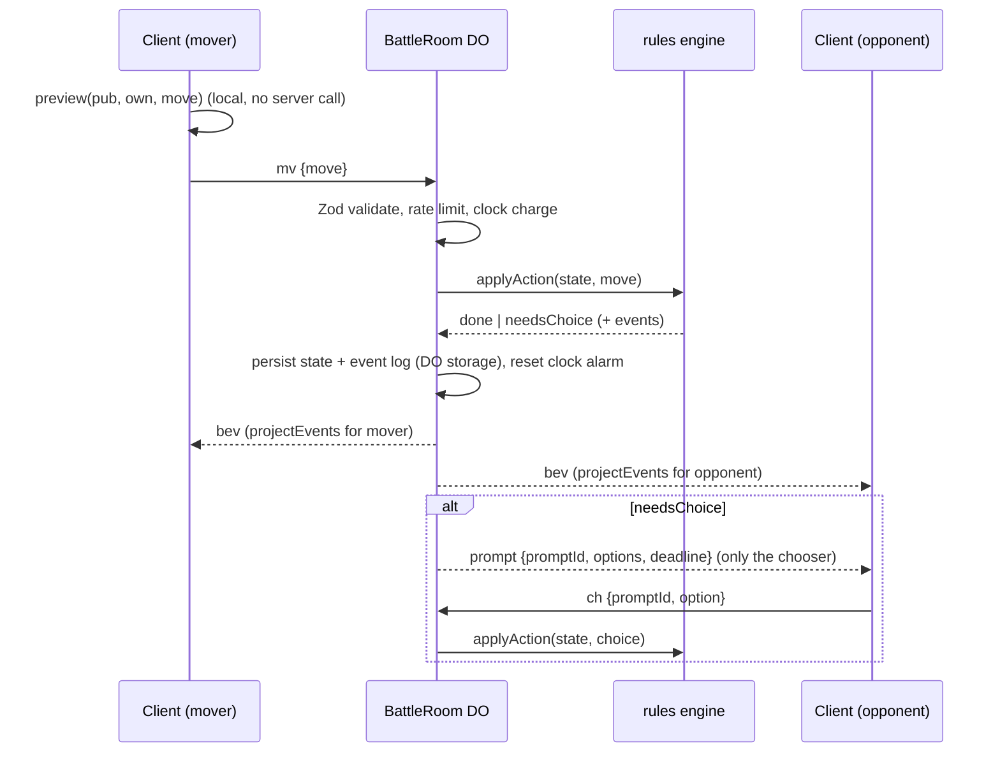
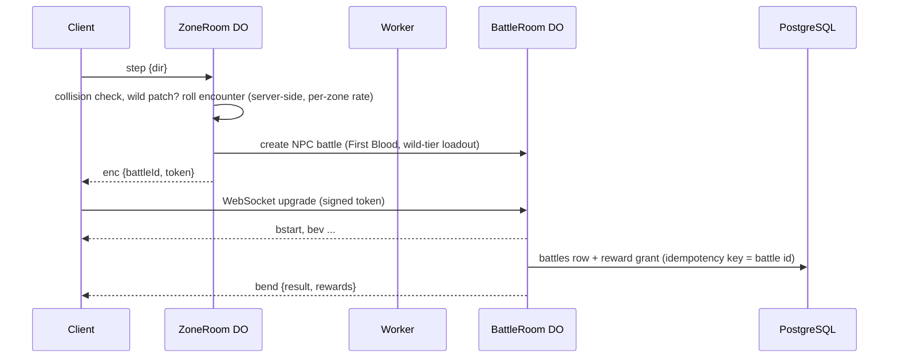
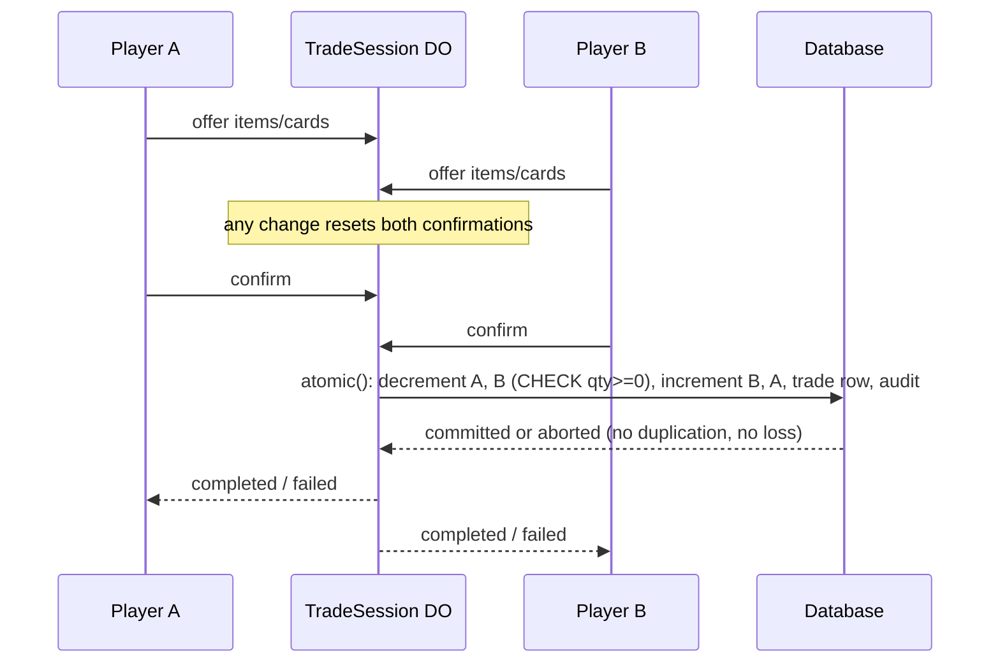

# Chain Theorem — Architecture

This document defines the package map, the dependency rules and every package's public interface. It is
the contract that all code is built against. The binding game rules are in `docs/DESIGN.md` (the spec);
this file shows how they are implemented. Delegated decisions made while writing it are logged as DD rows
in spec section 18 and as records in `docs/decisions/`.

## 1. Package map and dependency rules (spec 13.1, R-DATA-001)

```text
chain-theorem/
  AGENTS.md  CLAUDE.md  PROGRESS.md  README.md  TESTING.md  DEPLOY.md
  apps/
    client/     Vite + Phaser 4.2 + Preact overlay. Local battles (M3), online (M4+), overworld (M5+)
    server/     Worker entry (auth, REST, static assets) and the Durable Object classes
    tools/      content CLI, balance simulator, fuzzer, load test, seed, map importer
  packages/
    rules/      pure deterministic engine + module SDK (`@chain-theorem/rules`, `/sdk`), zero deps
    ai/         NPC search, depends only on rules
    content/    ability, item and trait modules; config.ts (CAPS); generated registry
    db/         Kysely schema, migrations, repositories (PostgreSQL and SQLite/D1)
    protocol/   Zod schemas for WebSocket messages and REST payloads
  docs/         DESIGN.md, ARCHITECTURE.md, CONTENT_GUIDE.md, PLAYTEST_GATE_1.md, decisions/
  assets/       LICENSES.md and any human-supplied art
  scripts/      repo scripts (dependency check, secret scan, dev launcher, deploy check)
```

| Package    | May import                                                                |
| ---------- | ------------------------------------------------------------------------- |
| `rules`    | nothing (no runtime dependencies at all)                                  |
| `content`  | `rules`                                                                   |
| `ai`       | `rules`                                                                   |
| `db`       | nothing in the repo (Kysely, Zod)                                         |
| `protocol` | nothing in the repo (Zod)                                                 |
| `client`   | `rules`, `content`, `protocol`, `ai` (NPC in a Web Worker for local play) |
| `server`   | every package                                                             |
| `tools`    | every package                                                             |

Nothing imports `apps/*`. `rules` never imports `content`; the engine is built with
`createEngine(registry, CAPS)`. Enforced by `scripts/check-deps.ts` (package manifests) and ESLint
`no-restricted-imports` (source), both part of `pnpm check`. ESLint also bans `Date`, `Math.random`,
timers, `fetch`, `console` and `node:*` inside `packages/rules/src` (purity, spec 0).

Workspace packages export TypeScript sources directly (`exports` points at `.ts`); Vite, Vitest, tsx and
Wrangler (esbuild) all consume them, so there is no library build step.

## 2. Rules engine (`@chain-theorem/rules`, spec 13.2, R-DATA-002)

### 2.1 Coordinates and identities

- `Square` is `0..63`, `a1 = 0`, `b1 = 1`, …, `h8 = 63`; `file = sq & 7`, `rank = sq >> 3`.
- Every piece has a stable numeric `PieceId` (`0..31`), assigned at battle start in square order a1..h8.
  A piece keeps its id through promotion, capture and revival (spec 5.4).
- "Square order a1 to h8 from the owner's side" (5.4) is `relOrder(side, sq)`: white uses `sq`,
  black uses `(7 - rank) * 8 + file`.

### 2.2 Core types (`packages/rules/src/types.ts`)

```ts
export type Side = 'white' | 'black';
export type PieceType = 'pawn' | 'knight' | 'bishop' | 'rook' | 'queen' | 'king';
export type ElementId = 'ember' | 'tide' | 'grove' | 'storm' | 'stone' | 'frost' | 'neutral';
export type Category = 'CAPTURING' | 'CAPTURES' | 'CAPTURED' | 'PASSIVE';
export type FormatId = 'first_blood' | 'vanguard' | 'full';
export type Square = number;
export type PieceId = number;

export interface Move {
  from: Square;
  to: Square;
  promotion?: Exclude<PieceType, 'pawn' | 'king'>;
}
// Wire form is UCI: 'e2e4', 'e7e8q'. Castling is the king's two-square move.

export interface Loadout {
  elements: ElementId[]; // [A] or [A, B] with Blended Family (A = pawn/knight/bishop)
  items: string[]; // item ids
  itemParams?: Record<string, { element?: ElementId }>; // Attunement Charm, Masquerade Mask
  sets: string[][]; // 1 army-wide set, or 6 in PIECE_TYPES order (Schedule)
}

export interface PieceState {
  id: PieceId;
  side: Side;
  type: PieceType;
  element: ElementId;
  square: Square | -1; // -1 = captured (off the board)
  start: Square; // starting square (revive target)
  capturedSeq: number; // capture counter value when last captured, -1 if never
}

export interface ArmyState {
  level: number;
  loadout: Loadout; // validated snapshot, locked at battle start (7.4)
  sets: Record<PieceType, string[]>; // expanded ability sets per piece type
  consumedSlots: number;
}

export interface GameState {
  schema: 1;
  contentVersion: string;
  format: FormatId;
  board: number[]; // 64 entries: PieceId or -1
  pieces: PieceState[];
  turn: Side;
  castling: number; // bitmask K=1 Q=2 k=4 q=8
  ep: Square | -1;
  halfmove: number; // 50-move counter (plies without capture or pawn move)
  fullmove: number;
  ply: number;
  armies: Record<Side, ArmyState>;
  usage: Record<string, number>; // `${pieceId}:${abilityId}` -> charges spent (5.4)
  slices: Record<string, unknown>; // module state declared with `stateSlice` (13.5)
  reveals: Record<Side, RevealLog>; // what has been revealed ABOUT each side
  objective: Record<Side, number>; // qualifying captures for the format objective (9.1)
  captureSeq: number; // monotonically increasing capture counter
  repetition: string[]; // position hashes since the last irreversible move
  pending: PendingAction | null; // suspended action awaiting a choice (see 2.6)
  result: BattleResult | null;
  inCheck: Side | null; // king currently in check (for the alert, both king kinds)
  eventSeq: number; // number of events emitted so far in this battle
}

export interface RevealLog {
  abilities: Partial<Record<PieceType, string[]>>; // known abilities per piece type
  complete: PieceType[]; // piece types whose full set is known
  items: string[]; // known item ids
  allItems: boolean; // the full item list is known
  veiled: PieceType[]; // piece types known to carry Veil
}

export interface BattleResult {
  winner: Side | null; // null = draw
  reason: ResultReason;
}
export type ResultReason =
  | 'checkmate'
  | 'stalwart_captured'
  | 'objective'
  | 'resign'
  | 'timeout'
  | 'abandon'
  | 'stalemate'
  | 'repetition'
  | 'fifty_move'
  | 'agreement'
  | 'double_royal_defeat';
```

### 2.3 Engine API

```ts
export function createEngine(registry: ContentRegistry, caps: Caps): Engine;

export interface Engine {
  readonly registry: ContentRegistry;
  readonly caps: Caps;
  newBattle(setup: BattleSetup): { state: GameState; events: BattleEvent[] };
  legalMoves(state: GameState, side: Side): Move[];
  applyAction(state: GameState, input: ActionInput): ApplyResult;
  project(state: GameState, viewer: Side): PublicState;
  projectEvents(state: GameState, events: BattleEvent[], viewer: Side): PublicEvent[];
  preview(pub: PublicState, own: Loadout, move: Move): Preview;
  stateHash(state: GameState): string; // 16 hex chars; Zobrist board + FNV-1a extras
  validateLoadout(loadout: Loadout, player: PlayerFacts): LoadoutValidation;
  deduce(pub: PublicState): Deductions; // Dossier (8.3)
  toFen(state: GameState): string;
}

export interface BattleSetup {
  format: FormatId;
  white: { level: number; loadout: Loadout };
  black: { level: number; loadout: Loadout };
  fen?: string; // custom start (tests, Scenario Lab)
  contentVersion?: string;
}

export type ActionInput =
  | { kind: 'move'; side: Side; move: Move; choices?: ChoiceOption[] }
  | { kind: 'choice'; side: Side; promptId: string; option: number } // index into options
  | { kind: 'resign'; side: Side }
  | { kind: 'timeout'; side: Side } // BattleRoom clock
  | { kind: 'abandon'; side: Side } // disconnect past grace
  | { kind: 'agreeDraw' };

export type ApplyResult =
  | { kind: 'done'; state: GameState; events: BattleEvent[] }
  | { kind: 'needsChoice'; state: GameState; events: BattleEvent[]; request: ChoiceRequest };
// Illegal input throws `RulesError` with a code ('illegal_move', 'not_your_turn', 'bad_choice', ...).
// Callers on the server catch it and reject the message (R-SEC-002).
```

All functions are pure: the input `state` is never mutated; `applyAction` works on a private clone.

### 2.4 Events (typed records, 13.2)

Every event has `i` (its battle-wide sequence index) and `depth` (0 = the committed action, 1 = a nested
bonus-action pipeline). Spec-named events: `MoveMade`, `Captured`, `AbilityTriggered`, `AbilitySilenced`,
`AbilityNegated`, `EffectFizzled`, `ChargeSpent`, `SquareIgnited`, `SquareExtinguished`, `Revealed`,
`Check`, `BattleEnded`. Added (DD-10): `BattleStarted`, `PieceMoved` (effect move), `PieceRevived`,
`Promoted`, `ChoiceMade`, `TurnPassed`, `ActionStarted`.

```ts
export type SourceRef =
  | { kind: 'ability'; id: string; piece: PieceId; side: Side }
  | { kind: 'item'; id: string; side: Side }
  | { kind: 'trait'; id: string; element: ElementId }
  | { kind: 'rule'; id: 'royal_immunity' | 'inv03' | 'silence' | 'depth' | 'bonus_in_bonus' };

export type FizzleReason =
  | 'no_body'
  | 'royal_immunity'
  | 'inv03'
  | 'protected'
  | 'bulwark'
  | 'burning'
  | 'occupied'
  | 'no_target'
  | 'depth_limit'
  | 'bonus_in_bonus'
  | 'already_on_board';
```

### 2.5 Hidden information (8, R-INFO-005, R-SEC-001)

- `project(state, viewer)` returns the whole board, the viewer's own army in full, and for the opponent
  only: level, displayed element(s) and group mapping, consumed slots, and `reveals[opponent]`.
  Opponent usage counters are included only for revealed abilities. State slices are included only
  through each slice's own `project` function (default: omitted).
- `projectEvents` whitelists fields per event type. Knowledge is per piece type (8.2): an opponent
  ability id not in the viewer's reveal log for that type is replaced by `null` (Veil works by blocking
  the reveal, so its ids are stripped by the same rule). A hidden activation keeps only the piece and
  type (category and attunement are `null` too); fizzles and spent charges of unnamed abilities, and
  every `ChoiceMade`, are sent only to the side entitled to them (DD-45). A pending choice's options go
  only to the chooser.
- Masquerade Mask: while it is up, pieces, promotions and group mappings show the chosen element and
  the Hot Foot slice shows pending burns only to their owner; the Mask drops on the observations listed
  in DD-44.
- Safety test (R-SEC-001): the fuzzer serializes every projection and projected event and fails if a
  string value equals an unrevealed opponent ability or item id, if a name appears on a piece type it
  was not revealed for, if a hidden activation carries its category or attunement, or if a masked
  element or an opponent's pending burn is visible (`apps/tools/src/fuzz/game.ts`).

### 2.6 The five-phase pipeline and suspended actions (5.3, 5.4)

`applyAction(move)`:

1. **Commit.** Validate against `legalMoves` (hook-aware). Record `ActionStarted`.
2. **Before capture** (move captures only). For each CAPTURING ability of the captor, in set order:
   eligibility, charges, per-action limit, conditions, then `triggerFilter` (silence rule, negations,
   Stopwatch). Allowed triggers resolve immediately.
3. **Capture.** Remove the victim (`Captured`), move the captor (`MoveMade`), castling rook,
   en passant, promotion (`Promoted`, new type's set and group element, R-RULES-002). `onPieceMoved`.
4. **Reactions.** Queue the victim's CAPTURED triggers, then the captor's CAPTURES triggers; run
   `queueOrder` (Always First). `triggerFilter` runs as each trigger is queued (silenced or negated ones
   are revealed then and never resolve) and again just before it resolves (a NEGATE registered by an
   earlier activation cancels queued triggers). Resolve FIFO; each activation fully resolves (including
   choices and any nested pipeline) before the next. Effect captures never queue triggers.
5. **Settle** (once, after the depth-0 chain and its chain-end effects). Pass the turn and run
   `onTurnEnd`; then adjudicate in precedence order: royal defeats (Stalwart capture, checkmate; both
   sides = draw), format objective (earliest qualifying capture in chain order), stalemate, 50-move rule,
   threefold repetition. Emit `Check` when a king (either kind) is in check.

Bonus actions (INV-01): `BONUS_ACTION` grants one extra move inside the current action. A bonus move that
captures runs the pipeline recursively at `depth + 1` (max `CAPS.MAX_CHAIN_DEPTH`). Inside a bonus action
every `BONUS_ACTION` effect fizzles (`bonus_in_bonus`), so the effective depth is 1 (DD-12).

**Choices and suspension (DD-11).** When an effect needs a choice the engine looks for a pre-supplied
answer; if none, it stops and returns `needsChoice`. `state.pending` then holds the pre-action snapshot,
the action input, the ordered answers so far, the open `ChoiceRequest` and the number of events already
emitted. `applyAction(state, { kind: 'choice' })` validates the answer and deterministically re-runs the
action from the snapshot with the extended answer list, returning only the new events. Because the
engine is deterministic (INV-04) the replay reaches the same point; the pending record is plain JSON, so
it survives a Durable Object restart. A single-option mandatory choice resolves without a prompt.

### 2.7 Module SDK (`@chain-theorem/rules/sdk`, 13.5, R-DATA-005)

```ts
export function defineAbility(def: AbilityDef): AbilityDef;
export function defineItem(def: ItemDef): ItemDef;
export function defineTrait(def: TraitDef): TraitDef;
export const fx: EffectBuilders; // effectCapture, negate, protect, move, revive, bonusAction,
// reveal, modifyRule, when (conditional), atChainEnd
export const target: TargetBuilders; // self, captor, victim, chosen(filter), mostRecentCaptured(type)
export const square: SquareBuilders; // origin, start, chosen(filter)

export interface ContentRegistry {
  abilities: readonly AbilityDef[];
  items: readonly ItemDef[];
  traits: readonly TraitDef[];
  version: string; // content version recorded per battle (13.5)
}

export interface AbilityDef {
  // spec 5.6 plus `hooks` for PASSIVE abilities
  id: string;
  name: string;
  version: number;
  category: Category;
  affinity: ElementId;
  eligible: PieceType[] | 'all';
  tags: ('replay' | 'revive')[];
  minLevel: number;
  slotCost: number;
  limits: { perAction: 1; charges?: number };
  conditions?: Condition[];
  effects: EffectSpec[];
  attuned?: { effects: EffectSpec[]; mode: 'replace' | 'append'; conditions?: Condition[] };
  hooks?: Partial<RuleHooks>; // PASSIVE abilities (Stalwart, Veil) act through hooks
  text: { short: string; rules: string };
  status: 'COMMITTED' | 'PROVISIONAL' | 'PLAYTEST';
  retired?: boolean;
}

export interface ItemDef {
  id: string;
  name: string;
  version: number;
  slotCost: 1 | 2 | 3 | 4;
  minLevel: number;
  capacity?: 2 | 3 | 4 | 5; // capacity items only
  exclusiveGroup?: string; // 'capacity'
  grants?: { perTypeSets?: true; secondElement?: true }; // Schedule, Blended Family (DD-13)
  param?: { element: 'required' }; // Attunement Charm, Masquerade Mask
  hooks: Partial<RuleHooks>;
  text: { short: string; rules: string };
  status: 'COMMITTED' | 'PROVISIONAL' | 'PLAYTEST';
  retired?: boolean;
}

export interface TraitDef {
  id: string;
  name: string;
  element: ElementId;
  version: number;
  hooks: Partial<RuleHooks>;
  text: { short: string; rules: string };
  status: 'COMMITTED' | 'PROVISIONAL' | 'PLAYTEST';
}
```

**Hooks** (13.5 plus DD-14 additions marked ✚). Order: engine invariants, then traits, items, abilities,
each sorted by `priority` then `id`. Item and ability hooks run only for the side that equips them
(`ctx.owner`); trait hooks always run and check piece elements themselves.

```ts
export interface RuleHooks {
  priority?: number;
  // init runs once at battle start for every registry module (owner null); project omitted = private.
  stateSlice: { id: string; init(ctx: ReadCtx): unknown; project?(v: unknown, viewer: Side, ctx: ReadCtx): unknown; hash?: boolean };
  onBattleStart(ctx: SetupCtx): void;
  moveFilter: {
    passThrough?(ctx: ReadCtx, piece: PieceView): boolean;          // Flow
    blockedSquares?(ctx: ReadCtx, piece: PieceView): Square[] | null; // Hot Foot: may not move to or
                                                                    //   capture a piece standing on
    kingMode?(ctx: ReadCtx, king: PieceView): 'stalwart' | undefined; // Stalwart
  };
  queueOrder(ctx: ReadCtx, queue: QueuedTrigger[]): QueuedTrigger[]; // Always First
  triggerFilter(ctx: MutCtx, t: TriggerInfo): 'allow' | 'silence' | 'negate'; // Stillness, Stopwatch
  silenceOverride✚(ctx: MutCtx, t: TriggerInfo): boolean;             // Resonance Crystal
  effectIntercept(ctx: MutCtx, e: EffectInfo): 'allow' | { fizzle: FizzleReason }; // Bulwark, Hot Foot
  onPieceMoved(ctx: MutCtx, m: PieceMovedInfo): void;                 // Hot Foot ignition
  onTurnEnd(ctx: MutCtx, info: { side: Side }): void;                 // Hot Foot countdown
  revealFilter: {
    reveal?(ctx: ReadCtx, r: RevealRequest): 'allow' | 'hide';        // Veil
    element?(ctx: ReadCtx, viewer: Side, piece: PieceView): ElementId | undefined; // Masquerade
  };
  modifyCharges✚(ctx: ReadCtx, piece: PieceView, ability: AbilityDef, charges: number): number; // Overabundance
  attunement✚(ctx: ReadCtx, piece: PieceView, ability: AbilityDef): boolean; // Attunement Charm
  onEvent✚(ctx: MutCtx, ev: BattleEvent): void;                       // Masquerade, Hot Foot bookkeeping
}
```

The silence rule (6.2), Royal Immunity (4.4), INV-03 (4.1) and PROTECT/NEGATE bookkeeping are engine
invariants implemented in `rules` with the same hook shapes, so they always run first.

Effect data (5.2) measures distances from an `Anchor`: `self`, `captor` (its current square), `victim`,
`origin` (the square the captor moved from) or `landing` (the square it captured on, DD-41). INV-03
checks run on a draft (`engine/simulate.ts`): the change is applied, movement rules are recomputed from
the draft (a revived Tide rook or a promotion to a Tide queen brings Flow), and own-king safety uses the
rules as they will stand after `onTurnEnd` (DD-47). For a chooser other than the acting player, the
acting king counts as Stalwart only once Stalwart is revealed (DD-46). Target prompts carry `purpose`
and square prompts `subject` (DD-53).

### 2.8 Other rules modules

- `loadout.ts`: `validateLoadout` implements R-LOAD-004 1–7 from CAPS and module data only.
- `deduce.ts`: enumerates every item combination consistent with public facts (consumed slots,
  displayed elements, observed abilities and slot costs, complete sets, revealed items, level) and
  reports facts true in all of them (Dossier, 8.3).
- `preview.ts`: builds a hypothetical state from `PublicState` + own loadout (unknown opponent abilities
  treated as absent), runs the pipeline with default choices, and flags `?` unknowns (victim or captor
  types with unrevealed capacity) (8.4).
- `fen.ts`, `zobrist.ts`, `movegen.ts`, `pipeline/*.ts`, `project.ts`.

## 3. Content (`@chain-theorem/content`, 13.5)

```text
packages/content/
  config.ts                 CAPS (levels, slots, capacities, chain depth, silence scope, formats)
  abilities/<id>.ts         one module per ability + <id>.test.ts scenario test
  items/<id>.ts             one module per item + <id>.test.ts
  traits/<id>.ts            one module per element trait + <id>.test.ts
  registry.generated.ts     written by `pnpm content:index` (CI fails if stale)
  index.ts                  exports `registry`, `CAPS`, `engine` (createEngine(registry, CAPS))
  src/testing.ts            `scenario()` helper for module tests and golden tests
  src/npc.ts, src/quests/   NPC loadouts and quests are content data too (9.4, 10.5)
```

`scenario({ fen, white, black, format, moves, choices })` builds a battle from a FEN and loadouts,
applies moves and choices, and returns the events and final state for assertions.

## 4. AI (`@chain-theorem/ai`, 3.3, 9.4)

```ts
export type Tier = 'wild' | 'trainer' | 'elite';
export interface SearchOptions {
  ms?: number; // time budget, requires now
  now?: () => number;
  nodes?: number; // node budget (deterministic); default from the tier without a clock
  depth?: number; // override the tier depth
  seed?: number; // deterministic noise (Wild)
}
export function search(
  engine: Engine,
  pub: PublicState,
  own: Loadout,
  tier: Tier,
  opts?: SearchOptions,
): SearchResult;
export function chooseMove(
  engine: Engine,
  pub: PublicState,
  own: Loadout,
  tier: Tier,
  opts?: SearchOptions,
): Move;
export function chooseOption(
  engine: Engine,
  pub: PublicState,
  own: Loadout,
  req: ChoiceRequest,
  tier: Tier,
): number;
export function evaluate(engine: Engine, state: GameState, side: Side, tier?: Tier): number;
```

The AI never sees hidden data: it builds a belief state from its own projection (same path as preview).
Iterative-deepening alpha-beta with move ordering (captures first) and an ability-aware evaluation
(material, known abilities' expected value, burning squares, king safety, format objective progress).
Deterministic when given a node budget (the simulator and tests), time-bounded on the server.

## 5. Protocol (`@chain-theorem/protocol`, 13.4, R-NET-001)

Envelope `{ t: string, s?: number, d?: unknown }`; every message has a Zod schema; invalid messages
are dropped and counted.

| Direction       | t                               | d                                                              |
| --------------- | ------------------------------- | -------------------------------------------------------------- |
| client → zone   | `step`                          | `{ dir: 'n' \| 's' \| 'e' \| 'w' }`                            |
| client → zone   | `chat`                          | `{ ch: 'zone' \| 'party' \| 'guild' \| 'whisper', text, to? }` |
| client → zone   | `chal`, `chalReply`, `interact` | challenge, accept or decline, talk to NPC                      |
| zone → client   | `zsnap`                         | `{ zone, channel, you, players[], npcs[], challengeZone }`     |
| zone → client   | `zstep`                         | `{ p, x, y, dir }`                                             |
| zone → client   | `zjoin`, `zleave`, `zbattle`    | presence changes, battling marker                              |
| zone → client   | `chatmsg`                       | `{ ch, from, name, text, filtered }`                           |
| zone → client   | `enc`                           | `{ battleId, token }`                                          |
| client → battle | `hello`                         | `{ from }` last event index seen (reconnect replay)            |
| client → battle | `mv`                            | `{ move: 'e2e4', choices? }`                                   |
| client → battle | `ch`                            | `{ promptId, option }`                                         |
| client → battle | `resign`, `draw`, `drawReply`   | conduct                                                        |
| battle → client | `bstart`                        | `{ public, you }`                                              |
| battle → client | `bev`                           | `{ from, events, clocks }`                                     |
| battle → client | `prompt`                        | `{ promptId, options, deadline }`                              |
| battle → client | `bend`                          | `{ result, reason, rewards }`                                  |
| battle → client | `err`, `drawOffer`, `clock`     | errors, draw offers, clock sync                                |

## 6. Server (`apps/server`, 12.2, R-TECH-002)

Worker routes: `/api/auth/*` (magic link, OAuth, sign-out), `/api/me`, `/api/loadouts`, `/api/inventory`,
`/api/battles` (challenge links, NPC battles), `/api/queue`, `/api/trades`, `/api/guilds`,
`/api/leaderboards`, `/api/tournaments`, `/api/billing/*` (checkout, webhook), `/api/admin/*`,
`/ws/zone/:zone`, `/ws/battle/:id`, `/ws/queue/:format` (WebSocket upgrades need a 60-second signed
token bound to the player and room, R-SEC-006), and static assets.

REST contract (M4; JSON bodies validated with `@chain-theorem/protocol` schemas; errors are
`{ error: code }` with a 4xx status; state-changing requests must come from the app's own origin):

| Method and path                              | Body                    | Answer                                                                                   |
| -------------------------------------------- | ----------------------- | ---------------------------------------------------------------------------------------- |
| `POST /api/auth/start`                       | `{ email }`             | `{ ok: true }` always (no account enumeration); mails a 15-minute single-use link        |
| `POST /api/auth/verify`                      | `{ token }`             | `{ status: 'signed_in', me }` + session cookie, or `{ status: 'needs_profile', signup }` |
| `POST /api/auth/complete`                    | `{ signup, name, dob }` | `{ status: 'signed_in', me }` + cookie; `too_young`, `bad_date`, `invalid_token`         |
| `POST /api/auth/signout`                     | —                       | `204`, cookie cleared                                                                    |
| `GET /api/auth/providers`                    | —                       | `{ providers: ProviderId[] }` (only those with keys)                                     |
| `GET /api/auth/oauth/:p/start`, `…/callback` | —                       | redirects; the callback ends at `/#/login?signup=…` for a new account                    |
| `GET /api/me`                                | —                       | `{ me: { id, name, level, xp, adult } \| null }` (200 either way: no console noise)      |
| `GET /api/me/export`, `DELETE /api/me`       | —                       | data export / account deletion (R-SEC-010)                                               |
| `GET /api/inventory`                         | —                       | `{ items: {id, qty}[], cards: {id, qty}[] }`                                             |
| `GET /api/loadouts`                          | —                       | `{ loadouts: { id, name, loadout, valid, errors }[] }` (max 5, 7.4)                      |
| `PUT /api/loadouts`                          | `SaveLoadout`           | the saved loadout with `valid` and `errors` from `validateLoadout`                       |
| `DELETE /api/loadouts/:id`                   | —                       | `204`                                                                                    |
| `POST /api/battles`                          | `CreateBattle`          | NPC: `BattleTicket`; challenge: `{ code, url, ticket }`                                  |
| `GET /api/challenges/:code`                  | —                       | `{ format, from: { name, level }, open }`                                                |
| `POST /api/challenges/:code/accept`          | `{ loadoutId }`         | `BattleTicket`                                                                           |
| `POST /api/queue/ticket`                     | `JoinQueue`             | `{ url }` for the queue socket (`/ws/queue/:format?t=`)                                  |
| `POST /api/battles/:id/ticket`               | —                       | `BattleTicket` (players of that battle only; a fresh 60 s ticket per connect)            |
| `GET /api/battles/active`                    | —                       | `{ battles: { id, format, opponent }[] }` to rejoin after a reload                       |

M5 additions (overworld):

| Method and path           | Body            | Answer                                                                                                                                    |
| ------------------------- | --------------- | ----------------------------------------------------------------------------------------------------------------------------------------- |
| `POST /api/world/ticket`  | —               | `WorldTicket { zone, url }`: the socket (`/ws/zone/:zone?t=`) for the player's saved zone or the start zone; the server picks the channel |
| `GET /api/friends`        | —               | `{ friends: { id, name, status: 'friends' \| 'incoming' \| 'outgoing', zone }[] }`                                                        |
| `POST /api/friends`       | `FriendRequest` | `{ status: 'requested' \| 'friends' }` (by display name or id)                                                                            |
| `DELETE /api/friends/:id` | —               | `204`                                                                                                                                     |
| `GET /api/progress`       | —               | `{ level, xp, xpToNext, coins, keyItems, quests, lessonsDone }` for the HUD                                                               |

New accounts start at level 1 with the starter collection: Dual Adept's Glove, Hit and Run, Last
Word and Scout (every level-1 module); M5 rewards grow it.

| Durable Object   | One per                  | Holds                                                             | Time                                                         |
| ---------------- | ------------------------ | ----------------------------------------------------------------- | ------------------------------------------------------------ |
| `BattleRoom`     | battle                   | GameState, full event log, clocks, sockets (hibernation), prompts | alarm: flag fall, prompt timeout, disconnect grace, NPC move |
| `ZoneRoom`       | zone channel             | tile positions, zone chat, encounter rolls, challenge-zone state  | none (event-driven)                                          |
| `Matchmaker`     | queue (format x bracket) | waiting players, pairing                                          | alarm: widen search                                          |
| `GuildRoom`      | guild                    | roster cache, guild chat                                          | none                                                         |
| `TradeSession`   | trade                    | both offers, confirmations                                        | alarm: expiry                                                |
| `TournamentRoom` | tournament               | bracket, pairings, results                                        | alarm: round start                                           |

Every DO uses `ctx.acceptWebSocket` (Hibernation API) and `ctx.storage.setAlarm`; no `setInterval`, no
game loop, no outbound sockets (R-COST-002). BattleRoom persists `GameState` and the event log in its own
storage after every action; at the end it archives the log to R2 (`BATTLE_LOGS`) and writes one `battles`
row plus rewards through the repositories (13.3).

Interfaces with a local implementation and a production implementation (never faked):

| Interface         | Local / tests                     | Production                                   |
| ----------------- | --------------------------------- | -------------------------------------------- |
| `MailSender`      | console (magic link printed)      | HTTP provider (human-only key)               |
| `OAuthProvider`   | disabled without keys             | Google, GitHub, Discord when keys exist      |
| `BillingProvider` | `FakeBillingProvider`             | `PaddleBillingProvider` (sandbox, then live) |
| `TelemetrySink`   | local sink (JSON lines / memory)  | Workers Analytics Engine                     |
| `BlobStore`       | local R2 (Miniflare) / memory     | R2                                           |
| `Database`        | SQLite (better-sqlite3, D1 local) | PostgreSQL via Hyperdrive                    |

## 7. Database (`@chain-theorem/db`, 13.3, 13.6, R-DATA-003/004)

One Kysely query layer, written once, runs on PostgreSQL, better-sqlite3 and D1. The package has four
entries so the Worker bundle never pulls in native code (a test walks the import graph):

| Import                   | Contents                                                                             | Used by                                     |
| ------------------------ | ------------------------------------------------------------------------------------ | ------------------------------------------- |
| `@chain-theorem/db`      | `Schema` types, `createDb`, `migrate`, repositories, errors, `uuidv7`, JSON schemas  | anything (imports only `kysely` and `zod`)  |
| `@chain-theorem/db/pg`   | `postgresDb(connectionString, { max? })` via node-postgres (BIGINT parsed to number) | Worker through Hyperdrive, CI, `test:db:pg` |
| `@chain-theorem/db/d1`   | `d1Db(binding)` via kysely-d1; atomic lists run as one `binding.batch()`             | Worker in `wrangler dev` and Workers tests  |
| `@chain-theorem/db/node` | `sqliteDb(filename = ':memory:')` via better-sqlite3; re-exports `postgresDb`        | Node only: repository tests, tools, seed    |

```ts
export function createDb(
  kysely: Kysely<Schema>,
  dialect: 'sqlite' | 'd1' | 'postgres',
  options?: { now?: () => number; runAtomic?: AtomicRunner }, // D1 must pass a batch() runner
): Db;
export interface Db {
  kysely: Kysely<Schema>;
  dialect: 'sqlite' | 'd1' | 'postgres';
  atomic(statements: readonly CompiledQuery[]): Promise<number[]>; // rows affected, in order
  now(): number; // injectable clock for created/updated timestamps
  players: PlayerRepo;
  sessions: SessionRepo;
  loginTokens: LoginTokenRepo;
  oauthAccounts: OauthAccountRepo;
  inventory: InventoryRepo;
  loadouts: LoadoutRepo;
  ratings: RatingRepo;
  battles: BattleRepo;
  wagers: WagerRepo;
  rewards: RewardRepo;
  audit: AuditRepo;
  world: WorldRepo; // M5: coins, key items, progress flags, quests, positions, presence, chat filter
  social: SocialRepo; // M5: friends, parties
  destroy(): Promise<void>;
}
export function migrate(db: Db): Promise<string[]>; // ids applied by this call; [] when up to date
```

| Repository      | Methods (M4)                                                                                                                                                                                                                                                                |
| --------------- | --------------------------------------------------------------------------------------------------------------------------------------------------------------------------------------------------------------------------------------------------------------------------- |
| `players`       | `create({ email, displayName, adultFrom })`, `getById`, `getByEmail`, `rename`, `addXp(id, delta, levelForXp?)`, `syncLevel(id, levelForXp)` (level only rises), `addXpStatement`, `exportData(id)`, `delete(id)` (R-SEC-010)                                               |
| `sessions`      | `create(playerId, { ttlMs })` returns the raw 32-byte token once and stores its SHA-256, `getValid(token, now)`, `delete(token)`, `deleteForPlayer`, `deleteExpired(now)` (R-SEC-006)                                                                                       |
| `loginTokens`   | `issue({ email, purpose, ttlMs, data? })` (magic link; hashed; `data` carries display name, `adultFrom` and a pending `oauth` identity), `consume(token, now, purpose?)` exactly once, `countIssuedSince(email, since)`, `deleteExpired(now)`                               |
| `oauthAccounts` | `link(playerId, provider, providerUserId)` (false if already linked), `findPlayerId(provider, providerUserId)`, `listForPlayer`                                                                                                                                             |
| `inventory`     | `list(playerId)`, `qty`, `grant(playerId, 'item' \| 'card', id, qty)`, `spend(...)` (conditional, boolean), `grantStatement`, `spendStatements` (for atomic lists)                                                                                                          |
| `loadouts`      | `list(playerId)`, `get(playerId, id)`, `count`, `save(playerId, { id?, name, loadout, isValid })` (null if the id is not the player's), `setValid`, `delete(playerId, id)`                                                                                                  |
| `battles`       | `create({ id?, format, whiteId, blackId })` (result null; `id` may be any 1..128 char string, e.g. `c-<code>`), `get`, `finish(id, { result, reason, endedAt, logKey })` (once), `finishStatement`, `listRecentForPlayer`, `listActiveForPlayer`                            |
| `wagers`        | `create({ battleId, whiteStake, blackStake, status? })`, `get`, `getByBattle` (escrow and settlement: M6)                                                                                                                                                                   |
| `rewards`       | `grant({ key, playerId, items?, cards?, xp?, coins?, keyItems?, flags? })` returns `granted` or `duplicate`, `grantStatements` (to compose with `finishStatement`), `get(key, playerId)`                                                                                    |
| `world`         | `coins`, `addCoinsStatement`, `spendCoins` (conditional), `keyItems`, `keyItemStatement`, `flags`, `flagStatement`, `setFlag`, `quests`, `questStatement`, `setQuest`, `setPosition`, `setPresence`, `presence`, `filterChat`, `setFilterChat`, `setLevel` (migration 0002) |
| `social`        | `requestFriend` (a mutual request makes friends), `removeFriend`, `areFriends`, `friendIds`, `friends` (with presence for friends), `createParty`, `joinParty` (race-safe cap of 4 by `CHECK (size <= 4)`), `leaveParty`, `party`, `partyOf`                                |
| `ratings`       | `get(playerId, format, bracket)`, `listForPlayer`, `upsert(...)` (Glicko-2 update: M6)                                                                                                                                                                                      |
| `audit`         | `append({ playerId, kind, payload })`, `appendStatement`, `listForPlayer`                                                                                                                                                                                                   |

Later milestones add repositories for guilds, trades, friends, quests, billing, social and tournaments; the
guild, guild member, trade, friend and quest progress tables already exist.

**Tables** (migration `0001_initial`): every table of spec 13.3 plus `login_tokens` (hashed token,
email, purpose, pending sign-up data, `expires_at`, `used_at`), `oauth_accounts` (UNIQUE provider +
provider user id) and `reward_grants` (UNIQUE `grant_key` + `player_id`, R-SEC-003), and the
`schema_migrations` ledger. Player-owned rows reference `players(id)` with foreign keys (enforced on all
three engines). `players.adult_from` (epoch ms of the 18th birthday, from `adultFromBirthDate()`) is the
only age data; the birth date is never stored (R-SEC-011).

**Portability** (spec 13.6): IDs are UUIDv7 strings from the application (`uuidv7()`, monotonic within
a process); timestamps are epoch milliseconds (`BIGINT` on PostgreSQL, `INTEGER` on SQLite); JSON is
`JSONB` on PostgreSQL and `TEXT` on SQLite, validated with Zod on write and on read (a bad row throws
`DbDataError`); booleans are `INTEGER` 0/1 on both. Migrations are forward-only, branch by dialect only
for column types (`ts`, `json`, `real`), use `IF NOT EXISTS`, and apply with their ledger row as one
atomic list; `migrate()` is a no-op when run again, including concurrently.

**Atomic writes (DD-15):** `atomic(statements)` runs an ordered list of compiled queries in one
transaction: `BEGIN … COMMIT` on one connection for PostgreSQL and better-sqlite3, one `batch()` on D1
(which has no interactive transactions). It resolves to the affected-row count of each statement. Any
error rolls back every statement; constraint violations surface as `DbConstraintError` with `kind`
(`unique`, `check`, `foreign_key`, `not_null`) and, where the engine reports them, `table` and
`constraint`. Because a D1 batch cannot stop halfway on a row count, every invariant inside an atomic list
is a constraint: `inventory.spendStatements` inserts a zero row if missing (conflict ignored) and then
decrements without a condition, so an over-spend or a spend of something never owned violates
`CHECK (qty >= 0)` and aborts the list; grants are upserts; reward idempotency is the `reward_grants`
unique key (the duplicate aborts the list and `rewards.grant` reports `duplicate`). Standalone
operations use conditional updates checked by affected rows: `inventory.spend` (`qty = qty - n WHERE
qty >= n`), `loginTokens.consume` (`used_at IS NULL AND expires_at > now`), `battles.finish`
(`result IS NULL`). No `SELECT … FOR UPDATE` anywhere.

**Tests:** the same suite (`packages/db/test`) runs on in-memory SQLite, on `d1Db` over an in-process D1
stand-in backed by better-sqlite3 (same surface and error text as workerd's D1), and on PostgreSQL when
`TEST_PG_URL` is set (a fresh schema per test). `pnpm test:db` runs SQLite and D1; `pnpm test:db:pg`
uses `TEST_PG_URL`, or starts a throwaway local cluster (PostgreSQL binaries; as root it runs as
`postgres`), or Docker `postgres:17`, and otherwise prints why it skipped and exits 0.

In the Worker, create the `Db` per request from the binding (`d1Db(env.DB)` or
`postgresDb(env.HYPERDRIVE.connectionString, { max: 5 })`) and close a PostgreSQL one with
`ctx.waitUntil(db.destroy())`: Workers do not share sockets between requests and allow six open
connections per invocation, and Hyperdrive does the real pooling. Repositories never use Kysely's
`transaction()`, which D1 lacks; multi-statement writes go through `atomic()`.

## 8. Client (`apps/client`)

- `src/battle/`: Phaser `BoardScene` (procedural creature silhouettes per piece type, glyph badges,
  element rings and tints, burning-square overlay with counters, check pulse, ability pips, Classic
  View), `BattleController` (local engine or online socket), animation queue with fast mode and
  reduced motion.
- `src/ui/`: Preact + Signals overlay: loadout builder, Dossier, step-through event log, move preview,
  prompts, clocks, menus. All text-heavy UI lives in the DOM.
- `src/lab/`: Scenario Lab (dev only, excluded from production builds by `import.meta.env.DEV`).
- `src/world/` (M5): overworld scene from Tiled JSON, zone socket, chat, social panels.
- NPC search runs in a Web Worker in local play.

## 9. Data flow diagrams

### 9.1 A move



### 9.2 An encounter



### 9.3 A trade



### 9.4 A wager

```mermaid
sequenceDiagram
  participant A as Player A
  participant M as Worker (challenge)
  participant B as Player B
  participant R as BattleRoom
  participant DB as Database
  A->>M: challenge with stake
  B->>M: accept with stake (both confirm; change resets)
  M->>DB: atomic(): move both stakes into escrow (wagers row, CHECK qty>=0)
  M->>R: create battle (loadout snapshot may still use staked items)
  R->>DB: at end: atomic(): winner receives both stakes | draw returns them; wager settled
```
