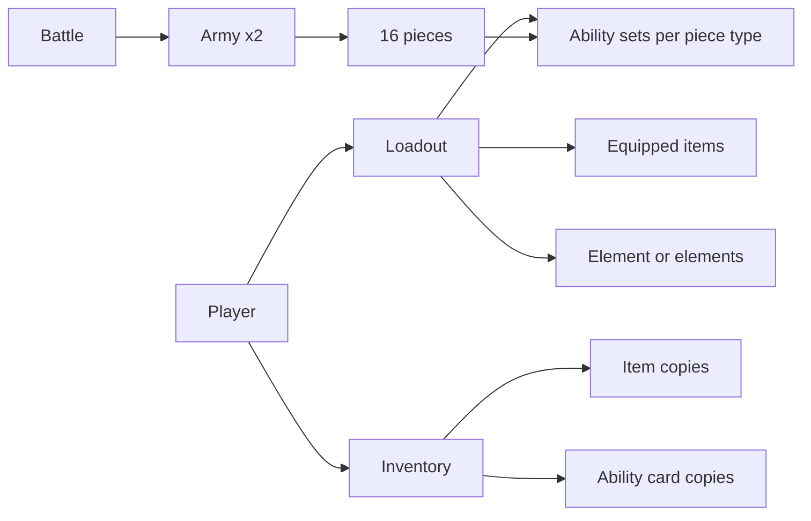
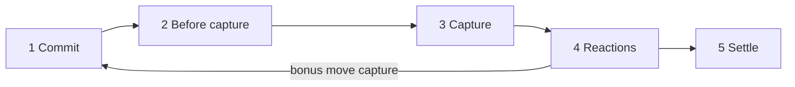
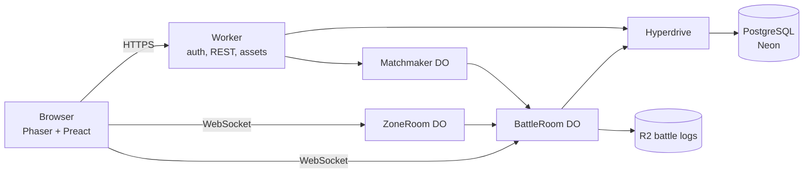
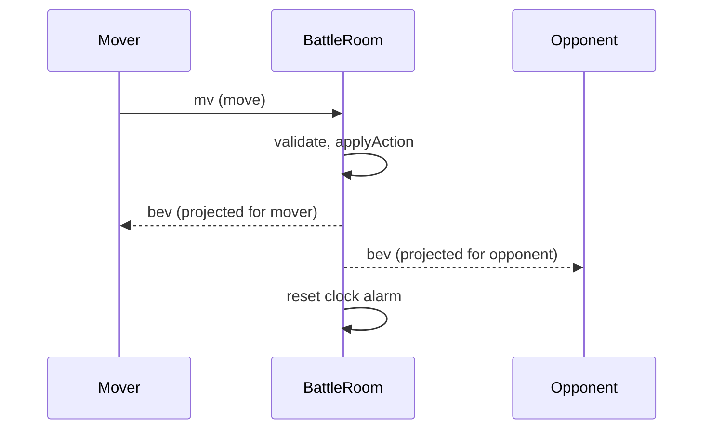

# Chain Theorem — Design Doc & AI Build Spec v0.2

Sep 24, 2026 · William-Andrew Smith

## 0. How to use this doc (read first)

This doc is the single source of truth for building Chain Theorem. Any AI agent implementing it follows the status tags, requirement IDs and precedence rules below, and never silently invents a rule.

| Tag | Meaning | What an agent may do |
| --- | --- | --- |
| COMMITTED | The designer's decision | Implement exactly. Never change without designer approval. |
| PROVISIONAL | Proposed default, not yet confirmed | Implement as specified, behind config or content data so it can change cheaply. |
| PLAYTEST | Mechanic whose balance is unknown | Implement as tunable data and emit telemetry for it. |
| OPEN | Retired: the designer delegated remaining decisions (D-37) | Never create new OPEN items. Choose the best-case option, log it in section 18, and implement it. |

**Requirement IDs** use the form `R-<AREA>-<NNN>` (for example `R-RULES-004`). Areas: CORE, RULES, ABIL, ELEM, LOAD, INFO, FMT, WORLD, ART, TECH, NET, DATA, COST, SEC, TEST. Cite the ID in commit messages, test names and code comments that implement it.

**Precedence when two rules conflict** (highest first):

1. Invariants (marked INVARIANT anywhere in this doc).
2. COMMITTED decisions.
3. Ability or item text over base chess rules (specific beats general).
4. PROVISIONAL defaults.

**Standing instructions for agents**

- The rules engine is pure and deterministic: no clock reads, no unseeded randomness, no I/O. Randomness, if ever used, comes from a seed passed in.
- Abilities, items and elements are content data. Adding a new ability must not require editing the resolver unless it needs a new effect primitive.
- The server never sends an opponent's unrevealed loadout to a client (R-SEC-001).
- Every rule has at least one test named after its requirement ID.
- If something is ambiguous, choose the best-case option that fits the pillars (section 1), log it in section 18 with a one-line reason, and keep building. Never stall waiting for an answer.

## 1. Vision, pillars and scope

Chain Theorem is a lightweight, browser-first MMO where players explore a cute, handheld-era overworld, collect items and ability cards, and fight turn-based battles on a full 8x8 chess board whose pieces are original creatures. The core loop: build a concealed army, then use chess positioning to exploit your build and uncover your opponent's.

**Core fantasy (R-CORE-001, COMMITTED):** Pokémon Gen 2/3-style exploration and vibes, but every battle is chess with 16 pieces per side, bent by capture-triggered abilities, elemental attunement and item synergies.

**Pillars** (use these to break design ties, in this order):

1. **Calculable depth.** Abilities must be deterministic and learnable, so skilled players can calculate exchanges. Surprise comes from hidden loadouts, never from dice.
2. **Chess stays chess.** About 99% of standard chess is binding. Abilities bend specific rules; they never replace the game.
3. **Build, then outplay.** Army construction (items plus ability cards) matters, but in-battle play must be able to overcome a moderate build disadvantage.
4. **Cheap to run, pleasant to play.** Every system is judged against the $4/month profitability target (section 14).
5. **Welcoming to non-chess players.** Onboarding, move previews and short formats must let a strategy player who barely knows chess enjoy the game.

**Audience (R-CORE-002, COMMITTED):** everyone from veteran chess players to strategy players who barely know chess. Design for both: veteran-grade rules precision, novice-grade UI clarity.

**Experience priorities (R-CORE-003, COMMITTED):** competitive battles, exploring and collecting items, and a persistent shared world, all first-class. When they conflict, competitive fairness wins over collection power (PROVISIONAL ordering).

**Non-goals for v1**

- No creature capturing. Creatures are how pieces look, not collectibles (R-CORE-004, COMMITTED).
- No actual Pokémon names, creatures, sprites, music or references (R-CORE-005, COMMITTED).
- No randomness in battle resolution.
- No native mobile app or downloadable client. Browser first, desktop and mobile browsers (R-CORE-006, COMMITTED).
- No player-to-player real-money economy, and no player market or auction house; players trade directly or wager items.

## 2. Decision register

Rows marked COMMITTED are designer decisions and are binding; the rest are proposed defaults an agent implements until the designer changes the status here. Change the Status column as decisions firm up.

| ID | Decision | Status | Section |
| --- | --- | --- | --- |
| D-01 | Audience spans veteran chess players to strategy players who barely know chess | COMMITTED | 1 |
| D-02 | About 99% of chess is binding; abilities bend movement, turn order and win conditions | COMMITTED | 4 |
| D-03 | A capture removes the piece immediately. No health, damage or armour | COMMITTED | 4 |
| D-04 | Ability resolution logic is delegated to this spec (section 5) | COMMITTED | 5 |
| D-05 | Attunement is army-wide unless an item changes it | COMMITTED | 6 |
| D-06 | Blended Family: pawns, knights, bishops take element A; rooks, queen, king take element B | COMMITTED | 6 |
| D-07 | Collectibles are items and ability cards only; no creature capturing | COMMITTED | 7 |
| D-08 | Item slots: 1 at level 1, one more every 5 levels, 6 at level 25; level cap 30 | COMMITTED | 7 |
| D-09 | Abilities are army-wide unless Multitasker's Schedule allows per-piece-type sets | COMMITTED | 7 |
| D-10 | Capacity items: Dual Adept's Glove 2 abilities (1 slot); Triple Adept's Gloves 3 (2 slots); Journeyman's Medallion 4 (3 slots); Headmaster Ring 5 (4 slots) | COMMITTED | 7 |
| D-11 | Before battle, players see only the opponent's element(s), consumed item slots and level, unless an item says otherwise | COMMITTED | 8 |
| D-12 | Full 16-piece army in every battle; smaller-stakes formats such as First Blood | COMMITTED | 9 |
| D-13 | Battle frequency comparable to classic handheld monster games | PLAYTEST | 10 |
| D-14 | Social scope: everything except creature capture (guilds, direct trading, item wagers, tournaments, challenge zones); no player market | COMMITTED | 10 |
| D-15 | $4/month subscription must be highly profitable at every practical scale | COMMITTED | 14 |
| D-16 | Cute handheld-era art and vibes with zero Pokémon IP; cosmetics are earned only | COMMITTED | 11 |
| D-17 | Browser first, on desktop and mobile | COMMITTED | 12 |
| D-18 | Stalwart king: no checkmate, keeps the check alert, can only be captured by a piece | COMMITTED | 4 |
| D-19 | Five-phase deterministic resolution pipeline | COMMITTED | 5 |
| D-20 | Six elements in two triangles (Ember, Tide, Grove; Storm, Stone, Frost); an element's only disadvantage is against its foil | COMMITTED | 6 |
| D-21 | Elemental advantage silences the weaker piece's triggers in that capture (scope tunable, 6.2) | COMMITTED | 6 |
| D-22 | Capacity items never stack; every other item costs 1 slot | COMMITTED | 7 |
| D-23 | Royal Immunity: no king, ordinary or Stalwart, can be removed by an effect capture | COMMITTED | 4 |
| D-24 | Owning one copy of an ability card unlocks it for every use in your loadouts | COMMITTED | 7 |
| D-25 | Stack: TypeScript monorepo on Cloudflare Workers, Durable Objects and R2; PostgreSQL (Neon via Hyperdrive) in production, SQLite in tests | COMMITTED | 12 |
| D-26 | Infrastructure ceiling of $0.40 per paying subscriber per month | COMMITTED | 14 |
| D-27 | Ranked matchmaking brackets by unlocked item slots, then rating | COMMITTED | 9 |
| D-28 | Storm's abilities always trigger first | COMMITTED | 6 |
| D-29 | Element traits: Hot Foot (Ember), Flow (Tide), Overabundance (Grove), Bulwark (Stone), Stillness (Frost) | COMMITTED | 6 |
| D-30 | Items and abilities have level requirements | COMMITTED | 7 |
| D-31 | Items may bend any rule, including pre-battle information (Masquerade Mask, Warden's Stopwatch) | COMMITTED | 7 |
| D-32 | Item wager battles, with both players' consent | COMMITTED | 9 |
| D-33 | Challenge zones: entering one is consent to automatic PvP challenges | COMMITTED | 10 |
| D-34 | A free trial instead of a free tier | COMMITTED | 14 |
| D-35 | Chat is filtered whenever any participant is under 18 | COMMITTED | 15 |
| D-36 | Game title: Chain Theorem | COMMITTED | 1 |
| D-37 | Remaining design decisions are delegated: best-case choices are logged in section 18 and bind like COMMITTED rows | COMMITTED | 18 |
| D-38 | Abilities, items and traits are self-contained modules declaring level requirement and slot cost; adding one needs no engine change | COMMITTED | 13 |
| D-39 | Warden's Stopwatch negates replay and revive abilities for both players | COMMITTED | 7 |
| D-40 | Hot Foot counts the opponent's 3 turns; sliders pass over burning squares; Flow never applies to castling; a square burns only when the Ember piece moves off it | COMMITTED | 6 |

## 3. Glossary and core entities

These terms are used exactly as defined here in code, UI copy and tests.

| Term | Definition |
| --- | --- |
| Army | A player's 16 pieces in a battle: 8 pawns, 2 knights, 2 bishops, 2 rooks, 1 queen, 1 king. |
| Piece type | One of six roles: pawn, knight, bishop, rook, queen, king. |
| Creature | The visual form of a piece, set by its element and piece type. Cosmetic only; never collected. |
| Element | An attunement: Ember, Tide, Grove, Storm, Stone or Frost. Every piece has exactly one. |
| Trait | An element's always-on rule (6.1). Not an ability: uses no slot and is never silenced. |
| Element group | Under Blended Family, group A = pawns, knights, bishops (12 pieces); group B = rooks, queen, king (4 pieces). |
| Ability card | A collectible that unlocks one ability for use in loadouts. |
| Ability | A rule attached to pieces. Has a category: Capturing, Captures, Captured or Passive. |
| Consumable ability | An ability with charges: a fixed number of uses per piece per battle. |
| Ability capacity | Number of abilities each piece type may hold (1 to 5), set by the equipped capacity item. |
| Ability set | The abilities assigned to a piece type. Army-wide by default; per type with Multitasker's Schedule. |
| Item | A collectible equipped into item slots. Changes capacity, elements or other army rules. |
| Item slot | Equipment budget unlocked by level, 1 to 6. Items cost 1 to 4 slots. |
| Consumed slots | Total slot cost of equipped items. Visible to the opponent. |
| Loadout | A saved combination of element(s), items and ability sets. Locked at battle start. |
| Move capture | A capture made by a normal chess move. |
| Effect capture | A removal caused by an ability (for example Poisoned Meat). Counts as a capture for win conditions. |
| Burning square | A square ignited by Ember's Hot Foot; non-Ember pieces cannot move to or capture on it while it burns. |
| Action | One player's committed move plus the full reaction chain it causes. |
| Reaction chain | The ordered sequence of ability activations caused by one action. |
| Silenced | An ability that would trigger but is suppressed by elemental advantage (section 6). |
| Revealed | An opponent ability or item whose identity is now public for the rest of the battle. |
| Royal defeat | A king is captured, checkmated, or its owner resigns or times out. |

**Entity relationships**



A loadout references inventory items; at battle start it is snapshotted so later inventory changes cannot affect a running battle.

## 4. Battle rules: chess baseline and deviations

The FIDE Laws of Chess govern everything (movement, castling, en passant, promotion, check, checkmate, stalemate) unless this section or an ability's text says otherwise ([FIDE Laws of Chess](https://handbook.fide.com/chapter/E012023)).

### 4.1 Invariants

- **INV-01** One action per turn. An ability may grant at most one bonus action inside an action; bonus actions cannot grant further bonus actions.
- **INV-02** An ordinary king is never captured. It loses only to checkmate, resignation, timeout or abandonment.
- **INV-03** An action may never leave the acting player's own ordinary king in check. Moves follow standard legality. Any ability effect, from either side, that would leave the acting player's ordinary king in check fizzles when it tries to resolve.
- **INV-04** Every action resolves to exactly one resulting state (determinism).
- **INV-05** A captured piece leaves the board immediately in the Capture phase (D-03).
- **INV-06** A committed action is spent. Hidden opponent abilities can change its outcome but never make it illegal or retractable.
- **INV-07** No king, ordinary or Stalwart, is ever removed by an effect capture (Royal Immunity, D-23).

### 4.2 Standard rules kept (R-RULES-001, COMMITTED)

Standard starting position, alternating single moves, all normal piece movement, castling, en passant, promotion, check and checkmate. White is assigned by the server (random in casual play, alternating in ranked). En passant is a move capture and triggers abilities normally. Castling is not a capture and triggers nothing.

**Promotion (R-RULES-002, PROVISIONAL):** a promoted piece adopts everything from its new type: that type's ability set and, under Blended Family, that type's element. A pawn promoting to a queen therefore joins group B. Chess promotion is not creature evolution; there is no permanent evolution in v1.

### 4.3 Stalwart king (R-RULES-003, behaviour COMMITTED, legality PROVISIONAL)

- A Stalwart king cannot be checkmated but still triggers the check alert.
- Its owner may leave it in check, move it into attacked squares, and castle through or into attacked squares.
- It keeps Royal Immunity: only a piece capturing it with a move can take it, never an effect.
- Its capture ends the battle after the current reaction chain finishes resolving.
- If its owner has no legal move at all, that is stalemate (draw).
- Stalwart has no effect on non-king pieces, so an army-wide Stalwart is legal but only matters for the king.

### 4.4 Royal Immunity (R-RULES-004, COMMITTED)

No king can be targeted or removed by an effect capture, Stalwart kings included. Example: a king captures a pawn with Poisoned Meat; the retaliation fizzles and the king survives. A Stalwart king therefore falls only to a piece that captures it.

### 4.5 Win, loss and draw (R-RULES-005, PROVISIONAL)

| Outcome | Condition |
| --- | --- |
| Win | Checkmate an ordinary king |
| Win | Capture a Stalwart king with a piece (move capture only) |
| Win | Opponent resigns, runs out of time, or abandons (disconnect beyond grace, section 9) |
| Draw | Stalemate |
| Draw | Threefold repetition of the full engine state (board, side to move, castling and en passant rights, revealed info, ability usage counters) |
| Draw | 50 moves each with no capture of any kind and no pawn move |
| Draw | Mutual agreement |
| Draw | Both kings defeated within the same reaction chain |

Timeout is always a loss; the FIDE insufficient-material exception is disabled because revive abilities make material counts unreliable. Insufficient-material auto-draws are disabled for the same reason.

**Royal defeat precedence:** if a reaction chain contains a royal defeat, it outranks any format objective such as First Blood (section 9).

## 5. Ability system and resolution engine

Every action runs through one deterministic five-phase pipeline, and abilities are data composed from a small set of effect primitives. The designer's three trigger moments (capturing, captures, is captured) are COMMITTED; everything below that formalises them is binding (D-19, D-37) unless marked PLAYTEST.

### 5.1 Categories (R-ABIL-001)

| Category | UI label | Owner | When it fires |
| --- | --- | --- | --- |
| CAPTURING | When capturing | Captor | After the move is committed, before the victim is removed |
| CAPTURES | After capturing | Captor | After the victim is removed |
| CAPTURED | When captured | Victim | After it is removed |
| PASSIVE | Always | Any | Continuously modifies a rule (for example Stalwart) |

Defenders can never prevent a capture; this keeps D-03 true. Defensive play comes from CAPTURED effects and from the captor's side negating them. Keep PASSIVE abilities rare: the game's identity is capture-triggered.

### 5.2 Effect primitives (R-ABIL-002)

Abilities are built only from these primitives. A new primitive is an engine change; a new ability is a content change.

| Primitive | Does |
| --- | --- |
| EFFECT_CAPTURE(target) | Removes a piece as an effect capture |
| NEGATE(filter) | Cancels queued or future triggers matching the filter within this action |
| PROTECT(target, filter) | Makes matching effects against the target fizzle within this action |
| MOVE(piece, square) | Relocates a piece without capturing |
| REVIVE(pieceId, square) | Returns a captured piece to the board |
| BONUS_ACTION(constraints) | Grants one extra move inside the current action (INV-01) |
| REVEAL(target) | Makes abilities or items public |
| MODIFY_RULE(ruleId, params) | Passive rule change |

Target selectors: SELF, CAPTOR, VICTIM, CHOSEN(filter). When an ability needs a choice, its owner chooses.

### 5.3 The pipeline (R-ABIL-003)



A bonus action that is itself a move capture runs a nested pipeline, up to a maximum depth of 3 (tunable).

1. **Commit.** Validate the move against public rules and the mover's own abilities. Lock it. The mover makes any choices their own CAPTURING abilities need.
2. **Before capture.** Resolve the captor's CAPTURING abilities in loadout order. Apply elemental silence (section 6).
3. **Capture.** Atomically remove the victim and move the captor to its destination.
4. **Reactions.** Queue the victim's CAPTURED abilities, then the captor's CAPTURES abilities (Storm's Always First trait moves Storm abilities to the front). Resolve the queue first-in first-out. Each activation resolves fully before the next.
5. **Settle.** Check royal defeat, check and checkmate, format objectives and draw counters, then pass the turn.

### 5.4 Resolution rules (R-ABIL-004)

- **Earned triggers persist.** A trigger is queued the moment its event happens and stays queued even if its source is later removed.
- **Self-acting effects fizzle without a body.** An effect that moves or protects its own piece fizzles if that piece is off the board. Effects measured from a square use the piece's last known square.
- **Effect captures do not chain by default.** An effect capture never triggers CAPTURES or CAPTURED abilities.
- **Activation limits.** Each ability instance on each piece fires at most once per action, nested actions included. Charges (uses per piece per battle) live in the ability's data; an ability with charges is consumable. A revived piece keeps its identity and usage counters.
- **Ordering.** Same piece: the owner's loadout order (a real choice players make). Same side, several pieces: square order a1 to h8 from the owner's side. Across sides: victim's side first unless a trait says otherwise.
- **Mid-action choices.** If an opponent's ability needs a choice during your action, the chooser gets a prompt of 15 seconds charged to their own clock. No answer means the first valid option in square order.
- **INV-03 check.** Before any effect resolves, the engine simulates it; if it would leave the acting player's ordinary king in check, it fizzles.

### 5.5 Worked examples (each becomes a golden test)

| # | Setup | Result |
| --- | --- | --- |
| E1 | Knight with Hit and Run captures a pawn with Poisoned Meat (neutral elements) | Pawn removed. Poisoned Meat removes the knight. Hit and Run fizzles (no body). Both gone. |
| E2 | As E1, but the knight also has Pierce | Pierce negates Poisoned Meat (revealed as negated). Knight returns to its origin square. |
| E3 | A king (ordinary or Stalwart) captures a Poisoned Meat pawn | Royal Immunity: retaliation fizzles, ability revealed, king survives. |
| E4 | First Blood: queen captures a Poisoned Meat pawn | Poisoned Meat removes the queen: the first non-pawn capture belongs to the pawn's owner, who wins after the chain settles. |
| E5 | White rook on e2 shields king e1 from a black queen on e8 and captures a Poisoned Meat pawn on e5 | Removing the rook would expose the white king, so Poisoned Meat fizzles (INV-03). |
| E6 | Bishop captures a knight with Riposte | Knight's owner picks a piece that can legally capture the bishop; that capture runs a nested pipeline at depth 1. |
| E7 | Ember knight captures on e5; two turns later it moves to f3 | Hot Foot: e5 ignites. Until the opponent has taken 3 turns, no non-Ember piece may move to or capture on e5; a non-Ember rook may still slide over it. |
| E8 | Tide rook on a1, its own pawn on a2, a3–a7 empty, enemy king on a8 | Flow: the rook's line passes through its own pawn, so the enemy king is in check. The rook may also move from a1 to a5 through the pawn. |
| E9 | Grove bishop with Rebirth is captured three times in one battle | Overabundance: Rebirth has 2 charges on a Grove piece, so the bishop returns twice (each time its starting square is empty); the third capture removes it for good. |

### 5.6 Ability data schema (R-ABIL-005)

```ts
type PieceType = 'pawn' | 'knight' | 'bishop' | 'rook' | 'queen' | 'king';
type Category = 'CAPTURING' | 'CAPTURES' | 'CAPTURED' | 'PASSIVE';
type ElementId = 'ember' | 'tide' | 'grove' | 'storm' | 'stone' | 'frost' | 'neutral';
type AbilityTag = 'replay' | 'revive';  // hooks for items such as Warden's Stopwatch

interface AbilityDef {
  id: string;                    // 'poisoned_meat'; unique, never reused
  name: string;
  version: number;               // bump when behaviour changes
  category: Category;
  affinity: ElementId;           // matching bearer element unlocks `attuned`
  eligible: PieceType[] | 'all';
  tags: AbilityTag[];            // 'replay' = grants a bonus move; 'revive' = returns a captured piece
  minLevel: number;              // level requirement, 1 to LEVEL_CAP
  slotCost: number;              // ability slots used, 1 to MAX_ABILITY_CAPACITY (starter set: 1)
  limits: { perAction: 1; charges?: number };  // charges = uses per piece per battle; set means consumable
  conditions?: Condition[];      // e.g. { victimTypeNot: 'pawn' }
  choice?: ChoiceSpec;           // who chooses and from what
  effects: EffectSpec[];         // ordered primitives from 5.2
  attuned?: { effects: EffectSpec[]; mode: 'replace' | 'append' };
  text: { short: string; rules: string };
  status: 'COMMITTED' | 'PROVISIONAL' | 'PLAYTEST';
  retired?: boolean;             // shipped ids are retired, never deleted
}

interface ItemDef {
  id: string;                    // 'wardens_stopwatch'
  name: string;
  version: number;
  slotCost: 1 | 2 | 3 | 4;       // 1 for every item that is not a capacity item
  minLevel: number;              // level requirement, 1 to LEVEL_CAP
  capacity?: 2 | 3 | 4 | 5;      // capacity items only
  exclusiveGroup?: string;       // 'capacity': at most one equipped item per group
  hooks: Partial<RuleHooks>;     // pure functions, see 13.5
  status: 'COMMITTED' | 'PROVISIONAL' | 'PLAYTEST';
  retired?: boolean;
}
```

### 5.7 Starter ability catalogue (PLAYTEST)

Fourteen abilities for the first prototype, spread across all categories and the first three elements. Momentum and Riposte carry the replay tag; Reinforce and Rebirth carry the revive tag. Rebirth, Reinforce and Momentum are consumable; their charge counts are PLAYTEST. Every starter ability costs 1 ability slot; Lvl is its level requirement (PLAYTEST values).

| ID | Category | Affinity | Eligible | Lvl | Effect | Attuned bonus |
| --- | --- | --- | --- | --- | --- | --- |
| scout | Capturing | Tide | All | 1 | Reveal the victim's abilities before they resolve | Also reveal the opponent's highest-cost item |
| hit_and_run | Captures | Tide | Non-king | 1 | Return to the square it moved from, if empty | May instead land on any empty square adjacent to it |
| last_word | Captured | Tide | All | 1 | Reveal all abilities of the captor's piece type | Also reveal the opponent's item names |
| poisoned_meat | Captured | Grove | All | 2 | Effect-capture the captor | If the captor survives, reveal all its abilities |
| pierce | Capturing | Tide | All | 3 | Negate the victim's Captured abilities for this capture | Also reveal all abilities of the victim's piece type |
| backdraft | Captured | Ember | All | 4 | Effect-capture one enemy pawn adjacent to this square, other than the captor | May target an adjacent knight or bishop instead |
| antidote | Capturing | Grove | All | 5 | The first effect capture targeting this piece this action fizzles | Every effect capture targeting it this action fizzles |
| cleave | Captures | Ember | All | 6 | Effect-capture one enemy pawn diagonally adjacent to the landing square | May pick an orthogonally adjacent pawn instead |
| momentum | Captures | Ember | Non-king | 8 | Bonus action: this piece makes one non-capturing move (2 charges) | The bonus move may be made by any friendly pawn instead |
| reinforce | Captures | Grove | All | 10 | If the victim was not a pawn, revive your most recently captured pawn on its starting square (1 charge) | Triggers on any victim |
| riposte | Captured | Ember | All | 12 | Bonus action for the owner: capture the captor with any piece that legally can | If none can, and the captor is a pawn, effect-capture it |
| rebirth | Captured | Grove | Non-king | 14 | At chain end, return to its starting square if empty (1 charge) | May return to any empty back-rank square |
| stalwart | Passive | Neutral | King | 16 | Section 4.3 | None |
| veil | Passive | Neutral | All | 18 | This piece's abilities are not named when they activate; only the effect is shown | None |

## 6. Elements and attunement

Six elements form two rock-paper-scissors triangles: Ember beats Grove beats Tide beats Ember, and Storm beats Frost beats Stone beats Storm. Each element has one always-on trait, and its only disadvantage is against its foil (the element that beats it), which silences its abilities in a capture. Because captures always remove pieces (D-03), elements act on the ability layer rather than on damage.

### 6.1 Element identities (R-ELEM-001, COMMITTED)

The first triangle maps onto the three trigger categories; the second covers tempo, protection and control. Every trait is a pure advantage that works in every matchup (D-28, D-29).

| Element | Beats | Foil (loses to) | Specialty | Trait (always on) |
| --- | --- | --- | --- | --- |
| Ember | Grove | Tide | Captures (aggression, area denial) | **Hot Foot:** after an Ember piece captures, the capture square burns once that piece moves off it; for 3 turns no non-Ember piece can enter it |
| Tide | Ember | Grove | Capturing (finesse, mobility) | **Flow:** Tide pieces may move through their own side's pieces |
| Grove | Tide | Ember | Captured (legacy, endurance) | **Overabundance:** every consumable ability on a Grove piece has double the charges |
| Storm | Frost | Stone | Tempo (bonus moves) | **Always First:** your Storm pieces' abilities resolve before every other ability in the same queue |
| Stone | Storm | Frost | Protection | **Bulwark:** the first effect capture targeting each of your Stone pieces each battle fizzles |
| Frost | Stone | Storm | Control | **Stillness:** a piece that captures your Frost piece has its Captures abilities negated for that capture |

Traits are not abilities: they use no slots, silence never switches them off, and they apply per piece, so they work unchanged under Blended Family. If both sides have Storm triggers in the same queue, the default order (5.4) applies among them.

**Hot Foot rules (R-ELEM-005, COMMITTED)**

- Only a move capture by an Ember piece starts it. The square the piece lands on becomes a pending burn tied to that piece.
- When that piece leaves the square for any reason other than being captured, the square ignites. Hit and Run ignites it immediately. Being captured on the square does not ignite it.
- While it burns, no non-Ember piece from either side may move to or capture on the square. Ember pieces of both sides use it normally. Sliding pieces may still pass over it.
- An Ember piece standing on a burning square cannot be move-captured by a non-Ember piece, so an Ember king there cannot be checked by non-Ember pieces. Effect captures still reach it, Royal Immunity aside.
- An effect cannot place a non-Ember piece on a burning square; it fizzles instead.
- The square burns until the igniting player's opponent has taken 3 turns. Igniting a burning square again resets the count.
- Burning squares are public game state, drawn on the board and included in the repetition hash.

**Flow rules (R-ELEM-006, COMMITTED)**

- A Tide piece treats squares held by its own side's pieces as empty while moving or attacking through them, but cannot end a move on one.
- Flow affects sliding moves and a pawn's two-square first move. Knights and single king steps are unaffected, and castling is unchanged.
- Attacks pass through allies too: a Tide rook behind its own pawn attacks, and can give check, along that file.

**Overabundance rules (R-ELEM-007, COMMITTED)**

- A consumable ability is one with charges (5.6). Abilities without charges are unaffected.
- A Grove piece starts each battle with double the charges of every consumable ability it carries.
- Charges persist through revival (5.4), so a Grove piece with Rebirth can return twice.

### 6.2 Advantage: the silence rule (R-ELEM-002, COMMITTED; scope tunable)

In any capture between two pieces where one element beats the other, the disadvantaged piece's triggered abilities do not fire for that capture.

- Disadvantaged captor: its Capturing and Captures abilities are silenced.
- Disadvantaged victim: its Captured abilities are silenced.
- Same element, or elements from different triangles: nothing is silenced.
- Silence never affects Passive abilities, traits or chess movement.
- A silenced ability is revealed by name (section 8).
- For an effect capture, the "captor" is the piece whose ability caused it.

| Captor and victim | Silenced |
| --- | --- |
| Captor's element beats the victim's | The victim's Captured abilities |
| Victim's element beats the captor's | The captor's Capturing and Captures abilities |
| Same element, or different triangles | Nothing |

**Tuning knob** `silenceScope`: `ALL_TRIGGERS` (default) silences every trigger of the weaker piece; `REACTIONS_ONLY` spares Capturing abilities; `OFF` disables advantage for testing. If disadvantaged players lose too often, test `REACTIONS_ONLY` first.

**Why this design:** an element's only weakness is its foil, and the answer to a bad matchup is army building. A Tide army facing Grove cannot count on Pierce carried by its own Tide pieces, because Grove silences them; it uses Blended Family to carry Pierce on a second element's pieces instead. That is the "abilities mitigate innate weaknesses" loop the designer asked for.

### 6.3 Attuned bonus (R-ELEM-003, COMMITTED)

An ability whose affinity matches its bearer's element uses its Attuned version (section 5.7). Neutral abilities have none. Players choose between stronger on-element cards and off-element cards that cover weaknesses.

### 6.4 Blended Family (R-ELEM-004, COMMITTED)

- The two elements must differ.
- Group A (pawns, knights, bishops: 12 pieces) takes element A; group B (rooks, queen, king: 4 pieces) takes element B.
- Silence, traits and attunement are computed per piece.
- A promoted pawn joins its new type's group (R-RULES-002).
- The opponent sees both elements and which group holds each.

Balance note: the split is by piece type, not piece count. Group A takes most early exchanges; group B holds the heavy pieces and the king.

### 6.5 Rollout (COMMITTED)

The engine and content schemas support all six elements from M2. MVP content ships Ember, Tide and Grove; Storm, Stone and Frost follow in M7, each with six creatures (36 in total) and at least four affinity abilities.

## 7. Items, ability cards, loadouts and progression

Army building is a six-slot budget problem: capacity items buy more abilities per piece, and every slot spent on capacity is a slot not spent on elements, per-type sets or utility. The maximum build (Headmaster Ring + Multitasker's Schedule + Blended Family) fills all 6 slots and allows 30 ability selections across two elements.

### 7.1 Item slots by level (R-LOAD-001, COMMITTED)

Formula: `slots = min(6, 1 + floor(level / 5))`. The level cap is 30.

| Level | 1–4 | 5–9 | 10–14 | 15–19 | 20–24 | 25–30 |
| --- | --- | --- | --- | --- | --- | --- |
| Item slots | 1 | 2 | 3 | 4 | 5 | 6 |

Levels 25–30 add no slots; progress there comes from items with level requirements (7.2). Keep the formula and every level requirement in config.

### 7.2 Item catalogue (R-LOAD-002)

| Item | Slot cost | Min level | Effect | Status |
| --- | --- | --- | --- | --- |
| Dual Adept's Glove | 1 | 1 | Ability capacity 2 | COMMITTED; level PLAYTEST |
| Triple Adept's Gloves | 2 | 5 | Ability capacity 3 | COMMITTED; level PLAYTEST |
| Journeyman's Medallion | 3 | 12 | Ability capacity 4 | COMMITTED; level PLAYTEST |
| Headmaster Ring | 4 | 20 | Ability capacity 5 | COMMITTED; level PLAYTEST |
| Multitasker's Schedule | 1 | 10 | A separate ability set for each of the six piece types | COMMITTED; level PLAYTEST |
| Blended Family | 1 | 15 | Two elements split by group (6.4) | COMMITTED; level PLAYTEST |
| Warden's Stopwatch | 1 | 18 | Negates every replay and revive ability, for both players, for the whole battle | COMMITTED; level PLAYTEST |
| Masquerade Mask | 1 | 14 | Opponent sees an element you choose until your first silence event | PLAYTEST |
| Resonance Crystal | 1 | 6 | The first time one of your pieces would be silenced this battle, it is not | PLAYTEST |
| Attunement Charm (per element) | 1 | 4 | Abilities of that affinity count as Attuned on all your pieces | PLAYTEST |
| Scout's Lens | 1 | 3 | At battle start, reveal the first ability in the opponent's pawn set | PLAYTEST |

Capacity N costs N − 1 slots, and capacity items never stack. Every other item costs 1 slot. Without a capacity item, capacity is 1. Min levels are PLAYTEST values tuned from telemetry; with them, the Maximum build below arrives at level 25.

### 7.3 Ability sets (R-LOAD-003)

- Without Multitasker's Schedule: one set of up to capacity abilities, applied to all six piece types.
- With it: six sets, one per type, each up to capacity. The same ability may appear in several sets.
- An ability that is ineligible for a type (for example Stalwart on a pawn) does nothing there but still uses the slot.
- No duplicates inside one set. The order within a set is the resolution order (5.4).

| Build | Items | Slots used | Result |
| --- | --- | --- | --- |
| Maximum | Headmaster Ring, Schedule, Blended Family | 6 | 30 selections, two elements, no utility |
| Flexible | Journeyman's Medallion, Schedule, Blended Family, one utility | 6 | 24 selections, two elements, one utility |
| Focused | Headmaster Ring, two utilities | 6 | 5 army-wide abilities, one element |
| Starter | Dual Adept's Glove | 1 | 2 army-wide abilities |

The item catalogue must keep the Flexible and Focused builds competitive with Maximum; that is the core balance target for items.

### 7.4 Loadout validation (R-LOAD-004, INVARIANT at battle start)

1. Total item slot cost ≤ unlocked item slots for the player's level.
2. Every equipped item's and ability's level requirement ≤ the player's level.
3. At most one item per exclusive group (so at most one capacity item), and no item equipped twice.
4. In every ability set, total ability slot cost ≤ capacity, with no duplicates.
5. Set count is 1, or 6 with Multitasker's Schedule.
6. Blended Family requires two different elements.
7. Every equipped item and ability is owned and not retired.

Every limit above comes from the caps config and module data (13.5); none is hard-coded.

The server snapshots the validated loadout at battle start; later inventory changes cannot touch a running battle. Players keep up to 5 saved loadouts (PROVISIONAL).

### 7.5 Collection and progression (R-LOAD-005, PROVISIONAL)

- Owning one copy of an ability card unlocks it everywhere (D-24). Extra copies are tradeable.
- Sources: NPC trainer rewards, wild-encounter drops, quests, exploration finds, tournaments, shops using soft currency, direct player trading and wager winnings.
- Battles never cost collection except through an agreed item wager (9.5). All pieces return after every battle; other stakes are XP, rating and rewards.
- XP comes from battles (weighted by format and result), quests and discoveries. Level cap 30.
- Items and cards are never sold for real money; the subscription covers access to everything that affects play.

## 8. Hidden information and reveals

Players start each battle knowing only the opponent's level, element(s) and consumed item slots, then learn the rest by watching abilities fire. Probing (sacrificing something cheap to see what happens) is intended strategy.

### 8.1 Visible before battle (R-INFO-001, COMMITTED)

| Visible | Hidden |
| --- | --- |
| Level | Item names and item count |
| Element, or both elements plus which group holds each | Abilities and their order |
| Consumed item slots as a total (for example 5 of 6) | Whether Multitasker's Schedule is equipped |

Showing two elements unavoidably reveals that Blended Family is equipped. That is accepted. Items may override this table (D-31); Masquerade Mask, for example, shows a false element.

### 8.2 Reveal rules (R-INFO-002, PROVISIONAL)

- An ability is revealed, together with the piece type it was seen on, when it activates, is silenced, is negated or fizzles.
- A passive is revealed the first time its rule difference is observable (a Stalwart king moving into check).
- An item is revealed when its effect is observable or when a REVEAL effect names it.
- Veil is the one exception: the opponent sees the board effect but not the ability name.
- Reveals last for the rest of the battle. The full ability and item catalogue is public outside battles.

### 8.3 The Dossier panel (R-INFO-003, PROVISIONAL)

Each player has a panel listing known opponent abilities by piece type, known items, and deductions the engine can prove from public facts. Example: 1 slot consumed and two abilities seen on pawns means Dual Adept's Glove and no Schedule. Deduction hints help newcomers; players can hide them.

### 8.4 Move previews (R-INFO-004, PROVISIONAL)

The client previews a move's consequences using only its own loadout and revealed opponent information, and marks unknowns with a "?". Previews never ask the server anything. After commit the move is spent even if a hidden ability changes the outcome (INV-06).

### 8.5 Server information contract (R-INFO-005, INVARIANT)

- The server holds full state and sends each player a projection: `projectFor(playerId, state)`.
- A projection contains the whole board and only revealed opponent loadout data.
- Events are projected too: an unrevealed ability's activation is sent as its board effect plus an ability id only once revealed.
- Telemetry tracks "surprise losses" (battles decided by an ability the loser never saw). If that rate is high, add more reveal tools before adding more hidden power.

## 9. Battle formats, clocks and matchmaking

Every format uses the full 16-piece army (COMMITTED); formats differ only in objective, clock and stakes, so frequent wild encounters stay short.

### 9.1 Formats (R-FMT-001)

| Format | Objective | Used for | Clock | Target length | Status |
| --- | --- | --- | --- | --- | --- |
| First Blood | First to capture any non-pawn piece (move or effect capture) wins; royal defeat still wins | Wild encounters, casual PvP | 3 min + 2 s | 2–5 min | Objective COMMITTED, clock PROVISIONAL |
| Vanguard | First to capture three non-pawn pieces, or royal defeat | Mid-stakes NPCs, quick ranked | 5 min + 3 s | 5–10 min | PROVISIONAL |
| Full Battle | Standard win conditions (4.5) | Trainer-style NPCs, ranked, tournaments | 10 min + 5 s | 10–25 min | PROVISIONAL |
| Correspondence | Full Battle at 24 h per move | Guild wars, async play | 24 h per move | Days | Later milestone |

**Objective adjudication (R-FMT-002):** record qualifying captures in reaction-chain order, finish the whole chain, then adjudicate. Royal defeat in the same chain outranks the format objective. Chains are sequential, so the earliest qualifying capture is always unique.

### 9.2 Clocks and conduct (R-FMT-003, PROVISIONAL)

- Fischer increment. The server owns the clock using timestamps; no ticking loop runs.
- A mid-action choice prompt (5.4) is charged to the chooser's clock.
- Disconnect grace is 60 seconds while the clock keeps running. Past grace, or on flag fall, the battle is lost.
- Resign, draw offer (at most one per 10 moves) and rematch are always available.

### 9.3 Matchmaking (R-FMT-004, PROVISIONAL)

- Ranked brackets use **unlocked** item slots (level), never consumed slots, so unequipping items cannot sandbag: brackets 1–2, 3–4 and 5–6 slots.
- Rating: Glicko-2, tracked per bracket and per format.
- Unranked queues match within ±5 levels.
- Outside challenge zones, PvP requires consent (a challenge the other player accepts); entering a challenge zone is consent (10.4).

### 9.4 NPC opponents (R-FMT-005, PROVISIONAL)

| Tier | Search | Loadout | Used for |
| --- | --- | --- | --- |
| Wild | Depth 2 plus heuristics | 1–2 abilities | Wild encounters |
| Trainer | Depth 3, ability-aware evaluation | Themed builds | Route trainers, quests |
| Elite | Depth 4, ability-aware evaluation | Full builds | Gym-style bosses, events |

- NPCs run server-side with a CPU budget of about 50 ms per move (tunable).
- NPCs see only their own projection of the battle; they never read hidden player data.
- NPC loadouts are content data and follow the same reveal rules as players.

### 9.5 Item wagers (R-FMT-006, COMMITTED)

- PvP only: never in ranked queues, never against NPCs, never from trial accounts.
- Both players offer items or ability cards and both confirm; any change resets both confirmations. Stakes are visible to both players, but a stake never reveals whether that item is equipped.
- At battle start the stakes move into server escrow; the loadout snapshot still uses a staked item in this battle.
- The winner receives both stakes in one database transaction. A draw returns them. Abandonment is a loss.
- Wagers need both players' explicit consent, even inside challenge zones.
- Items must stay impossible to buy or cash out for real money (14.4); real-money value would raise gambling-law questions.

## 10. Overworld, encounters and social systems

The overworld is a tile-based, handheld-era map shared by many players, where movement is sent as tile steps rather than continuous positions, which keeps bandwidth and server cost tiny. Everything social is in scope except creature capture (COMMITTED); it ships in phases.

### 10.1 Overworld (R-WORLD-001, PROVISIONAL)

- 16x16 px tiles, four-direction grid movement, maps authored in Tiled and exported as JSON.
- The world is split into zones (towns, routes, wild patches, interiors). A zone instance shows at most 60 players; overflow opens a parallel channel of the same zone.
- The client sends step intents at most 8 per second; the server checks collisions and broadcasts compact step events to the zone.
- A player in battle stays on their tile with a "battling" marker.

### 10.2 Encounters (R-WORLD-002, PLAYTEST)

- Wild patches (the tall-grass equivalent) roll an encounter per step on the server using a per-zone rate; the client never decides encounters.
- Wild encounters default to First Blood against a Wild-tier NPC.
- Pacing target: a 30-minute session holds about 4–6 First Blood encounters and 1 longer battle. Tune rates per zone.
- Paths avoid wild patches, so players control how often they fight. A key item (not using item slots) can lower the rate. Key items are a separate inventory category from battle items.

### 10.3 Onboarding for non-chess players (R-WORLD-003, PROVISIONAL)

The starting town is a Chess Academy quest line: piece movement puzzles, check and checkmate, then one ability at a time, then elements. Move highlighting and optional "this square is attacked" hints stay on for new players until they turn them off. Veterans can skip the chess lessons but not the ability lessons.

### 10.4 Social systems (R-WORLD-004)

| System | Scope | Milestone |
| --- | --- | --- |
| Chat | Zone, party, guild and whisper channels; rate-limited; filtered by youngest participant (R-SEC-011) | M5 |
| Friends and parties | Friend list, presence, party travel | M5 |
| PvP challenges | Consent-based challenges anywhere; automatic challenges inside challenge zones | M5 |
| Trading | Direct trades of items and ability cards, two-step confirm, one atomic database transaction | M6 |
| Item wager battles | PvP battles with escrowed stakes (9.5) | M6 |
| Guilds | Membership, ranks, guild chat, guild leaderboard | M6 |
| Leaderboards | Per bracket and per format | M6 |
| Tournaments | Scheduled Swiss and single-elimination events per bracket | M7 |
| Spectating | Delayed, public-projection-only view of live battles | M7 |
| Guild territory or wars | Not yet (designer's call) | Later |

There is no player market or auction house (COMMITTED); players trade directly or wager.

**Trading rules:** any change to either side of a trade resets both confirmations. Trading away an item used in a saved loadout marks that loadout invalid until fixed. Trades are logged for support and fraud review.

**Challenge zones (R-WORLD-006, COMMITTED):** marked areas where entering is consent to be challenged without accepting. A banner shows on entry, and leaving ends consent. Inside, a player can start a battle with anyone in the same slot bracket (9.3), in the zone's format (First Blood). No one can be challenged while in a battle or for 60 seconds after one, and wagers still need both players' consent (9.5).

### 10.5 Quests (R-WORLD-005, PROVISIONAL)

Quests are data files with step types: talk, reach location, defeat a named NPC, win a battle under a constraint (for example "win using only Tide abilities"). Rewards are XP, items, ability cards and soft currency.

## 11. Art direction and presentation

The look is cute, rounded, handheld-era pixel art with entirely original creatures; on the battle board, readability beats spectacle. Placeholder art (coloured shapes plus chess glyphs) is used until milestone M4.

### 11.1 Style (R-ART-001)

- Pixel art with a limited, GBA-era palette, nearest-neighbour integer scaling, and a 16x16 overworld tile grid.
- MVP roster: 18 creatures (3 elements x 6 piece types), rising to 36 with Storm, Stone and Frost. Cosmetic variants are earned in play only, never sold. Each needs a front sprite, a back sprite, a 2-frame idle and a faint frame. Capture and ability effects are shared VFX.
- Silhouettes follow piece type across all elements: pawns small, knights leaping beasts, bishops slender casters, rooks sturdy and blocky, the queen large and regal, the king crowned. A player should identify a piece's type from its outline alone.
- Original chiptune music and sound in Opus or OGG, lazy-loaded per zone.

### 11.2 Board readability (R-ART-002, INVARIANT)

Across all 32 pieces a player must read role, owner, element and status at a glance.

| Information | How it is shown |
| --- | --- |
| Role | Silhouette plus a small chess glyph badge in the square corner |
| Owner | Your pieces show back sprites, opponent pieces front sprites, plus a coloured base ring |
| Element | Element icon on the base ring plus a tint |
| Revealed abilities | Small pips under the piece; tap or hover for details |
| Charges | Remaining uses shown as pips on the ability's detail card |
| Burning square | Flame overlay with the number of opponent turns left |
| Check | The king's square pulses; the same alert shows for Stalwart kings |

- A Classic View toggle replaces creatures with standard chess glyphs for veterans.
- Animations are skippable, and a fast mode resolves reaction chains in under 1 second.
- Every reaction chain is replayable step by step with a plain-language log line per step.
- Colour is never the only signal: every colour cue has an icon or shape partner. Support reduced motion and text scaling.

### 11.3 IP guardrails (R-ART-003, COMMITTED)

No Pokémon names, creature designs, sprites, UI chrome, fonts, sounds, item look-alikes (no capture-ball shapes) or type names. Element names are original (Ember, Tide, Grove). Every asset needs a recorded source and licence in `assets/LICENSES.md`.

### 11.4 Asset budget (R-ART-004, PROVISIONAL)

| Asset | Budget (compressed) |
| --- | --- |
| First load, to the title screen | 2 MB |
| First playable, tutorial town | 5 MB total |
| Each additional zone (tiles, NPCs, music) | 500 KB |
| All 18 creature sprite sheets | 400 KB |

## 12. Technical stack

Chosen stack (D-25, COMMITTED): TypeScript everywhere, Phaser 4 in the browser, and Cloudflare Workers plus Durable Objects on the server, with one shared rules engine that runs in both places. Production data lives in PostgreSQL; tests run on SQLite through the same query layer. One language means the move preview and the authoritative server can never disagree about the rules.

### 12.1 Stack table (R-TECH-001)

| Layer | Choice | Version policy | Why |
| --- | --- | --- | --- |
| Language | TypeScript, `strict: true` | 5.x, pinned | One language for client, server, rules and tools |
| Monorepo | pnpm workspaces | Latest stable, lockfile committed | Shared packages, simple for agents |
| Build | Vite | Latest stable | Fast dev server, small builds |
| Game rendering | [Phaser 4](https://phaser.io/download/release/v4.2.0) | 4.2.x, pin at project start | Mature 2D engine; Tiled maps, sprites, scenes. Stable since April 2026 |
| Menus and HUD | Preact + Signals, DOM overlay above the canvas | Latest stable | Accessible, text-heavy UI (Dossier, loadouts, chat) stays out of the canvas |
| Rules engine | `@chain-theorem/rules`, pure TS, zero runtime dependencies | Internal | Runs in the browser for previews and in Durable Objects for authority |
| Content modules | `@chain-theorem/content`: one file per ability, item and trait (13.5) | Internal | New content without engine changes |
| Schemas | Zod in `@chain-theorem/protocol` and `@chain-theorem/content` | Latest stable | One validated definition of every message and content file |
| Edge API | Cloudflare Workers | Workers Paid plan | Auth, REST, routing, static assets |
| Stateful servers | Durable Objects, SQLite backend, WebSocket Hibernation API, Alarms | Current | One actor per battle, zone, guild, trade; idle actors cost nothing |
| Database, production | PostgreSQL on Neon (Launch plan), reached through Cloudflare Hyperdrive | Latest Postgres major Neon offers | Managed, scale-to-zero, a database branch per pull request |
| Database, tests and local | SQLite: in memory for unit tests, a local D1 binding for Worker tests | Latest stable | Fast, zero setup |
| Query layer | Kysely in `@chain-theorem/db`, PostgreSQL and SQLite dialects | Latest stable | One typed query codebase for both databases; supported by Hyperdrive |
| Payments | Paddle Billing (merchant of record) | Current API | Handles global sales tax; supports sellers in Jamaica (14.3) |
| Assets | Workers Static Assets; R2 for large packs | Current | Static asset requests are free |
| Telemetry | Workers Analytics Engine plus Workers Logs | Current | Cheap event counters for balance and cost tracking |
| Tests | Vitest, fast-check, `@cloudflare/vitest-pool-workers`, Playwright | Latest stable | Unit, property, Durable Object and end-to-end tests |
| Content tools | Tiled (maps), Aseprite (sprites) | Latest | Standard pixel-art pipeline |
| CI/CD | GitHub Actions, `wrangler deploy`, a preview environment per pull request | n/a | Every change tested before deploy |

### 12.2 Durable Object classes (R-TECH-002)

| Class | One instance per | Holds |
| --- | --- | --- |
| BattleRoom | Battle | Full battle state, clocks (alarm), event log, both sockets |
| ZoneRoom | Zone channel | Player tile positions, zone chat, encounter rolls |
| Matchmaker | Queue (format x bracket) | Waiting players, pairing |
| GuildRoom | Guild | Roster cache, guild chat |
| TradeSession | Trade | Both offers, confirmation state |
| TournamentRoom | Tournament | Bracket, pairings, results |

Rule for every Durable Object: no `setInterval`, no ticking game loop, and no open outbound connections, so it stays eligible for hibernation. Timers use Alarms.

### 12.3 Client targets (R-TECH-003, PROVISIONAL)

| Target | Budget |
| --- | --- |
| Browsers | Last two versions of Chrome, Edge, Firefox and Safari, including iOS Safari and Android Chrome |
| Minimum device | 2019 mid-range Android phone, 3 GB RAM, 360x640 viewport |
| Frame rate | 60 fps overworld, 30 fps floor on minimum device |
| Initial JavaScript | ≤ 600 KB gzipped |
| Memory | ≤ 150 MB in tab |
| Network | Playable at 400 kbps with 300 ms round trip |
| Install | Installable PWA manifest; no offline play |

### 12.4 Alternative B: reuse the Go Arcane Chess engine (not recommended for v1)

An authoritative Go server on a small VPS could reuse the existing Arcane Chess ability code. The cost is two rules engines (Go on the server, a TypeScript port in the browser for previews) that must stay identical. Recommended use of that codebase instead: mine it for ability edge cases and turn them into golden tests for `@chain-theorem/rules`.

[Phaser 4.2.0 release](https://phaser.io/download/release/v4.2.0) · [Durable Objects pricing](https://developers.cloudflare.com/durable-objects/platform/pricing/) · [Workers pricing](https://developers.cloudflare.com/workers/platform/pricing/index.md) · [Hyperdrive drivers and ORMs](https://developers.cloudflare.com/hyperdrive/configuration/connect-to-postgres) · [Neon pricing](https://neon.com/pricing)

## 13. Architecture, data model and protocol

The browser talks to a stateless Worker for accounts and REST, and holds WebSockets to one ZoneRoom and, during a fight, one BattleRoom; PostgreSQL, reached through Hyperdrive, stores durable player data; R2 stores finished battle logs.



### 13.1 Repository layout (R-DATA-001)

```text
chain-theorem/
  AGENTS.md            # agent rules: link to this doc, commands, conventions
  apps/
    client/            # Vite + Phaser 4 + Preact overlay
    server/            # Worker entry and Durable Object classes
    tools/             # content CLI (new, index, validate), balance simulator, map importer
  packages/
    rules/             # pure deterministic engine, hook system and module SDK; zero dependencies
    ai/                # NPC search, depends only on rules
    content/           # content modules and registry (13.5)
      abilities/       # one file per ability, with its scenario test
      items/           # one file per item, with its scenario test
      traits/          # one file per element trait
      config.ts        # global caps: level cap, slot formula, capacity limits
    db/                # Kysely schema, migrations, repositories (PostgreSQL and SQLite)
    protocol/          # WebSocket message schemas and types
  docs/
    DESIGN.md          # Markdown export of this doc
    decisions/         # one short record per architecture decision
```

Dependency rule: `rules` depends on nothing and exposes the module SDK; `content` and `ai` depend on `rules`; `db` and `protocol` depend on nothing inside the repo; `client` uses `rules`, `content` and `protocol`; `server` uses every package. Nothing depends on `apps/*`, and `rules` never imports `content` (13.5).

### 13.2 Rules engine API (R-DATA-002)

```ts
// Every function is pure. No clocks, no I/O, no unseeded randomness.
legalMoves(state: GameState, side: Side): Move[];
applyAction(state: GameState, input: ActionInput): ApplyResult;
// ApplyResult = { kind: 'done', state, events }
//             | { kind: 'needsChoice', state, events, request: ChoiceRequest }
// A pending resolution queue lives inside GameState, so a suspended action
// survives a Durable Object restart and resumes with applyAction(state, choice).
project(state: GameState, viewer: Side): PublicState;      // strips hidden info
preview(pub: PublicState, own: Loadout, move: Move): Preview; // unknowns flagged
stateHash(state: GameState): string;                         // Zobrist, for repetition
```

Clocks live in BattleRoom, outside the engine. Burning squares and remaining charges live inside `GameState`. Events are typed records (`MoveMade`, `Captured`, `AbilityTriggered`, `AbilitySilenced`, `AbilityNegated`, `EffectFizzled`, `ChargeSpent`, `SquareIgnited`, `SquareExtinguished`, `Revealed`, `Check`, `BattleEnded`) so the client can animate and log each step.

### 13.3 Database tables (R-DATA-003)

| Table | Key columns |
| --- | --- |
| players | id, email, display_name, level, xp, zone_id, tile_x, tile_y, sub_status, sub_expires_at, trial_ends_at, adult_from |
| sessions | id, player_id, expires_at |
| inventory_items | player_id, item_id, qty |
| inventory_cards | player_id, ability_id, qty |
| loadouts | id, player_id, name, loadout_json, is_valid, updated_at |
| ratings | player_id, format, bracket, rating, rd, volatility, games |
| battles | id, format, white_id, black_id, result, reason, started_at, ended_at, log_key |
| wagers | id, battle_id, white_stake_json, black_stake_json, status, settled_at |
| guilds / guild_members | id, name, tag, owner_id / guild_id, player_id, rank |
| trades | id, a_id, b_id, status, offer_json, completed_at |
| friends | a_id, b_id, status |
| quest_progress | player_id, quest_id, step, data_json |
| audit_log | id, player_id, kind, payload_json, at |

`adult_from` is the only age data stored (the date the account turns 18, used by R-SEC-011). Item level requirements live in content data, not in the database.

During a battle, state and the event log live in the BattleRoom's own Durable Object storage; at the end the log is archived to R2 and one summary row goes to PostgreSQL. Rewards, trades and wagers each run in one database transaction (13.6).

### 13.4 WebSocket protocol (R-NET-001)

Envelope: `{ "t": type, "s": clientSeq, "d": data }`. Keys are short because step events are the most frequent message.

| Direction | Message | Purpose |
| --- | --- | --- |
| Client to zone | `step {dir}` | One tile step intent |
| Client to zone | `chat {ch, text}` | Chat message |
| Zone to client | `zsnap`, `zstep {p, x, y, dir}` | Zone snapshot, another player's step |
| Zone to client | `enc {battleId, token}` | Encounter started; open a BattleRoom socket |
| Client to battle | `mv {move, choices?}` | Commit a move |
| Client to battle | `ch {promptId, option}` | Answer a mid-action choice |
| Client to battle | `resign`, `draw`, `drawReply` | Conduct |
| Battle to client | `bstart {public, you}` | Projected start state |
| Battle to client | `bev {from, events, clocks}` | Projected events since index `from` |
| Battle to client | `prompt {promptId, options, deadline}` | Choice needed |
| Battle to client | `bend {result, reason, rewards}` | Battle over |

**Reconnect:** the client reconnects with the last event index it saw; the server replays projected events from there. Every message is validated with its Zod schema on arrival; invalid messages are dropped and counted.



### 13.5 Content modules (R-DATA-005, COMMITTED)

Every ability, item and element trait is one self-contained module file that declares its data, including level requirement and slot cost, and builds its behaviour from engine primitives and hooks. Adding one means adding a file and its test; the engine, database, protocol and client need no changes.

**Ability module**

```ts
// packages/content/abilities/poisoned_meat.ts
import { defineAbility, fx, target } from '@chain-theorem/rules/sdk';

export default defineAbility({
  id: 'poisoned_meat',
  name: 'Poisoned Meat',
  version: 1,
  category: 'CAPTURED',
  affinity: 'grove',
  eligible: 'all',
  tags: [],
  minLevel: 2,                      // level requirement
  slotCost: 1,                      // ability slots used
  limits: { perAction: 1 },         // add `charges` to make it consumable
  effects: [fx.effectCapture(target.captor())],
  attuned: { mode: 'append', effects: [fx.revealIfSurvives(target.captor())] },
  text: { short: 'Takes its captor down with it.', rules: 'When captured, effect-capture the captor.' },
  status: 'PLAYTEST',
});
```

**Item module**

```ts
// packages/content/items/wardens_stopwatch.ts
import { defineItem } from '@chain-theorem/rules/sdk';

export default defineItem({
  id: 'wardens_stopwatch',
  name: "Warden's Stopwatch",
  version: 1,
  slotCost: 1,                      // item slots used
  minLevel: 18,                     // level requirement
  hooks: {
    // Both players: negate every replay and revive trigger for the whole battle.
    triggerFilter: ({ ability }) =>
      ability.tags.includes('replay') || ability.tags.includes('revive') ? 'negate' : 'allow',
  },
  status: 'COMMITTED',
});
```

**Global caps** live in one config file. Modules and the loadout validator read them; nothing else hard-codes a limit.

```ts
// packages/content/config.ts
export const CAPS = {
  LEVEL_CAP: 30,
  itemSlots: (level: number) => Math.min(6, 1 + Math.floor(level / 5)),
  MAX_ITEM_SLOTS: 6,
  BASE_ABILITY_CAPACITY: 1,
  MAX_ABILITY_CAPACITY: 5,
  MAX_CHAIN_DEPTH: 3,
  SILENCE_SCOPE: 'ALL_TRIGGERS',
} as const;
```

**Hook points.** Modules change rules only through these hooks. Hooks are pure functions and run in a fixed order: engine invariants first, then traits, items and abilities, each sorted by `priority` and then `id`.

| Hook | Runs | Used by |
| --- | --- | --- |
| stateSlice | Declares extra typed state, included in hashing and projection | Hot Foot (burning squares), charges |
| onBattleStart | After loadouts lock | Overabundance, Scout's Lens, Masquerade Mask |
| moveFilter | During legal-move generation | Flow, Hot Foot, Stalwart |
| queueOrder | Before a reaction queue resolves | Always First (Storm) |
| triggerFilter | When a trigger is queued: allow, silence or negate | Silence rule, Stillness, Warden's Stopwatch |
| effectIntercept | Before an effect resolves: allow or fizzle | Royal Immunity, Bulwark, Antidote, INV-03 |
| onPieceMoved | After a piece changes square | Hot Foot ignition |
| onTurnEnd | After Settle | Hot Foot countdown |
| revealFilter | While building a player's projection | Veil, Masquerade Mask |

**Registry and tooling**

- The engine is built with `createEngine(registry, CAPS)`; `rules` never imports `content`.
- `pnpm content:new ability <id>` (or `item`, `trait`) scaffolds a module and its test from a template.
- `pnpm content:index` regenerates the registry file; CI fails if it is stale.
- `pnpm content:validate` checks every module: unique id, `minLevel` within 1 to `LEVEL_CAP`, `slotCost` within the caps, known tags and affinities, rules text present, and at least one scenario test.
- Each battle records the content version it used, so replays load the same module versions. Shipped ids are retired, never deleted.

**Adding an ability (agent checklist)**

1. Run `pnpm content:new ability <id>`.
2. Fill in the data: category, affinity, eligibility, tags, level requirement, slot cost, charges, and effects from `fx.*`.
3. If no existing primitive or hook can express it, add the primitive to the SDK first, with its own tests, and log it in section 18.
4. Write at least one `scenario()` test: board setup, loadouts, moves, expected events.
5. Run `pnpm content:index` and `pnpm check`. Nothing outside the module and its test should change.

### 13.6 Database: PostgreSQL in production, SQLite in tests (R-DATA-004, COMMITTED)

All durable data goes through one Kysely query layer in `@chain-theorem/db`, so repository code is written once and runs on both engines. Durable Object storage holds only in-flight battle and zone state; it is not the game database.

| Environment | Database | Access |
| --- | --- | --- |
| Production | PostgreSQL on Neon (Launch plan) | Hyperdrive + Kysely with the `pg` driver |
| Pull-request previews | A Neon branch of the staging database | Hyperdrive + Kysely |
| Unit and repository tests | In-memory SQLite | Kysely SQLite dialect |
| Worker integration tests | Local D1 binding (SQLite) in the Workers test pool | Kysely over the D1 binding |
| CI portability job | PostgreSQL in a container | Kysely with the `pg` driver |

**Portability rules**

- Repositories use only SQL both engines support; migrations may branch by dialect only for column types.
- IDs are UUIDv7 strings generated by the application.
- Timestamps are integer epoch milliseconds (BIGINT in PostgreSQL).
- JSON is JSONB in PostgreSQL and TEXT in SQLite; the repository layer parses and validates it with Zod.
- Race safety comes from transactions plus conditional updates (`qty = qty - n WHERE qty >= n`, then check the row count), never `SELECT … FOR UPDATE`, which SQLite lacks.
- Migrations are forward-only, and CI runs each one on both SQLite and PostgreSQL.

Hyperdrive officially supports Kysely through node-postgres ([Hyperdrive drivers](https://developers.cloudflare.com/hyperdrive/configuration/connect-to-postgres)).

## 14. Cost model and monetization

A heavy subscriber costs roughly $0.01–$0.02 a month in variable infrastructure under this architecture, well inside the $0.40 ceiling; the real threat to margin at $4 is payment processing fees, which are at least 20 times larger. Figures below are estimates from Cloudflare's published rates and must be re-measured once telemetry exists (R-COST-003).

### 14.1 Heavy-player scenario (R-COST-001, PROVISIONAL)

Assumptions per subscriber per month: 60 hours online, 1 incoming overworld message per second while online, 40 battles (30 First Blood, 10 Full) with about 1,000 incoming battle messages, NPC search at 50 ms per NPC move, 2 ms to process each zone message.

| Component | Usage | Estimated cost |
| --- | --- | --- |
| Zone messages (billed 20:1 as Durable Object requests) | 216,000 messages → 10,800 requests | $0.0016 |
| Zone execution time (hibernation on) | 432 s x 128 MB = 54 GB-s | $0.0007 |
| Battle messages, alarms, execution incl. NPC search | \~2,050 requests, \~7.5 GB-s | $0.0004 |
| Durable Object SQLite writes | \~5,000 rows | $0.0050 |
| PostgreSQL writes (rewards, XP, trades) | \~2,000 rows | In the fixed database cost |
| Worker requests (login, REST) | \~5,000 requests | $0.0015 |
| **Total variable** |  | **≈ $0.009** |

Fixed cost: the Workers Paid plan at $5/month plus PostgreSQL on Neon. Neon's Launch plan bills $0.106 per CU-hour of compute, which scales to zero when idle, and $0.35 per GB-month of storage ([Neon pricing](https://neon.com/pricing)); a 0.25 CU database that never sleeps costs about $19/month, and development runs on the free plan at $0. Hyperdrive adds no query charges on Cloudflare's published rates ([Cloudflare rates](https://www.cloudflare.com/en-in/rates/)). The Workers allowances (10 million Worker requests, 1 million Durable Object requests, 400,000 GB-s, 50 million SQLite rows written) absorb roughly the first 75 heavy subscribers. At about $25/month fixed and about $3.30 net per subscriber after merchant-of-record fees, revenue covers infrastructure from 8 subscribers upward.

Rates used: Durable Objects $0.15 per million requests with incoming WebSocket messages billed 20:1 and outgoing messages free, $12.50 per million GB-s, $1.00 per million SQLite rows written; Workers $0.30 per million requests beyond 10 million ([Durable Objects pricing](https://developers.cloudflare.com/durable-objects/platform/pricing/), [Workers pricing](https://developers.cloudflare.com/workers/platform/pricing/index.md)).

### 14.2 Cost guardrails (R-COST-002, INVARIANT)

- Every Durable Object is hibernation-eligible when idle: no intervals, no game loops, no outbound connections.
- Overworld traffic is tile steps only, capped at 8 per second per player. Never per-frame positions.
- Positions are saved to PostgreSQL on zone change and logout, not continuously.
- Finished battle logs go to R2, not the database.
- Telemetry reports cost per player-hour, per battle and per zone-hour. Alert if projected infrastructure exceeds $0.10 per subscriber.

### 14.3 Revenue and payment fees (R-COST-004, COMMITTED)

| Billing option | Charge | Approx. fee, card processor (\~2.9% + $0.30) | Approx. fee, merchant of record (\~5% + $0.50) |
| --- | --- | --- | --- |
| Monthly | $4 | $0.42 (10%) | $0.70 (18%) |
| Quarterly | $11 | $0.62 (6%) | $1.05 (10%) |
| Yearly | $40 | $1.46 (4%) | $2.50 (6%) |

Fee rates in this table are typical published rates from memory, not checked for this doc; confirm them with the chosen provider. Offer quarterly and yearly plans to spread fixed per-charge fees. A merchant of record also handles sales tax and VAT across countries, which matters for a global subscription.

**Provider (delegated decision DD-07):** Paddle Billing as merchant of record. Paddle works with software businesses anywhere except a short sanctions list, which does not include Jamaica, and it calculates and remits sales tax worldwide ([Paddle supported countries](https://www.paddle.com/help/start/intro-to-paddle/which-countries-are-supported-by-paddle)). Before launch, confirm Paddle approves the product category: a subscription game whose items have no cash value. Stripe remains an option only through a company registered in one of its supported countries.

### 14.4 Monetization rules (R-COST-005)

- One subscription at $4/month (COMMITTED) unlocks everything that affects play.
- A free trial (COMMITTED) gives full access for a limited time (7 days). Trial accounts cannot trade or wager, so they cannot farm items for other accounts.
- No selling items, ability cards or power for money. PROVISIONAL, but required while item wagers exist (9.5).
- Cosmetic creature variants are earned only, never sold (COMMITTED).

## 15. Security and anti-cheat

The server decides everything that matters (moves, encounters, rewards, trades) and never sends a client information it should not have; hidden loadouts make information leaks the most damaging bug class in this game.

| ID | Requirement | Verified by |
| --- | --- | --- |
| R-SEC-001 | Clients only ever receive `project()` output. No unrevealed ability or item id appears in any payload | Automated test scans every serialized message in fuzzed battles for unrevealed ids |
| R-SEC-002 | Server validates every move, step, choice and loadout; the client's word is never trusted | Unit and integration tests |
| R-SEC-003 | Encounter rolls, rewards and drops are decided server-side; each reward grant has an idempotency key (battle id) | Duplicate-grant test |
| R-SEC-004 | Trades, rewards and wagers run in one database transaction using conditional updates (quantity checks inside the write) | Concurrency test: parallel trades never duplicate or lose items |
| R-SEC-005 | Rate limits per socket: 8 steps/s, chat 1/s with a burst of 5, battle 5 msgs/s; excess is dropped and counted, repeat offenders disconnected | Load test |
| R-SEC-006 | Sessions in HttpOnly, Secure, SameSite cookies. WebSocket upgrades need a 60-second signed token bound to player and room | Auth tests |
| R-SEC-007 | Payment webhooks are signature-verified; entitlement lives server-side | Webhook tests |
| R-SEC-008 | Ranked integrity: cap rating gained from the same opponent per day; flag repeated pairings | Telemetry rule |
| R-SEC-009 | Secrets only in Worker secrets, never in the client bundle or repository | CI secret scan |
| R-SEC-010 | Store minimum personal data (email, display name); provide account deletion and data export | Endpoint tests |

**Chat safety (R-SEC-011, COMMITTED):** each conversation is filtered according to its youngest participant. If anyone in a zone chat, party, guild channel or whisper is under 18, that conversation is filtered for everyone in it; conversations among adults only are unfiltered, though any adult can switch the filter on for themselves.

- Collect date of birth at sign-up but store only the date the account turns 18 (`adult_from`).
- Recompute a channel's filter level whenever its membership changes, before the next message is delivered.
- Whispers to or from an under-18 account are limited to friends (PROVISIONAL).
- Report, mute and block stay available to everyone. The minimum sign-up age is 13, or the local age of digital consent where that is higher (DD-06).

**Engine assistance:** players could consult chess engines during PvP. Hidden abilities blunt this, but it is not solved; statistical detection for ranked play is a later milestone.

## 16. Build plan: point-by-point instructions

Build the battle game first and prove it is fun before building the world: M0–M3 need no server at all, and Playtest Gate 1 after M3 decides whether the ability and element rules survive. An agent works one numbered step at a time, writes the tests first for anything in `@chain-theorem/rules`, and does not start a milestone until the previous one's "Done when" is met.

**Working rules for every step**

1. Read the sections the step cites before writing code.
2. One step per branch and pull request; the PR description lists the requirement IDs it implements.
3. If implementing a step forces a rule choice this doc does not make, choose the best-case option, log it in section 18, and continue.
4. If a PROVISIONAL rule changes, update the decision register in section 2 in the same PR.

### M0 — Repository and guardrails

- [ ] 0.1 Create the pnpm monorepo exactly as in 13.1, TypeScript strict, ESLint, Prettier, Vitest.
- [ ] 0.2 Add GitHub Actions running typecheck, lint and tests on every pull request, plus a PostgreSQL service container for the database portability job (13.6).
- [ ] 0.3 Export this doc to `docs/DESIGN.md`; write `AGENTS.md` with the commands and the standing instructions from section 0.
- [ ] 0.4 Create the Neon project (free plan until launch) and a Hyperdrive configuration; local development uses SQLite only.

* **Done when:** `pnpm check` passes in CI on the empty skeleton.

### M1 — Pure chess core (`@chain-theorem/rules`, no abilities)

- [ ] 1.1 Board representation and move generation for all pieces, castling, en passant and promotion (R-RULES-001).
- [ ] 1.2 Check, checkmate, stalemate, 50-move rule, and threefold repetition via Zobrist hashing (R-RULES-005).
- [ ] 1.3 Perft tests from the start position and the "Kiwipete" test position.
- [ ] 1.4 Typed event emission for every move.

* **Done when:** perft matches reference counts (start position depth 5 = 4,865,609; Kiwipete depth 4 = 4,085,603).

### M2 — Ability, element and loadout engine

- [ ] 2.1 Content module system (13.5): the SDK (`defineAbility`, `defineItem`, `defineTrait`), hook points, caps config, registry generator, and the scaffolding and validator CLIs.
- [ ] 2.2 Effect primitives (5.2) and the five-phase pipeline with the resolution queue stored in state (5.3, 5.4).
- [ ] 2.3 Loadout model and validation, including item and ability level requirements, slot costs, Multitasker's Schedule and Blended Family (7.3, 7.4, 6.4).
- [ ] 2.4 Silence rule, all six element traits as trait modules, and the `silenceScope` config (6.1, 6.2).
- [ ] 2.5 Stalwart, Royal Immunity, the INV-03 fizzle check, and format objectives (4.3–4.5, 9.1).
- [ ] 2.6 `project()`, reveal logs and Dossier deductions (8.2–8.5).
- [ ] 2.7 The 14 starter abilities and 11 items as content modules only (5.7, 7.2).
- [ ] 2.8 Golden tests for E1–E9, plus edge cases mined from the Arcane Chess codebase.
- [ ] 2.9 Property tests: determinism, chain termination, projection safety.

* **Done when:** 100,000 fuzzed games with random loadouts finish with no crash, no unbounded chain and identical replays.

### M3 — Local battle prototype in the browser

- [ ] 3.1 Vite + Phaser 4 board scene with placeholder art that meets the readability rules (11.2), including Classic View.
- [ ] 3.2 Preact overlay: loadout builder, Dossier, step-through event log, move preview (8.4).
- [ ] 3.3 `@chain-theorem/ai`: iterative-deepening alpha-beta with a time budget and ability-aware evaluation; Wild, Trainer and Elite tiers (9.4).
- [ ] 3.4 Balance simulator CLI: AI versus AI across loadouts, outputting win rates per element matchup and per build archetype.

* **Done when:** the designer can play First Blood, Vanguard and Full Battle against any NPC tier with any loadout, and the simulator prints a matchup table.
* **Playtest Gate 1 (designer):** confirm or change the silence rule, element traits and starter abilities before any server work.

### M4 — Online battles

- [ ] 4.1 Worker entry, passwordless email and OAuth sign-in, sessions (R-SEC-006).
- [ ] 4.2 `@chain-theorem/protocol` and the BattleRoom Durable Object: hibernating sockets, per-player projection, alarm-driven clocks, reconnect replay, choice prompts (13.4).
- [ ] 4.3 Matchmaker Durable Object for casual queues and challenge links.
- [ ] 4.4 Database package: Kysely schema, migrations and repositories for players, loadouts, inventory, battles and wagers; PostgreSQL on Neon through Hyperdrive in production, SQLite in tests; archive logs to R2 (13.3, 13.6).
- [ ] 4.5 Replace placeholders with the 18 creature sprite sets (11.1).

* **Done when:** two browsers on different networks complete timed battles with a mid-battle disconnect and reconnect, and the R-SEC-001 payload scan passes.

### M5 — Overworld vertical slice

- [ ] 5.1 Tiled maps for the Chess Academy town, one route and wild patches; ZoneRoom Durable Object with channels (10.1).
- [ ] 5.2 Server-side encounters into NPC battles; idempotent rewards (10.2, R-SEC-003).
- [ ] 5.3 NPC trainers, data-driven quests and the Chess Academy tutorial (10.3, 10.5).
- [ ] 5.4 Chat with youngest-participant filtering (R-SEC-011), friends, parties, consent-based PvP challenges and challenge zones (10.4).
- [ ] 5.5 Telemetry to Workers Analytics Engine and the cost dashboard (14.2).

* **Done when:** 50 simulated clients in one zone stay inside the cost guardrails, and a new player goes from sign-up to a first win in under 30 minutes.

### M6 — Economy, social and billing (closed beta)

- [ ] 6.1 Trading via TradeSession and database transactions; item wager battles with escrow (9.5); guilds; leaderboards.
- [ ] 6.2 Ranked queues with slot brackets and Glicko-2 (9.3).
- [ ] 6.3 Subscription billing and the free trial with the chosen provider, entitlement checks and verified webhooks (Paddle, 14.3).
- [ ] 6.4 Report, mute and block; a minimal admin console.

* **Done when:** concurrency tests show no item duplication, and billing works end to end in the provider's test mode.

### M7 — Tournaments, spectating, content

- [ ] 7.1 TournamentRoom with Swiss and single-elimination brackets.
- [ ] 7.2 Delayed, public-projection spectating.
- [ ] 7.3 Storm, Stone and Frost with their 18 creatures (6.5); more zones, NPCs, abilities and items; balance passes driven by telemetry.

* **Done when:** the first public tournament completes.

### Later

Correspondence battles, elements 4–6, guild territory, player market.

## 17. Testing and acceptance

Rules correctness is proven by golden, perft, property and replay tests; balance is judged against the numeric targets below, measured first by the M3 simulator and later by live telemetry.

### 17.1 Test layers (R-TEST-001)

| Layer | What it proves | Tooling |
| --- | --- | --- |
| Unit | Each requirement ID behaves as written | Vitest, test names include the ID |
| Perft | Base chess move generation is exact | Vitest, reference counts |
| Golden | Worked examples (E1–E9) and every reported edge case resolve identically forever | Vitest snapshot of event lists |
| Content modules | Every ability, item and trait module validates and passes its own scenario test | `content:validate`, Vitest |
| Property and fuzz | Determinism, chain termination, projection safety, loadout validity | fast-check |
| Replay | Stored action logs replay to the same final hash after every engine change | CLI in CI; a changed outcome is a rules change and needs a register update |
| Database portability | Repositories and migrations behave identically on SQLite and PostgreSQL | Vitest on in-memory SQLite and a PostgreSQL container |
| Durable Object integration | Sockets, projection, alarms, reconnect | `@cloudflare/vitest-pool-workers` |
| Load | Zone and battle cost and latency under simulated clients | Custom bot script |
| End to end | Sign-up, tutorial, first battle, trade | Playwright |

### 17.2 Balance targets (R-TEST-002, PLAYTEST)

| Metric | Target |
| --- | --- |
| Advantaged element win rate at equal skill | 55–60% (skill must still decide most games) |
| Maximum vs Flexible vs Focused builds | Each 45–55% against the others |
| White win rate | ≤ 56% |
| Surprise losses (decided by an ability the loser never saw) | < 15% of battles |
| Any single ability's pick rate in top ranked loadouts | < 40% |
| First Blood median length | 2–5 minutes |
| Full Battle median length | 10–25 minutes |
| New player first win | < 30 minutes after sign-up |

### 17.3 v1 release checklist

- [ ] All INVARIANT requirements have passing tests.
- [ ] R-SEC-001 payload scan passes across 10,000 fuzzed battles.
- [ ] Balance targets met in simulator and closed beta.
- [ ] Measured infrastructure cost ≤ $0.10 per subscriber per month.
- [ ] The designer has reviewed the delegated decisions log (section 18).

## 18. Delegated decisions log

The designer delegated every remaining design decision on 2026-09-24 (D-37). The rows below are the best-case choices made under that delegation; they bind like COMMITTED rows, and the designer can overrule any of them. Agents add new rows the same way instead of stopping to ask.

| ID | Decision | Why it is the best case |
| --- | --- | --- |
| DD-01 | Dual Adept's Glove costs 1 item slot | Matches the capacity pattern: capacity N costs N − 1 slots |
| DD-02 | A replay ability is one that grants a bonus move (tag `replay`: Momentum, Riposte) | One tag keeps Warden's Stopwatch and future items data-driven |
| DD-03 | The free trial lasts 7 days; trial accounts cannot trade or wager | Enough time to finish the tutorial and first route; blocks item farming with throwaway accounts |
| DD-04 | Challenge zones use First Blood and allow challenges only within the same slot bracket | Short fights; stronger players cannot farm newcomers |
| DD-05 | Level requirements for abilities (5.7) and items (7.2) start at the listed values and are tuned from telemetry | Introduces complexity gradually while the maximum build still arrives at level 25 |
| DD-06 | Minimum sign-up age is 13, or the local age of digital consent where higher | Matches the common child-privacy threshold (the US COPPA line) and works with the youngest-participant chat filter |
| DD-07 | Billing through Paddle as merchant of record, with monthly, quarterly and yearly plans | Supports sellers in Jamaica, handles global sales tax, and longer plans cut per-charge fees |
| DD-08 | Production PostgreSQL on Neon through Hyperdrive; SQLite for tests through one Kysely layer | Managed, scale-to-zero, a branch per pull request, and one query codebase |
| DD-09 | Earlier PROVISIONAL rows D-10, D-19, D-21 and D-24 to D-27 are now binding | The delegation removes the wait for confirmation |
| DD-10 | Battle events add BattleStarted, ActionStarted, PieceMoved (effect move), PieceRevived, Promoted, ChoiceMade and TurnPassed to the event types named in 13.2. | The client needs a typed record for every visible step to animate, log and replay chains (11.2); these are board changes the named types do not cover. |
| DD-11 | A suspended action is stored in GameState.pending as the pre-action snapshot, the action input, the ordered choice answers so far, the open ChoiceRequest and a snapshot of the queue; applyAction(state, choice) deterministically re-runs the action from the snapshot with the extended answer list and returns only the new events. | Plain JSON survives a Durable Object restart, and deterministic replay (INV-04) keeps the resolver simple recursive code instead of a hand-written continuation machine, which removes a whole class of resume bugs. |
| DD-12 | INV-01 says bonus actions cannot grant further bonus actions, so every BONUS_ACTION effect inside a bonus action fizzles (reason bonus_in_bonus). The effective nesting depth is therefore 1; CAPS.MAX_CHAIN_DEPTH (3) stays as a hard guard. | INV-01 outranks the tunable depth; keeping the guard protects against future primitives that could recurse. |
| DD-13 | Loadout-shaping items declare data the validator reads: capacity (capacity items), grants.perTypeSets (Multitasker's Schedule) and grants.secondElement (Blended Family); items needing a choice declare param.element (Attunement Charm, Masquerade Mask). | R-LOAD-004 requires every limit to come from CAPS and module data; flags keep the validator free of item ids. |
| DD-14 | Hook set additions: silenceOverride (Resonance Crystal), modifyCharges (Overabundance), attunement (Attunement Charm) and onEvent (Masquerade Mask, Hot Foot bookkeeping). moveFilter is split into passThrough (Flow), blockedSquares (Hot Foot) and kingMode (Stalwart), each called once per piece rather than per square. | These items and traits cannot be expressed with the listed hooks without item ids in the engine; per-piece movement hooks keep move generation fast enough for search and fuzzing. |
| DD-15 | Every multi-row write (rewards, trades, wagers) is an ordered list of statements executed atomically: BEGIN/COMMIT on PostgreSQL and better-sqlite3, batch() on D1. Invariants live inside the write: CHECK (qty >= 0) aborts over-spends, conditional updates are verified by row counts where the driver reports them, and unique keys make grants idempotent. | D1 has no interactive transactions, yet local wrangler dev must use D1 (BUILD_PROMPT M4); constraint-enforced atomic batches are race-safe on all three engines without SELECT … FOR UPDATE. |
| DD-16 | The build environment pins one development branch (claude/admiring-keller-uk28l5) with a remote, so every step is committed there as small conventional commits citing requirement IDs and pushed; pull requests are opened from it on request instead of one branch per step. | The session may only push to its designated branch; per-step commits keep the history reviewable step by step. |
| DD-17 | Charges are spent only when at least one effect of the activation resolves (a fully fizzled, negated or silenced activation costs nothing); a consumable ability with no charges left does not trigger at all. | Keeps consumables calculable (pillar 1) and matches E9, where Rebirth returns 'each time its starting square is empty'. |
| DD-18 | Bonus actions (Momentum, Riposte) are optional: the prompt lists Decline first and it is the default when the chooser does not answer. Target and square selections (Backdraft, Cleave, attuned Hit and Run, attuned Rebirth) are mandatory when a valid option exists; a mandatory choice with exactly one option resolves without a prompt. | A bonus move is an opportunity, and an auto-played move on timeout could hurt its owner; mandatory selections keep abilities strong and prompts rare. |
| DD-19 | Choice options are filtered by public rules only: occupancy, burning squares, Royal Immunity (kings are never offered as effect-capture targets) and the INV-03 simulation. Hidden protections (Antidote, Bulwark) are not used to filter, so a chosen effect can still fizzle. | Filtering by hidden protections would leak them through the option list (R-SEC-001). |
| DD-20 | Hit and Run's attuned text 'any empty square adjacent to it' means adjacent to the square the piece moved from; the origin square itself stays an option. | 'It' refers to the square named in the base effect; the attuned version widens the same retreat. |
| DD-21 | Riposte's bonus capture must be a legal move for the riposting side (never en passant) and must not leave the acting player's ordinary king in check (INV-03); if no such capture exists the bonus fizzles and the attuned fallback applies. | INV-03 covers every ability effect from either side, and the fallback text says 'if none can'. |
| DD-22 | Rebirth returns the piece, with its current type, to the starting square of that piece identity; its attuned version offers the starting square plus every empty square on its owner's back rank. Chain-end effects resolve in the order their triggers resolved. | Piece identity (5.4) is the stable anchor; ordering by resolution keeps chain ends deterministic and readable. |
| DD-23 | The engine accepts the element 'neutral' for test and sandbox battles (worked examples say 'neutral elements'); real loadouts must use CAPS.ENABLED_ELEMENTS, enforced by validateLoadout. | The golden examples need element-free armies, while players always field one of the six elements. |
| DD-24 | Hot Foot details: the element after promotion decides whether a capturing pawn leaves a pending burn; a pending burn also starts from a bonus-action move capture; a Flow double push over an occupied square sets no en passant square; castling is illegal when the king's or rook's destination is burning for that piece; a non-Ember pawn cannot capture en passant an Ember pawn standing on a burning square. | Each follows 'no non-Ember piece may move to or capture on the square' literally while keeping chess rules consistent. |
| DD-25 | Settle order: update the 50-move counter, pass the turn and run onTurnEnd (Hot Foot countdown) first, then adjudicate in precedence order: royal defeats (Stalwart capture, checkmate; both sides = draw), format objective, stalemate, 50-move rule, threefold repetition. | Mate and stalemate are judged on the exact position the next player faces; royal defeat outranks objectives (R-FMT-002). |
| DD-26 | Masquerade Mask shows one chosen element for all of the wearer's pieces (hiding Blended Family too) until the first silence event that involves any of the wearer's pieces in either direction; then the true elements show and the Mask is revealed. | Either direction of a silence exposes the true element relationship, so the bluff ends there. |
| DD-27 | Scout's Lens is revealed when it fires at battle start: both players see which pawn ability it exposed. | Players should know what their opponent knows (pillar 1: calculable depth). |
| DD-28 | Veil hides the ability name for activation, silence, negation and fizzle reveals; explicit REVEAL effects (Scout, Last Word, Pierce, Poisoned Meat attuned) still name veiled abilities. The first time Veil hides a name, the opponent learns that piece type is veiled. | A passive is revealed when its rule difference is observable (8.2); explicit reveals are tools that should beat concealment. |
| DD-29 | Attunement Charm and Masquerade Mask are single item modules with an element parameter chosen in the loadout; one owned copy covers every element. | Keeps the catalogue at the specified 11 items and avoids six near-duplicate modules. |
| DD-30 | Resonance Crystal: the first time any of your pieces would be silenced, none of that piece's triggers in that capture are silenced; the Crystal is revealed when it fires. A trigger that is negated (Pierce, Stillness, Stopwatch) is never 'silenced' and does not consume it. | Per-piece-per-capture scope matches 'one of your pieces would be silenced'; negation precedence stops the Crystal being wasted. |
| DD-31 | Bonus moves are real chess moves: they update castling rights, the en passant square and the 50-move counter, and a pawn reaching the last rank promotes (each promotion piece is a separate option). Castling is never a bonus move. | Keeps the board state consistent with FIDE rules after every move. |
| DD-32 | Stalwart is revealed when its rule difference is observable: its owner makes a move that would be illegal for an ordinary king, a would-be checkmate is survived, the king is captured by a piece, or an effect that INV-03 would have fizzled resolves. | 8.2: a passive is revealed the first time its rule difference is observable. |
| DD-33 | Threefold repetition hashes the full engine state: piece identities with type, element and square, side to move, castling rights, the en passant file only when a pawn could capture en passant, reveal logs, usage counters and every hashed state slice (burning squares included). | 4.5 defines repetition over the full engine state; identity matters because charges are per piece. |
| DD-34 | Zobrist keys come from xoshiro128** with a fixed seed; the non-board part of the state is folded in with a 64-bit FNV-1a hash of canonical JSON. | Deterministic across builds and platforms with no runtime dependency (INV-04). |
| DD-35 | Effect intercepts run in this order: Royal Immunity, INV-03, trait hooks (Bulwark, Hot Foot), item hooks, ability hooks, then PROTECT registrations (Antidote). The first fizzle wins and later interceptors are not consumed, so Bulwark is spent before Antidote. | Follows the fixed hook order of 13.5 (invariants, traits, items, abilities). |
| DD-36 | Silence uses the elements fixed when the move is committed (a promoting pawn counts with its pre-promotion element); attunement uses the bearer's element when the ability resolves. Negation takes precedence over silence. | One capture has one elemental matchup; per-piece attunement follows R-RULES-002 for the promoted piece's new set. |
| DD-37 | The projection includes the viewer's legal moves computed by the server from the true state, so a client never offers an illegal move or rejects a legal one (for example a revealed Stalwart king that may be captured). | The server is the authority (R-SEC-002); a client-side list could diverge under Masquerade Mask. |
| DD-38 | Format objectives count captures of pieces by their current type (a promoted pawn counts as its new type) and credit an effect capture to the side owning the ability that caused it. | 9.1 counts 'any non-pawn piece (move or effect capture)'; E4 credits the Poisoned Meat pawn's owner. |
| DD-39 | Choices pre-supplied with a move (mv.choices) are used only for the mover's own CAPTURING abilities in the committed action; every other choice is prompted. | 5.3 Commit: the mover makes the choices their own CAPTURING abilities need; nothing else can be known in advance. |
| DD-40 | Scout's attuned reveal picks the highest-cost item with ties broken by item id and fizzles when the opponent has no items; Last Word's attuned reveal discloses the complete item list, including that it is empty. | Deterministic tie-break; an empty list is itself useful information. |
| DD-41 | Cleave (and any effect filter anchored on 'landing') is measured from the square the captor captured on, even when an earlier trigger (Hit and Run, Momentum) has moved the captor away. The SDK anchor 'landing' names that square; 'captor' still means the captor's current square. | The spec text says 'diagonally adjacent to the square it captured on'; measuring from wherever the captor ended up made Cleave depend on loadout order and hit pieces the spec never targets (review finding 4). |
| DD-42 | A Hot Foot square that ignites during its igniter's opponent's own turn (a Riposte or other bonus capture moving the Ember piece off) is marked fresh: the rest of that turn does not count as one of the 3 opponent turns, and the flag clears when the turn ends. Burns lit on the igniter's own turn count as before. | R-ELEM-005 says the square burns 'until the igniting player's opponent has taken 3 turns'; a partial turn in which the square was not yet burning is not a turn taken under the burn (review finding 9). |
| DD-43 | Overabundance doubles charges by piece identity fixed at battle start: a piece that started the battle as a Grove piece keeps double charges for the whole battle (including after promoting into a non-Grove group under Blended Family), and a piece that becomes Grove only by promotion does not gain them. | R-ELEM-007 (COMMITTED) reads 'a Grove piece starts each battle with double the charges'. Following the current element made charges jump mid-battle and could leave remaining charges negative (review finding 11); R-RULES-002 is PROVISIONAL and ranks below the COMMITTED trait text. |
| DD-44 | Masquerade Mask drops (and the item and true elements are revealed) on the first observation the shown element cannot explain: a silence involving the wearer's pieces (DD-26); a square ignited by the wearer while the shown element is not Ember; an activation the opponent can name whose attuned flag differs from what the shown element predicts (attuned off the shown element by the bearer's own element, or not attuned although its affinity is the shown element; an attunement caused by an Attunement Charm keeps the Mask); a charge spent on a named ability of a piece that started as Grove while the shown element is not Grove; a Tide move or check through the wearer's own pieces while the shown element is not Tide. Pending burns are projected only to their owner. | DD-26 promises the Mask holds until the true element becomes observable. Each listed event makes it observable from the public record, so keeping the disguise up would show the opponent a contradiction and misinform the Dossier (review finding 15); unnamed activations reveal nothing, so they do not drop it. |
| DD-45 | Projection of hidden abilities (not yet named to the viewer, including under Veil): AbilityTriggered keeps the piece and type but nulls ability, category and attuned; AbilitySilenced and AbilityNegated null ability and category; EffectFizzled and ChargeSpent for an unnamed ability are not sent; ChoiceMade is sent only to the chooser. The board effects of the activation are still sent as their own events. | Veil promises 'your opponent sees only the effect'. Category, attunement, fizzle reasons, charge counts and declines identified the ability almost uniquely (review finding 14); a fizzle or decline has no effect to show. |
| DD-46 | INV-03 filtering of choice options follows DD-19: when the chooser is not the acting player, the acting player's king counts as Stalwart only if Stalwart is already revealed. An option that would leave a hidden-Stalwart king in check is not offered to the opponent; the same applies to the Riposte attuned fallback's 'no legal capturer' test. Effects that are not chosen (Poisoned Meat on the captor) use the true state and reveal Stalwart when they resolve (DD-32). | Offering the option, or showing a prompt with one more option, told the opponent the king was Stalwart without any reveal (review findings 6, 12, 16); filtering on public knowledge is the same principle DD-19 applies to hidden protections. |
| DD-47 | King safety for INV-03 is judged against the movement rules as they will stand after the turn ends (onTurnEnd applied to a draft): a move is illegal if the mover's ordinary king would be in check once an expiring Hot Foot burn goes out. Simulations for revive, effect moves and bonus moves recompute Flow and Hot Foot rules on a draft that includes the change (a revived Tide rook or a promotion to a Tide queen brings Flow). | INV-03 outranks DD-25's ordering: the countdown ran after legality, so a burn expiring at the end of the mover's own turn could leave that player's king in check (review findings 1, 2, 3). |
| DD-48 | An activation spends at most one charge, even when both an immediate effect and an fx.atChainEnd effect of the same activation resolve. | 5.6 counts charges per activation; DD-17 spends a charge when at least one effect resolves, not one per effect. |
| DD-49 | Retirement is a loadout rule only (R-LOAD-004 rule 7): a retired module cannot be equipped in a new loadout, but the engine resolves every module a running battle started with, including retired triggered abilities, so battles and replays play the same way. | 13.5: each battle records its content version so replays load the same modules; skipping retired triggers mid-battle changed outcomes while retired items and passives still ran. |
| DD-50 | newBattle validates both loadouts with R-LOAD-004 when BattleSetup.strict is set and throws on any error; every real battle sets it (server, local play, NPC, simulator, fuzzer). Tests and the Scenario Lab sandbox leave it off. validateLoadout rejects a level that is not an integer in 1..LEVEL_CAP (code bad_level, rule 2). | R-LOAD-004 is an invariant at battle start; a caller that forgot to validate, or a malformed level, could start an illegal battle and break Dossier deduction (review findings 18, 19). |
| DD-51 | The repetition hash includes the en passant file only when a legal en passant capture exists for the side to move (pins, burning squares and Stalwart rules included). | FIDE 9.2.3: positions are the same when the same moves are possible; a pseudo-legal en passant right that cannot be used must not prevent a threefold repetition claim (review findings 10, 21). |
| DD-52 | Accepted residual hint under Masquerade Mask: the viewer's own legal-move list (DD-37) is exact, so a square attacked only through an opponent's Flow line is missing from the viewer's king moves before the Mask drops. The Mask is not dropped by this; it drops when a Tide piece visibly moves or checks through its own pieces (DD-44). | Legality must stay exact (R-SEC-002, DD-37); hiding the restriction would let a player make an illegal move. The hint is indirect (the opponent must also infer which piece attacks) and the Mask is a PLAYTEST item. |
| DD-53 | ChoiceRequest carries two optional fields: purpose on target prompts (capture, move, revive or protect) and subject on square prompts (the piece that will be placed). Both are known to the chooser, who owns the ability. | The client can highlight the right piece and the NPC can score a protect or a push correctly; without them the NPC treated every chosen piece as harmed and every square as the bearer's. |
| DD-54 | Triggers are attributed to the piece type whose set they came from when collected: if the bearer promotes mid-chain (a bonus move), its remaining pawn-set triggers are still named, revealed, veiled and counted on the pawn type. | 8.2 ties knowledge to the piece type an ability was seen on; attributing pawn-set triggers to the queen bypassed Veil and corrupted the reveal log and Dossier (review finding 13). |
| DD-55 | A replay is shown from its recorded event log and final state hash; re-simulation is used to verify only battles whose recorded content version matches the running registry. Older battles stay viewable but are marked as not re-verifiable. | 13.5 wants replays of the same module versions; keeping every past registry in the bundle is heavy, while the event log is already self-contained for display (DD-10). |
| DD-56 | A mid-action prompt waits at most 15 seconds (spec 5.4) and never past the chooser's flag time; when the window ends the request's defaultOption applies (DD-18) and the chooser's clock is charged for the wait; if the flag falls first the chooser loses on time. | Keeps prompts from stalling a battle while charging their time to the chooser as 9.2 requires. |
| DD-57 | Online clocks: the side to move's clock starts when the BattleRoom is created; the Fischer increment is added when the mover's action completes (also through a prompt answer or timeout) and never after the battle ends; the flag falls at remaining ≤ 0; at equal times flag fall precedes a prompt default, which precedes grace expiry. NPC clocks never run. A human seat that never connects abandons when the 60 s grace from creation ends. | Server-owned timestamps with one deterministic order of deadlines make every result reproducible from the log (9.2, R-FMT-003). |
| DD-58 | Draw offers: 'one per 10 moves' is 20 plies since that side's last offer; an offer lapses at the next action; offering while the opponent's offer is open agrees; a declined offer is announced to both sides (drawDeclined); an NPC accepts only when its evaluation of its own belief state is ≤ −150 centipawns. | Implements 9.2 conduct rules unambiguously and gives NPCs a conservative, projection-only draw policy (9.4). |
| DD-59 | Socket rate limits are token buckets per battle side (5 msgs/s, burst 10) that survive reconnects; invalid or refused messages count as strikes; 50 strikes in a row close the socket with 1008; an err is sent only on the first strike of a streak. Streamed messages (bev, prompt, bend, opp, drawOffer) go only to a side that sent hello on its current socket; one socket per side, a new one replaces the old. | R-SEC-005 limits must not reset by reconnecting; hello-gated streaming makes reconnect replay exact. |
| DD-60 | Reconnect replay sends each side the exact projected events it was sent live (stored per log record), not a re-projection of old events against today's reveal log. | A re-projection would show ability names learned later and differ from what the player saw; storing per-side projections costs about 3x the raw log (a 160-ply battle stays under 250 KB). |
| DD-61 | Server NPCs search with node budgets, never time: Wild 4,000, Trainer 20,000, Elite 12,000 nodes (about 8, 13 and 40 ms mean on a 2.8 GHz core); the first iteration always completes. If an NPC reply is refused, it falls back to its default option or another legal move; with nothing playable it resigns and the error is logged. | Workers do not advance Date.now during pure CPU work, so time budgets cannot bound server search; node budgets are deterministic and close to the 50 ms target of 9.4. |
| DD-62 | Database portability details: spends inside atomic lists are enforced by CHECK (qty >= 0) with a pre-inserted zero row (D1 batches cannot abort on a row count); the standalone spend uses WHERE qty >= n with the affected-row count; reward_grants is unique on (grant_key, player_id); booleans are INTEGER 0/1 on every engine; migrate() re-reads its ledger after a failure and moves on when another runner applied the migration. | One behaviour on PostgreSQL, better-sqlite3 and D1 without SELECT ... FOR UPDATE (13.6, DD-15). |
| DD-63 | Account deletion (R-SEC-010) removes every player-owned row and the email's login tokens in one atomic list; shared records keep the other party's history with this player's side set to NULL (battles, trades, guild owner). Pending sign-up data (display name, adult_from, OAuth link) lives only in the single-use login token. | Minimum personal data and a clean erase, without destroying other players' battle and trade history. |
| DD-64 | New accounts start at level 1 owning every level-1 module (Dual Adept's Glove, Hit and Run, Last Word, Scout), enough for a legal level-1 loadout; NPC loadouts are built from content data per tier and level (packages/content/src/npcs.ts, Wild 1-2 abilities, Trainer themed, Elite with utility items), validated at the NPC's level, falling back to off-affinity abilities at low levels as players must. | Online play needs owned modules (R-LOAD-004 rule 7) before M5 rewards exist; content-data NPCs follow the same rules as players (9.4). |
| DD-65 | Challenge links: the battle id is c-<code> with a 10-character random code; the BattleRoom holds a lobby with the creator until someone else accepts, then assigns colours at random and starts; the creator waits inside the battle (their socket is restarted when it starts). Casual queue windows widen by one level every 10 s after 30 s of waiting, and a pair needs both players' windows. | A code addresses its room directly (no lookup table); widening keeps small populations playable while nobody is matched outside the range they have waited for (9.3). |
| DD-66 | Security details of sign-in: magic links are single-use, 15 minutes, at most 5 per email per 15 minutes; the answer to /api/auth/start never reveals whether an account exists; sessions are 256-bit tokens stored only as SHA-256 hashes; state-changing requests must carry the app's own Origin; base64url signatures must be canonical; /api/me answers 200 with me: null when signed out. | R-SEC-006 and least disclosure; a signed-out visit must not produce console errors in the client. |
